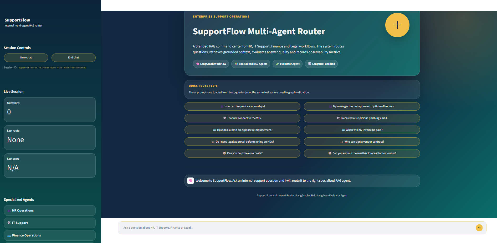
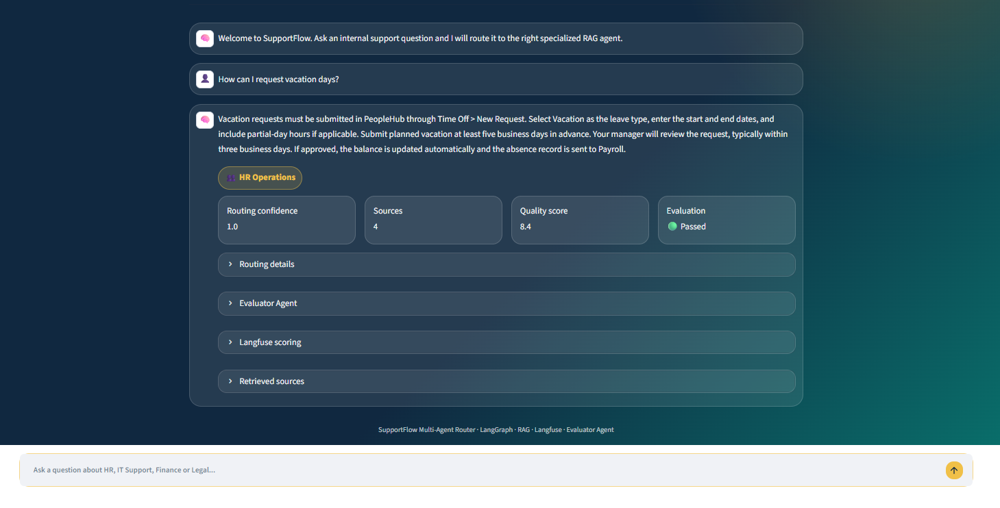
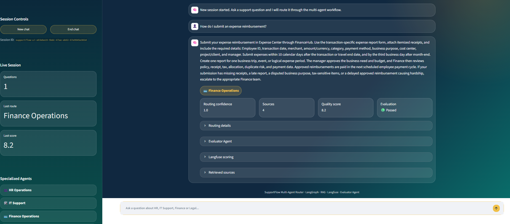
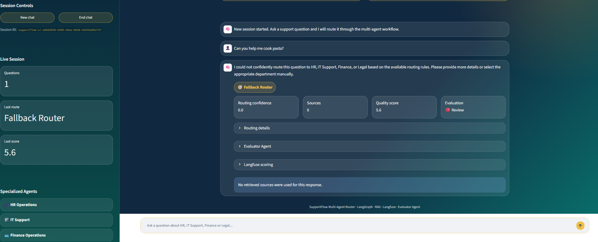
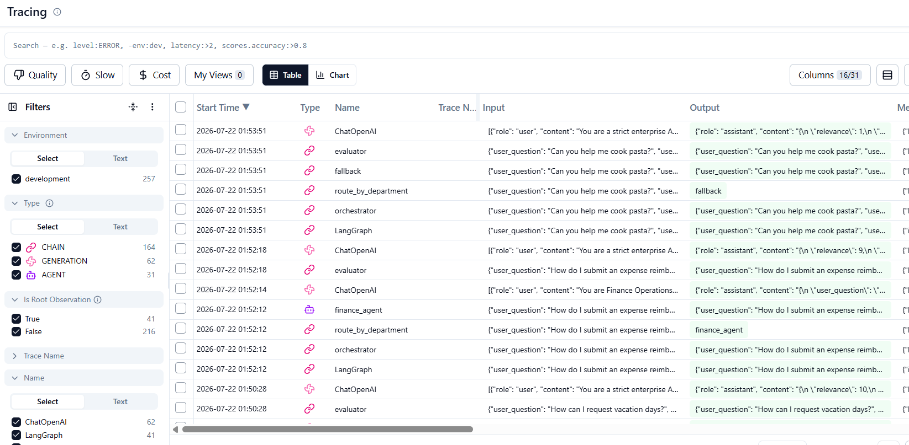
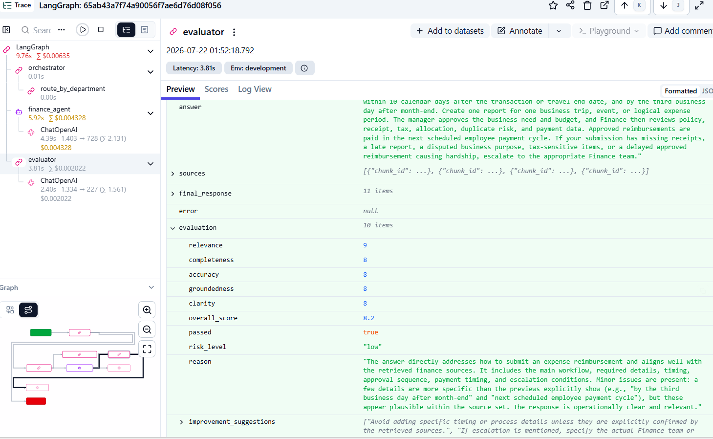
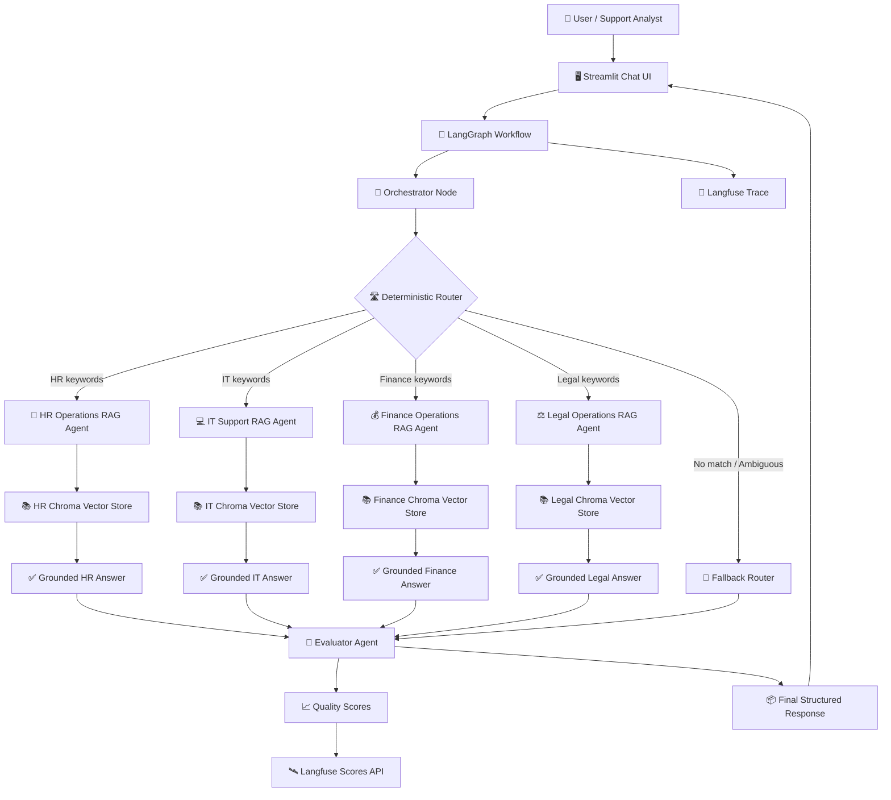

# 🤖 SupportFlow Multi-Agent Router

<p align="center">
  
  
  
  
  
</p>

> 🏢 **Enterprise multi-agent RAG support router** for HR, IT Support, Finance and Legal operations.

SupportFlow is a multi-agent enterprise support assistant built with **LangGraph**, **Retrieval-Augmented Generation**, specialized domain agents, **Langfuse observability**, automated response evaluation and a branded **Streamlit chat interface**.

The system receives an internal support question, classifies the route deterministically, sends the query to the correct specialized RAG agent, retrieves grounded internal documentation, generates a structured answer, evaluates answer quality and records observability metrics in Langfuse.

---

## 📌 Project Status

```text
Current stage: Stage 10 - Final Documentation
Notebook stage: Deferred until final delivery
```

##Implemented stages:

```text
Stage 1  - Domain Documents
Stage 2  - RAG Ingestion and Vector Stores
Stage 3  - LLM Provider Factory
Stage 4  - Specialized RAG Agents
Stage 5  - LangGraph Orchestrator
Stage 6  - Langfuse Observability
Stage 7  - Evaluator Agent
Stage 8  - Streamlit UI
Stage 10 - Final Documentation
```

---

## 🖼️ Screenshots


### 🖥️ Streamlit Command Center



### 👥 HR Route Example



### 💳 Finance Route with Evaluator



### 🔄 Fallback Route



### 🔍 Langfuse Trace



### 📈 Langfuse Scores



---

## 🎬 Animated Workflow


---

# 🏗️ System Architecture



---

## 🔄 How the Multi-Agent Workflow Works

```text
1. The user submits an internal support question through Streamlit.
2. LangGraph starts the workflow.
3. The orchestrator receives the question.
4. The deterministic router classifies the query into one of five routes:
   - hr
   - tech
   - finance
   - legal
   - fallback
5. The selected specialized RAG agent retrieves context from its own Chroma vector store.
6. The agent generates a grounded answer using only retrieved internal documentation.
7. The evaluator agent scores the final answer.
8. Langfuse captures traces and quality scores when configured.
9. Streamlit displays the answer, route, sources, evaluation and scoring status.
```

---

## 🚀 Core Features

- 🧠 **Multi-agent enterprise support routing**
- 🎯 **Deterministic route classification**
- 📚 **Specialized RAG agents by business domain**
- 🗂️ **Local Chroma vector stores**
- ✂️ **Markdown-first document ingestion**
- 🔁 **Provider abstraction for multiple LLM vendors**
- 🔗 **LangGraph conditional workflow**
- 🛰️ **Langfuse tracing and score recording**
- 🧪 **Evaluator agent with quality dimensions**
- 🎨 **Branded Streamlit chat interface**
- 💬 **Multi-turn chat**
- 🛑 **End chat and new chat controls**
- ⚡ **Quick test prompts from `test_queries.json`**
- 📤 **JSON conversation export**
  
```

---

## 🧩 Supported Domains

| Route | Domain | Agent |
|---|---|---|
| `hr` | 👥 HR Operations | HR Operations RAG Agent |
| `tech` | 💻 IT Support | IT Support RAG Agent |
| `finance` | 💰 Finance Operations | Finance Operations RAG Agent |
| `legal` | ⚖️ Legal Operations | Legal Operations RAG Agent |
| `fallback` | 🚧 Unsupported or ambiguous queries | Fallback Support Router |

---

## 📁 Repository Structure

```text
supportflow-multi-agent-router/
├── app/
│   └── streamlit_app.py
├── assets/
│   ├── screenshots/
│   └── diagrams/
├── data/
│   ├── hr_docs/
│   ├── tech_docs/
│   ├── finance_docs/
│   └── legal_docs/
├── notebooks/
├── src/
│   ├── agents/
│   │   ├── base_rag_agent.py
│   │   ├── evaluator.py
│   │   ├── finance_agent.py
│   │   ├── hr_agent.py
│   │   ├── legal_agent.py
│   │   └── tech_agent.py
│   ├── config/
│   │   └── settings.py
│   ├── graph/
│   │   ├── graph_builder.py
│   │   ├── router.py
│   │   ├── state.py
│   │   ├── test_evaluator_agent.py
│   │   ├── test_graph.py
│   │   └── test_langfuse_observability.py
│   ├── ingestion/
│   │   ├── document_loader.py
│   │   ├── ingest_documents.py
│   │   └── text_splitter.py
│   ├── llm/
│   │   ├── llm_factory.py
│   │   └── test_llm_factory.py
│   ├── observability/
│   │   └── langfuse_client.py
│   ├── retrieval/
│   │   ├── retriever_factory.py
│   │   ├── test_retriever.py
│   │   └── vectorstore.py
│   └── schemas/
│       ├── evaluation.py
│       └── rag_response.py
├── test_queries.json
├── .env.example
├── .gitignore
├── pyproject.toml
├── uv.lock
└── README.md
```

---

## 🛠️ Technology Stack

| Layer | Technology |
|---|---|
| 🖥️ UI | Streamlit |
| 🔗 Workflow orchestration | LangGraph |
| 📚 RAG framework | LangChain |
| 🗄️ Vector database | Chroma |
| 🧬 Embeddings | OpenAI `text-embedding-3-small` |
| 🤖 LLM providers | OpenAI, xAI/Grok, DeepSeek |
| 🛰️ Observability | Langfuse |
| 🧪 Evaluation | LLM-as-judge + deterministic fallback |
| 📦 Package manager | uv |
| 🐍 Language | Python |

---

## 🔑 Environment Variables

Copy the example file:

```powershell
Copy-Item .env.example .env
```

Then add your real credentials in `.env`.

Required variables:

```env
# =============================================================================
# LLM PROVIDER CONFIGURATION
# =============================================================================

LLM_PROVIDER=openai
LLM_FALLBACK_PROVIDER=openai

# =============================================================================
# OPENAI CONFIGURATION
# =============================================================================

OPENAI_API_KEY=your-openai-api-key-here
OPENAI_MODEL=gpt-4o-mini

# =============================================================================
# XAI / GROK CONFIGURATION
# =============================================================================

XAI_API_KEY=your-xai-api-key-here
XAI_MODEL=grok-4.3

# =============================================================================
# DEEPSEEK CONFIGURATION
# =============================================================================

DEEPSEEK_API_KEY=your-deepseek-api-key-here
DEEPSEEK_MODEL=deepseek-chat

# =============================================================================
# EMBEDDINGS
# =============================================================================

EMBEDDING_MODEL=text-embedding-3-small

# =============================================================================
# LANGFUSE OBSERVABILITY
# =============================================================================

LANGFUSE_PUBLIC_KEY=pk-lf-your-public-key-here
LANGFUSE_SECRET_KEY=sk-lf-your-secret-key-here
LANGFUSE_BASE_URL=https://cloud.langfuse.com
LANGFUSE_HOST=https://cloud.langfuse.com
LANGFUSE_ENVIRONMENT=development
LANGFUSE_RELEASE=supportflow-stage-10

# =============================================================================
# EVALUATOR AGENT
# =============================================================================

EVALUATION_PASS_THRESHOLD=7.0
ENABLE_LANGFUSE_SCORING=true
```

Never commit the real `.env` file.

---

## ⚡ Installation

Clone the repository:

```bash
git clone https://github.com/<your-username>/supportflow-multi-agent-router.git
cd supportflow-multi-agent-router
```

Install dependencies:

```bash
uv sync
```

If dependencies need to be installed manually:

```bash
uv add streamlit
uv add langgraph
uv add langchain
uv add langchain-community
uv add langchain-openai
uv add langchain-chroma
uv add chromadb
uv add pypdf
uv add tiktoken
uv add python-dotenv
uv add langfuse
uv add langchain-xai
uv add langchain-deepseek
```

---

## 📦 Build Vector Stores

The vector stores are generated locally and are intentionally excluded from Git.

Run:

```bash
uv run python -m src.ingestion.ingest_documents
```

Expected generated folders:

```text
vectorstores/hr
vectorstores/tech
vectorstores/finance
vectorstores/legal
```

Expected chunk counts from validation:

```text
HR      - 127 chunks
Tech    - 128 chunks
Finance - 133 chunks
Legal   - 137 chunks
```

---

## 🚀 Run the Streamlit UI

```bash
uv run streamlit run app/streamlit_app.py
```

The UI supports:

```text
- Multi-turn chat
- New chat
- End chat
- Quick prompts from test_queries.json
- Route metadata
- Retrieved sources
- Evaluator scores
- Langfuse scoring status
- JSON export
```

---

## 🧪 Test Queries

The project uses `test_queries.json` as a shared source for route validation and UI quick prompts.

Example:

```json
[
  {
    "query": "How can I request vacation days?",
    "expected_department": "hr"
  },
  {
    "query": "I cannot connect to the VPN.",
    "expected_department": "tech"
  },
  {
    "query": "How do I submit an expense reimbursement?",
    "expected_department": "finance"
  },
  {
    "query": "Do I need legal approval before signing an NDA?",
    "expected_department": "legal"
  },
  {
    "query": "Can you help me cook pasta?",
    "expected_department": "fallback"
  }
]
```

---

## 🧪 Validation Commands

### Validate Retriever

```bash
uv run python -m src.retrieval.test_retriever
```

### Validate LLM Provider Factory

```bash
uv run python -m src.llm.test_llm_factory
```

### Validate Specialized RAG Agents

```bash
uv run python -m src.agents.test_specialized_agents
```

### Validate LangGraph Workflow

```bash
uv run python -m src.graph.test_graph
```

### Validate Langfuse Observability

```bash
uv run python -m src.graph.test_langfuse_observability
```

### Validate Evaluator Agent

```bash
uv run python -m src.graph.test_evaluator_agent
```

### Run UI

```bash
uv run streamlit run app/streamlit_app.py
```

---

## ✅ Validation Coverage

The system was validated across:

```text
- ✅ HR route
- ✅ IT Support route
- ✅ Finance route
- ✅ Legal route
- ✅ Fallback route
- ✅ Deterministic routing
- ✅ Full LangGraph workflow execution
- ✅ Langfuse observability
- ✅ Evaluator scoring
- ✅ Low-quality answer detection
- ✅ Streamlit chat execution
```

---

## ⚖️ Evaluator Agent

The evaluator scores each final response across five quality dimensions:

| Dimension | Description |
|---|---|
| `relevance` | 🎯 Checks whether the answer directly addresses the user question |
| `completeness` | 📚 Checks whether the answer includes steps, requirements and escalation guidance |
| `accuracy` | ✅ Checks whether the answer avoids contradictions or unsupported claims |
| `groundedness` | 🔗 Checks whether the answer is supported by retrieved sources |
| `clarity` | ✨ Checks whether the answer is professional, clear and actionable |

Example evaluation payload:

```json
{
  "evaluation": {
    "relevance": 9,
    "completeness": 8,
    "accuracy": 9,
    "groundedness": 9,
    "clarity": 9,
    "overall_score": 8.8,
    "passed": true,
    "risk_level": "low",
    "reason": "The answer is relevant, grounded and operationally useful.",
    "improvement_suggestions": []
  }
}
```

---

## 📊 Langfuse Observability

When configured, Langfuse captures graph execution traces and records evaluation scores.

Recorded score names:

```text
eval_relevance
eval_completeness
eval_accuracy
eval_groundedness
eval_clarity
eval_overall_quality
eval_passed
```

Langfuse is used to observe:

```text
- user question
- graph invocation
- orchestrator step
- selected route
- selected specialized agent
- final answer
- evaluator result
- quality scores
```

---

## 💡 Example User Questions

```text
How can I request vacation days?
My manager has not approved my time off request.
I cannot connect to the VPN.
I received a suspicious phishing email.
How do I submit an expense reimbursement?
When will my invoice be paid?
Do I need legal approval before signing an NDA?
Who can sign a vendor contract?
Can you help me cook pasta?
Can you explain the weather forecast for tomorrow?
```

---

## 📄 Example Final Response Shape

```json
{
  "user_question": "How can I request vacation days?",
  "detected_department": "hr",
  "routing_confidence": 1.0,
  "routing_reason": "Matched 1 keyword(s) for department 'hr'.",
  "matched_keywords": ["vacation"],
  "agent_name": "HR Operations RAG Agent",
  "answer": "Vacation requests must be submitted through PeopleHub...",
  "sources": [
    {
      "chunk_id": "hr_chunk_0001",
      "department": "hr",
      "source_file": "HR_Operations_Knowledge_Base.md",
      "score": 0.42,
      "content_preview": "..."
    }
  ],
  "evaluation": {
    "relevance": 9,
    "completeness": 8,
    "accuracy": 9,
    "groundedness": 9,
    "clarity": 9,
    "overall_score": 8.8,
    "passed": true,
    "risk_level": "low",
    "reason": "...",
    "improvement_suggestions": []
  },
  "langfuse_scoring": {
    "recorded": true,
    "reason": "Evaluation scores were recorded in Langfuse."
  }
}
```

---

## 🧱 Design Principles

This project follows SOLID-inspired architecture:

```text
Single Responsibility:
Each component has a clear responsibility:
router, retriever, agent, evaluator, graph builder, UI.

Open/Closed:
New domains can be added without rewriting existing agents.

Dependency Inversion:
LLM providers are accessed through a provider factory instead of hardcoded model calls.

Separation of Concerns:
Ingestion, retrieval, graph orchestration, observability and UI are separated.
```

---

## ⚠️ Limitations

```text
- Routing is deterministic and keyword-based.
- Ambiguous queries are routed to fallback instead of using semantic classification.
- Vector stores are local Chroma stores and must be regenerated after changing documents or embedding models.
- The evaluator is an LLM-as-judge and may vary slightly across model responses.
- Langfuse score recording requires valid Langfuse credentials.
- The Streamlit UI is designed for local demonstration, not production authentication.
- No external web fallback is included in this project stage.
- Notebook delivery is deferred to a later stage.
- The current system uses internal generated documentation, not real enterprise policies.
```

---

## 📦 Delivery Notes

This repository is self-contained for local execution.

To reproduce the project:

```text
1. Clone the repository.
2. Create `.env` from `.env.example`.
3. Add valid API keys.
4. Install dependencies with `uv sync`.
5. Run ingestion to create local vector stores.
6. Run validation scripts.
7. Start the Streamlit UI.
```

Recommended demo flow:

```text
1. Open Streamlit UI.
2. Ask an HR question.
3. Show routing metadata and sources.
4. Ask a Finance question.
5. Show evaluator score.
6. Ask an unsupported question.
7. Show fallback behavior.
8. Open Langfuse.
9. Show traces and scores.
```

---

## 🌿 Branch Summary

```text
feature/project-setup
feature/domain-documents
feature/rag-ingestion-vectorstores
feature/provider-factory
feature/specialized-rag-agents
feature/langgraph-orchestrator
feature/langfuse-observability
feature/evaluator-agent
feature/streamlit-ui
feature/final-documentation
```

---

## 🎯 Final Project Goal

SupportFlow demonstrates how a multi-agent enterprise support router can combine:

```text
- deterministic orchestration
- specialized RAG agents
- internal knowledge bases
- observability
- response quality evaluation
- branded user experience
```

The result is a modular and extensible foundation for enterprise AI support automation.

---

## 🚀 Final Documentation Commit

Recommended branch:

```bash
git checkout master
git pull origin master
git checkout -b feature/final-documentation
```

Create folders for screenshots and diagrams:

```powershell
mkdir assets
mkdir assets\screenshots
mkdir assets\diagrams
```

Add files:

```bash
git add README.md
git add .env.example
git add assets/screenshots
git add assets/diagrams
```

Commit:

```bash
git commit -m "docs: add final project documentation" -m "Prepare final documentation for the SupportFlow multi-agent routing system.

This stage adds:
- Complete README with project overview
- Architecture explanation
- Setup and usage guide
- Environment variable documentation
- Validation commands
- Screenshots section
- Multi-agent workflow diagram
- Evaluator and Langfuse documentation
- Limitations and delivery notes

This completes Stage 10: Final Documentation."
```

Push:

```bash
git push -u origin feature/final-documentation
```