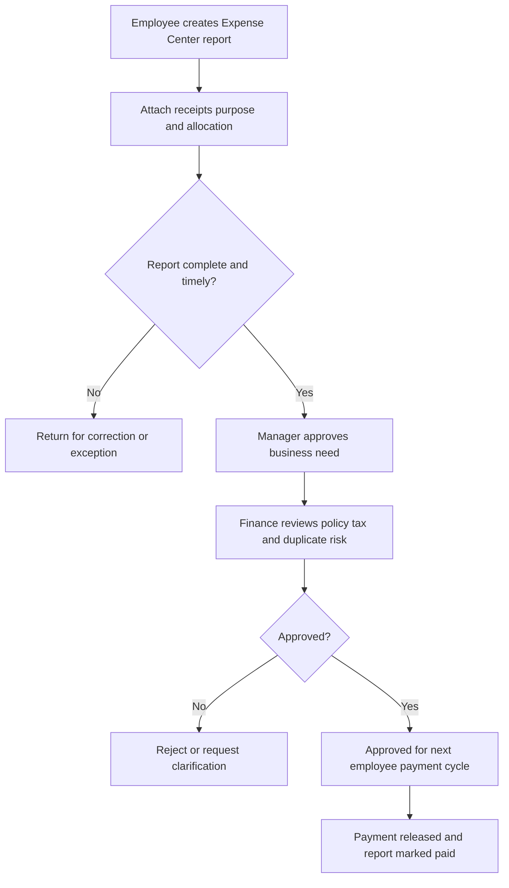
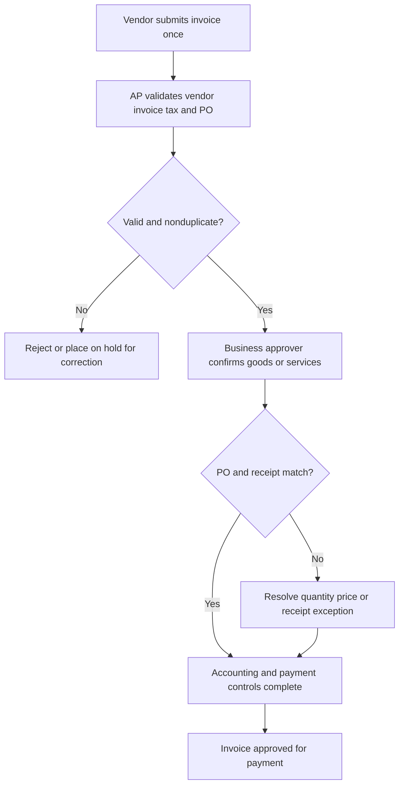
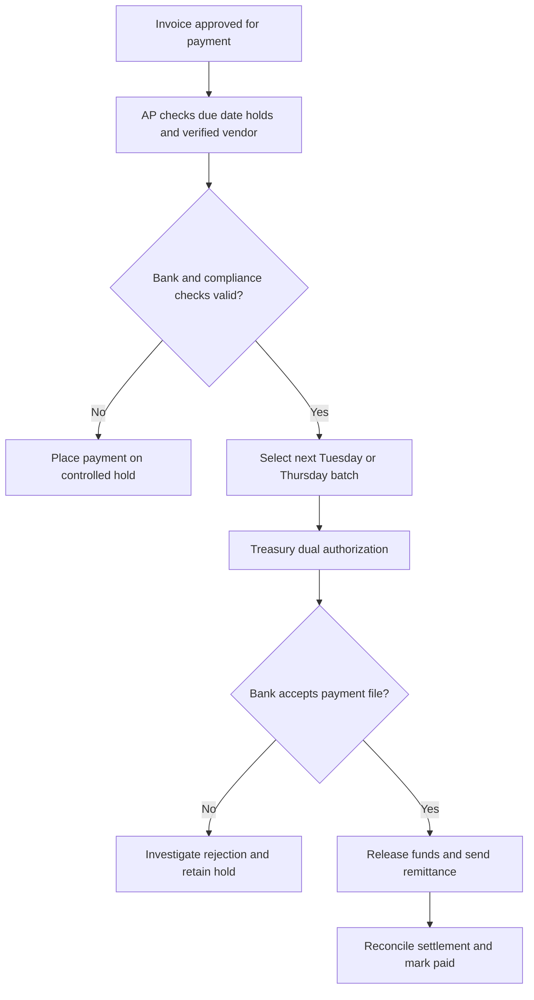
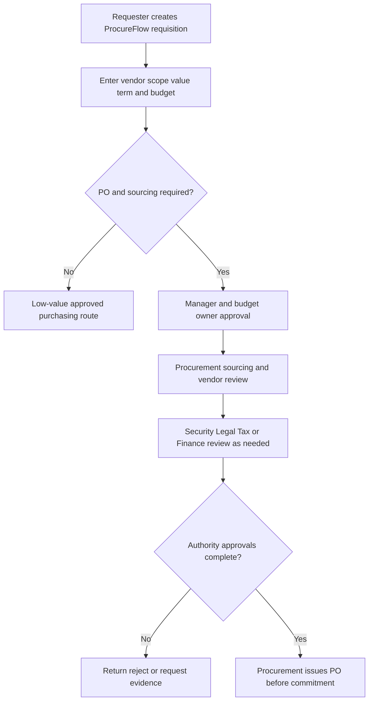
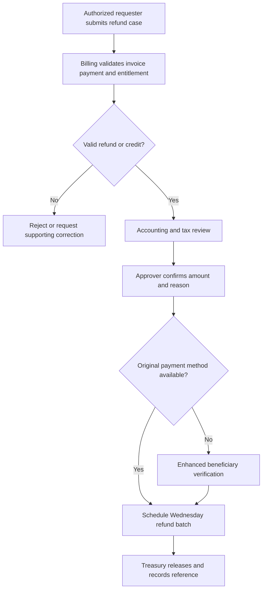

# Finance Operations Knowledge Base

## Internal Support Documentation

**Knowledge domain:** Enterprise Finance Operations  
**Intended system:** Finance RAG Agent in the Enterprise Support Router  
**Document owner:** Finance Operations  
**Version:** 1.0  
**Effective date:** 18 July 2026  
**Review cycle:** Quarterly, and after any material control, tax, or payment-process change  
**Classification:** Internal Confidential

> **Confidentiality notice:** This document is for authorized employees, managers, Finance personnel, and approved service providers. Do not place complete bank details, payment-card numbers, tax identifiers, payroll records, customer data, or authentication credentials in a standard Finance ticket. Use approved secure forms.

> **Authority note:** Applicable law, signed contracts, tax rules, the Delegation of Authority Matrix, audited accounting policy, benefit or payroll rules, and approved country addenda take precedence over this global manual. The Finance RAG Agent must identify uncertainty and escalate instead of promising approval, payment, reimbursement, refund, or tax treatment.

---

## Document Control

| Field | Value |
|---|---|
| Policy owner | Chief Financial Officer |
| Operational owner | Finance Operations Director |
| Expense owner | Expense and Corporate Card Manager |
| Accounts Payable owner | Accounts Payable Manager |
| Procurement owner | Procurement Director |
| Billing owner | Billing Operations Manager |
| Tax owner | Tax Director |
| Finance portal | FinanceHub |
| Procurement platform | ProcureFlow |
| Expense platform | Expense Center |
| Standard Finance hours | Monday-Friday, 08:00-17:00 employee local time, excluding company holidays |
| Urgent payment channel | FinanceHub High-Priority Finance Case |
| Security and fraud channel | Security Hotline and Fraud Concern form |
| Source priority | Law/contract, authority matrix, accounting/tax policy, approved record, this knowledge base |

### Change History

| Version | Date | Change | Approved by |
|---|---|---|---|
| 1.0 | 18 July 2026 | Initial enterprise Finance support corpus | Chief Financial Officer |

---

## Table of Contents

1. Finance Department Overview  
2. Finance Support Scope and Service Model  
3. FinanceHub and Case Management  
4. Expense Reimbursement and Reports  
5. Corporate Card Operations  
6. Accounts Payable, Invoices, and Vendor Payments  
7. Purchase Orders and Procurement  
8. Budget Approvals and Financial Planning  
9. Client Billing and Refunds  
10. Tax Documentation and Payroll Coordination  
11. Exceptions, Audit Support, and Financial Risk  
12. Finance Escalation Matrix  
13. Common Finance Support Tickets and FAQs  
14. Finance Agent Response Guidelines  
15. Structured Knowledge Snippets  
16. Finance Glossary  
17. Test Questions Appendix

---

# 1. Finance Department Overview

## 1.1 Finance Operations Mission

Finance Operations protects company funds, records complete and accurate transactions, pays employees and vendors according to approved obligations, bills customers accurately, supports tax and audit requirements, and gives business teams reliable financial information.

Finance Operations includes Expense Management, Corporate Card Administration, Accounts Payable, Procurement Operations, Billing Operations, Cash Operations, and coordination with Payroll, Tax, Treasury, Accounting, Legal, Security, and business budget owners. The department applies documented approvals and segregation of duties; it does not create approvals after the fact merely to release a payment.

The Finance RAG Agent explains approved procedures, status definitions, submission requirements, standard review and payment cycles, and escalation rules. It cannot approve spending, change bank details, release funds, interpret personal tax consequences, or guarantee settlement. It must route suspected fraud, invoice manipulation, bank-change requests, duplicate payment, bribery, or financial-data exposure to the designated human teams immediately.

## 1.2 Finance Support Scope

### Finance Support Intake and Routing Procedure

**Purpose:**  
Define which requests Finance Operations owns and how cases are routed to Expense, Accounts Payable, Procurement, Billing, Payroll, Tax, Accounting, Treasury, Legal, or Security.

**Applies to:**  
Employees, managers, budget owners, vendors, customers through approved channels, Finance staff, and authorized service providers.

**Process:**

1. The requester opens FinanceHub and selects Expenses, Corporate Card, Invoice, Vendor Payment, Purchase Order, Budget, Billing, Refund, Tax Document, Payroll Coordination, or Finance Exception.
2. The Finance RAG Agent identifies the legal entity, transaction type, amount, currency, dates, requester role, approval state, and deadline.
3. Finance Operations handles routine validation, status, payment scheduling, and documentation.
4. Procurement, Tax, Payroll, Accounting, Treasury, Legal, or Security receives specialist decisions.
5. The case record retains the request, supporting documents, approvals, control checks, decision, payment reference, and closure evidence.

**Required information:**  
Requester, legal entity, country, transaction or document ID, amount and currency, vendor/customer/employee, relevant dates, business purpose, cost center, approval status, and sanitized supporting evidence.

**Escalation:**  
Immediately escalate suspected fraud, bank-detail change, payment diversion, duplicate or unauthorized payment, bribery concern, data exposure, legal demand, or regulatory deadline. Escalate routinely when approval, contract, tax, accounting, or policy-exception authority is missing.

**Example user question:**  
"Can Finance pay an invoice even though the purchase order was created after the vendor started work?"

**Recommended agent answer:**  
"Finance cannot treat a retrospective purchase order as normal compliance. Submit the invoice, contract or engagement evidence, business reason, amount, budget owner, and explanation for the late PO. Procurement and Finance must review the exception before payment scheduling."

## 1.3 Finance Service Boundaries

| Request | Primary owner | Finance Operations role |
|---|---|---|
| Employee expense reimbursement | Expense Management | Validate policy, approval, and payment readiness |
| Corporate card transaction | Card Administration | Reconcile, control, and investigate exceptions |
| Vendor invoice and payment | Accounts Payable | Validate invoice, match approvals, schedule payment |
| New vendor or bank change | Procurement/Treasury/AP | Verify independently through secure process |
| Purchase order | Procurement and budget owner | Source, approve, and issue before commitment |
| Budget availability or transfer | FP&A/budget owner | Confirm plan and approve movement |
| Customer invoice or credit | Billing Operations | Validate contract, billing record, and correction |
| Employee wages, tax withholding, payslip | Payroll | Finance coordinates approved accounting inputs only |
| Tax form interpretation | Tax or personal advisor | Finance provides approved documents, not personal advice |
| Suspected payment fraud | Security/Treasury/Finance leadership | Freeze, preserve evidence, and support investigation |

---

# 2. Finance Support Scope and Service Model

## 2.1 Finance Case Priority Policy

### Finance Priority and Service-Level Policy

**Purpose:**  
Apply consistent urgency based on financial exposure, legal deadline, business impact, and fraud risk.

**Applies to:**  
All FinanceHub requests, vendor inquiries, approved customer billing cases, and system-generated exceptions.

**Process:**

1. Assign **Critical** for active payment fraud, unauthorized bank change, material duplicate payment in progress, compromised corporate card with active misuse, or significant financial-data exposure. Target human acknowledgement: 15 minutes through the emergency route.
2. Assign **High** for imminent statutory or contractual payment deadline, missing employee reimbursement causing documented hardship, blocked critical supplier, payroll funding risk, customer overcharge with service impact, or payment-cycle cutoff within one business day. Target acknowledgement: four business hours.
3. Assign **Normal** for complete expense, invoice, PO, budget, billing, refund, tax document, or status requests. Target acknowledgement: one business day.
4. Assign **Low** for general policy guidance, future planning, and nonurgent reporting. Target acknowledgement: two business days.
5. Amount alone does not determine urgency, but higher exposure increases required approval and review.

**Required information:**  
Transaction ID, amount/currency, legal entity, due date or cutoff, business impact, vendor/customer/employee, approval state, and fraud or security indicator.

**Escalation:**  
Critical cases require Security, Treasury, and Finance leadership. A Finance RAG Agent must not continue ordinary status troubleshooting when funds may be diverted or credentials compromised.

**Example user question:**  
"A vendor emailed new bank details for a payment due today."

**Recommended agent answer:**  
"Do not update or use the emailed bank details. Treat this as a High or Critical fraud risk and contact Accounts Payable and Treasury through the verified vendor-change process. The change must be independently confirmed using an approved contact already on file."

## 2.2 Segregation of Duties Policy

### Financial Approval and Segregation of Duties Standard

**Purpose:**  
Prevent unauthorized commitments, self-approval, payment diversion, and inaccurate accounting.

**Applies to:**  
Employees, managers, budget owners, Procurement, Accounts Payable, Billing, Treasury, Accounting, and system administrators.

**Process:**

1. The requester cannot approve their own expense, purchase, supplier setup, invoice exception, credit, or refund.
2. The person creating or changing vendor master data cannot be the sole person releasing payment.
3. The invoice approver confirms business receipt and cost allocation; Accounts Payable validates accounting and payment readiness.
4. Treasury releases payments using dual authorization when the payment method or threshold requires it.
5. Billing credits and refunds require an owner independent from the original billing entry when required by the authority matrix.
6. Conflicting roles are prevented or monitored and reviewed.

**Required information:**  
Requester, approver, vendor/customer/employee, amount, role, legal entity, cost center, system entitlement, and any conflict or delegation.

**Escalation:**  
Escalate self-approval, override pressure, requester-controlled vendor record, shared account, missing second approver, or role conflict to the Controller and Internal Controls.

**Example user question:**  
"Can I approve my own expense because my manager is away?"

**Recommended agent answer:**  
"No. Self-approval is prohibited. FinanceHub should route the report to an authorized delegate or the next approver. Your manager must establish delegation using their own account."

## 2.3 Finance Data Privacy and Secure Exchange

### Financial Data Handling Policy

**Purpose:**  
Protect banking, tax, card, payroll, vendor, customer, and employee financial information.

**Applies to:**  
All Finance requesters, Finance teams, vendors, customers, and automated support tools.

**Process:**

1. Never place full bank-account data, card numbers, tax identifiers, payroll files, authentication codes, or customer financial records in ordinary chat or email.
2. Use secure FinanceHub upload or the verified vendor/customer portal.
3. Redact unrelated personal and transaction data from screenshots.
4. Confirm the requester's authority before releasing payment status, tax documents, invoices, credits, or account statements.
5. Vendor bank changes require independent callback using the existing verified contact, not the contact in the change message.
6. Restrict cases involving payroll, investigations, legal holds, or financial misconduct.

**Required information:**  
Transaction reference, requester relationship, business purpose, document type, legal entity, and verified secure channel.

**Escalation:**  
Escalate exposed bank, card, tax, payroll, or customer data to Security and Privacy. Escalate misdirected payments or suspected impersonation to Treasury immediately.

**Example user question:**  
"Can I paste a vendor's bank account into this ticket?"

**Recommended agent answer:**  
"No. Use the secure Vendor Change form. Standard tickets must contain only the vendor ID, change-case reference, and business contact; bank data is verified separately."

## 2.4 Delegation of Authority Summary

### Global Purchase Approval Thresholds

**Purpose:**  
Provide a global default for purchase routing while preserving stricter local or category rules.

**Applies to:**  
All nonpayroll purchases and commitments, including software subscriptions, services, hardware, events, and consultants.

**Process:**

1. Below **USD 2,500 equivalent**, a permitted category may use an approved corporate card or low-value process with manager and budget availability; contracts, new vendors, software, and restricted categories still require Procurement review.
2. From **USD 2,500 to 24,999**, a purchase order is required before commitment, with manager/budget owner and Procurement approval.
3. From **USD 25,000 to 99,999**, competitive sourcing or documented sole-source justification, department-head approval, Procurement, and Finance Controller approval are required.
4. At **USD 100,000 or more**, CFO approval is required in addition to the preceding controls.
5. At **USD 250,000 or more**, the executive sponsor and any committee approval in the authority matrix are required.
6. Use total committed value, including implementation, renewals, options, taxes where applicable, and related transactions. Splitting purchases is prohibited.

**Required information:**  
Total committed value, currency, term, vendor, category, business justification, cost center, budget owner, sourcing evidence, and approvals.

**Escalation:**  
Escalate threshold ambiguity, split transactions, retroactive commitments, related-party vendors, nonstandard contract terms, or local rules to Procurement and the Controller.

**Example user question:**  
"Can I divide a USD 6,000 purchase into three card transactions?"

**Recommended agent answer:**  
"No. Transaction splitting is prohibited. The total commitment exceeds the USD 2,500 global PO threshold, so submit one ProcureFlow requisition before engaging the vendor."

---

# 3. FinanceHub and Case Management

## 3.1 FinanceHub Portal Usage

### Finance Request Submission Procedure

**Purpose:**  
Create complete, traceable requests and direct them to the correct Finance workflow.

**Applies to:**  
Employees, managers, budget owners, and authorized Finance partners.

**Process:**

1. Sign in to FinanceHub using company single sign-on.
2. Select the correct module: Expense Center, Corporate Card, Accounts Payable, ProcureFlow, Budget, Billing, Refund, Tax Documents, or Finance Help.
3. Use the transaction-specific form rather than a general ticket when one exists.
4. Enter the legal entity, amount/currency, date, cost center, business purpose, counterparty, and transaction ID.
5. Upload supporting documents through the secure form and save the confirmation number.
6. Use My Finance Requests to track status and update the existing case.

**Required information:**  
Module, requester, legal entity, transaction type and ID, amount/currency, dates, cost center, counterparty, approver, purpose, and sanitized evidence.

**Escalation:**  
Escalate missing access to IT, employment-record errors to HR, payment-fraud indicators to Security/Treasury, and accounting or tax interpretation to the designated specialist.

**Example user question:**  
"Where can I see my reimbursement request?"

**Recommended agent answer:**  
"Open FinanceHub > My Finance Requests and filter by Expense Report. The status will show submission, manager approval, Finance review, approved-for-payment, scheduled, or paid. Use the existing report thread for questions."

## 3.2 Duplicate Finance Case Policy

### Duplicate Request Prevention Procedure

**Purpose:**  
Prevent duplicate payments, conflicting instructions, and fragmented approvals.

**Applies to:**  
Employees, vendors through approved channels, customers through Billing, and Finance teams.

**Process:**

1. Search transaction ID, invoice number, expense report ID, PO, refund, or case before creating a new request.
2. Add evidence to the existing record when counterparty, amount, document, and requested action are the same.
3. Finance links related status inquiries to the original transaction.
4. A separate case is appropriate for a distinct invoice, different legal entity, separate refund, or confidential fraud concern.
5. Suspected duplicate invoices or payments remain open for review; they are not simply closed as duplicate tickets.

**Required information:**  
Existing request or transaction ID, new evidence, amount, counterparty, date, and requested next action.

**Escalation:**  
Escalate duplicate payment, conflicting bank instructions, repeated invoice number with different amount, or cases with different confidentiality restrictions.

**Example user question:**  
"My invoice status has not changed today. Should I submit it again?"

**Recommended agent answer:**  
"No. Resubmitting can create duplicate-payment risk. Update the existing invoice case with any new evidence or deadline and reference the invoice number and vendor ID."

## 3.3 Finance Status Definitions

| Status | Meaning | User action |
|---|---|---|
| Draft | Request is not submitted | Complete required fields and submit |
| Submitted | Request entered workflow | Monitor approval; no duplicate |
| Pending approval | Waiting for named business approver | Approver acts or delegation is used |
| Finance review | Finance validates policy/accounting | Respond to clarification in same case |
| On hold | Missing information, dispute, control, or compliance issue | Review hold reason and supply requested evidence |
| Approved for payment | Validated but not yet in payment batch | Check next applicable payment cycle |
| Scheduled | Included in an authorized payment batch | Await settlement; do not promise bank timing |
| Paid | Finance released payment and recorded reference | Confirm receipt using payment reference |
| Rejected | Request did not meet requirements | Review reason; correct or request exception |
| Cancelled | Authorized request was withdrawn or voided | Submit a new request only if a new obligation exists |

---

# 4. Expense Reimbursement and Reports

## 4.1 Expense Reimbursement Policy

### Employee Expense Reimbursement Policy

**Purpose:**  
Reimburse reasonable, necessary, approved business expenses while maintaining tax, accounting, budget, and audit evidence.

**Applies to:**  
Employees and approved nonemployees when a written agreement permits reimbursement, their managers, Expense Management, and budget owners.

**Process:**

1. Use an approved corporate card for eligible business expenses when available; personal payment should be the exception, not the default.
2. Submit expenses in Expense Center within 10 calendar days after the transaction or travel end date and by the third business day after month-end.
3. Create one report for one business trip, event, or logical expense period.
4. Attach itemized receipts, select the correct category, cost center, legal entity, project/client code, and add a specific business purpose.
5. The manager approves business need and budget; Finance validates policy, receipt, tax, allocation, duplicate risk, and payment data.
6. Approved reimbursements enter the next scheduled employee payment cycle.

**Required information:**  
Employee ID, transaction date, merchant, amount/currency, category, itemized receipt, payment method, business purpose, attendees when required, cost center, project/client, and manager.

**Escalation:**  
Escalate missing receipts beyond the affidavit limit, late reports, prohibited expenses, high-value personal payment, disputed business purpose, tax-sensitive items, or hardship caused by a delayed approved reimbursement.

**Example user question:**  
"How do I submit an expense reimbursement?"

**Recommended agent answer:**  
"Submit your expense reimbursement through FinanceHub by selecting Expense Report, attaching itemized receipts, choosing the correct cost center and category, and adding a specific business purpose. Finance reviews complete submissions within five business days after required approval."

## 4.2 Expense Reimbursement Workflow

**Workflow controls:** The employee cannot approve their own report. Manager approval confirms the business expense, while Finance approval confirms policy and accounting. Paid status means Finance released payment; bank posting time may vary.

## 4.3 Expense Report Submission Workflow

### Expense Report Preparation Procedure

**Purpose:**  
Create a complete report that can be approved and audited without repeated clarification.

**Applies to:**  
Employees, managers, delegates preparing but not approving reports, and Expense Management.

**Process:**

1. Import eligible corporate-card transactions or add out-of-pocket transactions once.
2. Match each line to its itemized receipt and confirm date, merchant, amount, currency, and payment method.
3. Select the most specific category and accounting allocation.
4. Enter a business purpose that states the activity, business benefit, project or customer, and participants when relevant.
5. Itemize mixed or hotel receipts into lodging, tax, meals, parking, and personal amounts.
6. Mark personal amounts as nonreimbursable and repay corporate-card personal charges according to the card process.
7. Review totals and submit to the correct manager.

**Required information:**  
Report name, dates, transaction lines, receipts, category, cost center, project/client, purpose, attendees, personal portion, and manager.

**Escalation:**  
Escalate duplicate imported transactions, wrong legal entity, unable-to-itemize hotel, personal corporate-card charge, or allocation across restricted projects.

**Example user question:**  
"Can I put all of last month's expenses into one line?"

**Recommended agent answer:**  
"No. Each transaction must be a separate line with its own date, merchant, amount, category, receipt, and business purpose. You may group related lines in one report for the same trip or period."

## 4.4 Receipt Requirements

### Itemized Receipt and Evidence Policy

**Purpose:**  
Provide evidence of what was purchased, when, for how much, and for which business purpose.

**Applies to:**  
All expense reports and corporate-card transactions.

**Process:**

1. An itemized merchant receipt is required for expenses of **USD 25 equivalent or more**.
2. Itemized receipts are required regardless of amount for lodging, airfare, corporate-card charges, gifts, entertainment, and categories requiring VAT or sales-tax evidence.
3. A card slip or bank statement alone is not itemized evidence.
4. The receipt must show merchant, date, items/services, taxes, total, and currency.
5. For meals or entertainment, record business attendees and purpose where permitted and required.
6. Protect personal card numbers and unrelated data when uploading.

**Required information:**  
Merchant, date, itemization, amount/currency, tax, payment method, business purpose, attendees where needed, and proof of payment when the receipt does not show it.

**Escalation:**  
Escalate missing receipt, unreadable or altered document, handwritten receipt without vendor details, duplicate evidence, or tax-document gap to Expense Management.

**Example user question:**  
"Is a screenshot of my card transaction enough?"

**Recommended agent answer:**  
"No. A card screenshot proves payment but not what was purchased. Attach the itemized merchant receipt. If it is unavailable, request a duplicate from the merchant or use the controlled missing-receipt process if eligible."

## 4.5 Missing Receipt Procedure

### Missing Receipt Affidavit Policy

**Purpose:**  
Handle genuinely unavailable receipts without normalizing weak evidence.

**Applies to:**  
Employees and Expense Management.

**Process:**

1. First request a duplicate receipt from the merchant, hotel, airline, or booking provider.
2. If unavailable, complete the Missing Receipt Affidavit with date, merchant, items, amount/currency, business purpose, payment method, and reason evidence is unavailable.
3. The standard affidavit may be used only for expenses not exceeding **USD 75 equivalent** and no more than two times in a rolling 12-month period.
4. Lodging, airfare, gift cards, entertainment, cash withdrawals, and restricted categories cannot use the standard affidavit without Finance exception approval.
5. Manager approval remains required; Finance may reject unsupported or repeated claims.

**Required information:**  
Transaction, merchant, date, amount/currency, category, purpose, proof of payment, merchant-contact attempt, and prior affidavit count.

**Escalation:**  
Escalate above-threshold, repeated, restricted-category, altered, or disputed claims to the Expense Manager and Controller.

**Example user question:**  
"I lost a USD 40 taxi receipt."

**Recommended agent answer:**  
"First request a duplicate from the provider. If unavailable and you have not exceeded the affidavit limit, complete the Missing Receipt Affidavit with trip details, amount, business purpose, proof of payment, and the duplicate-receipt attempt."

## 4.6 Business Purpose and Cost Allocation

### Expense Coding and Business Purpose Standard

**Purpose:**  
Record why the expense benefited the company and where it belongs in accounting and budget reporting.

**Applies to:**  
Expense submitters, managers, budget owners, and Finance.

**Process:**

1. Describe the specific business activity and outcome; "business expense" or "meeting" is insufficient.
2. Use the employee's cost center unless the documented benefiting department or project owns the cost.
3. Enter customer, project, grant, event, or campaign code when applicable.
4. Split a transaction only when distinct portions belong to different categories or allocations.
5. Obtain the receiving budget owner's approval for cross-department charges.
6. Do not code an expense to an available budget merely to avoid the correct owner.

**Required information:**  
Activity, business benefit, project/customer, attendees, category, legal entity, cost center, split amount, and receiving owner approval.

**Escalation:**  
Escalate disputed cost ownership, restricted fund, customer-billable expense, cross-entity allocation, or accounting classification uncertainty.

**Example user question:**  
"What is a sufficient meal business purpose?"

**Recommended agent answer:**  
"State the meeting objective, project or customer, business outcome, date, and attendees where required—for example, 'Implementation planning with Client Alpha project team.'"

## 4.7 Travel and Per Diem Policy

### Business Travel Expense Procedure

**Purpose:**  
Reimburse approved travel consistently and prevent duplicate per diem and actual-cost claims.

**Applies to:**  
Approved business travelers, managers, Travel Operations, and Expense Management.

**Process:**

1. Obtain required travel approval and use the approved booking channel before purchase.
2. Select reasonable fare, lodging, ground transport, and meal options within the location limits shown in Expense Center.
3. When per diem applies, claim the eligible rate and dates; do not also claim actual meals covered by per diem or conference/hotel inclusion.
4. Deduct personal extensions, upgrades, companion costs, minibar, and other personal amounts.
5. Document itinerary changes, unused tickets, credits, and refunds.
6. Submit the report within 10 calendar days after return.

**Required information:**  
Travel approval, itinerary, dates/location, booking record, receipts, per diem calculation, included meals, business purpose, and personal portion.

**Escalation:**  
Escalate emergency booking, significant price exception, personal extension, unused credit, international tax/visa fee, lost luggage purchase, or traveler safety event.

**Example user question:**  
"Can I claim dinner if the conference registration included it?"

**Recommended agent answer:**  
"No. A meal already provided by the conference, hotel, customer, or per diem must not be claimed again. Record it as an included meal in the per diem calculation."

## 4.8 Foreign Currency Expenses

### Foreign Currency Conversion Procedure

**Purpose:**  
Convert expenses consistently and document exchange-rate differences.

**Applies to:**  
Employees incurring expenses in a currency different from the reimbursement currency.

**Process:**

1. Corporate-card transactions use the posted card amount and currency supplied by the card feed.
2. Out-of-pocket expenses use the Expense Center rate for the transaction date unless the employee provides evidence of the actual card or exchange amount.
3. Upload the local-currency itemized receipt and, when using actual conversion, the payment statement with unrelated data hidden.
4. Do not add foreign transaction fees twice if already included in the posted amount.
5. Finance reviews material rate differences or cash conversions.

**Required information:**  
Transaction date, local amount/currency, reimbursement currency, system rate, actual charged amount if used, receipt, and payment evidence.

**Escalation:**  
Escalate cash exchange without evidence, multiple currencies on one receipt, material discrepancy, sanctioned/restricted country, or tax-sensitive transaction.

**Example user question:**  
"Which exchange rate should I use for a personal-card expense?"

**Recommended agent answer:**  
"Use the Expense Center transaction-date rate unless you attach evidence of the actual amount charged by your card provider. Hide unrelated card and account data."

## 4.9 Reimbursement Timeline

### Expense Review and Payment Timeline

**Purpose:**  
Set expectations for approval, Finance review, payment scheduling, and bank settlement.

**Applies to:**  
Employees, managers, Expense Management, and Treasury.

**Process:**

1. Managers should act within three business days.
2. Finance reviews a complete, manager-approved report within five business days.
3. Employee reimbursements run each Friday. Reports approved by Tuesday at 17:00 employee local time normally enter that Friday cycle; later approvals enter the next cycle.
4. The status changes to Scheduled after batch authorization and Paid after Finance releases funds.
5. Bank settlement may take one to three additional business days depending on country and bank.
6. Holds, corrections, holidays, bank rejection, or incomplete payment data extend the timeline.

**Required information:**  
Expense report ID, submission date, approval dates, status, amount/currency, employee payment country, and any hold message.

**Escalation:**  
Escalate manager inactivity after five business days, Finance review beyond five business days, Paid status without receipt after three banking days, bank rejection, or documented hardship.

**Example user question:**  
"I submitted my reimbursement two weeks ago and have not been paid."

**Recommended agent answer:**  
"Approved reimbursements are processed in the next scheduled Friday payment cycle. If your report has been pending for more than five business days, provide the expense report ID and submission date so Finance can review the approval, hold, and payment status."

## 4.10 Reimbursement Exception Procedure

### Expense Policy Exception Request

**Purpose:**  
Review a documented exception without converting it into routine entitlement.

**Applies to:**  
Employees, managers, budget owners, Expense Management, and the Controller.

**Process:**

1. Submit the expense report and a Finance Exception case before payment when possible.
2. Identify the policy requirement, transaction, amount, dates, reason, emergency or business facts, alternatives considered, and corrective action.
3. The manager and budget owner confirm business need and budget.
4. Expense Management reviews evidence; the Controller or designated owner approves higher-risk exceptions.
5. The decision records scope, amount, conditions, and whether tax treatment changes.
6. Approval of one exception does not establish precedent.

**Required information:**  
Report/transaction ID, policy clause, amount/currency, reason, timing, alternatives, manager, budget owner, evidence, and corrective action.

**Escalation:**  
Escalate prohibited item, executive expense, repeated exception, tax issue, bribery indicator, missing evidence, or amount above the authority threshold.

**Example user question:**  
"I paid a USD 3,200 emergency vendor bill personally."

**Recommended agent answer:**  
"This exceeds the normal low-value process and requires Finance exception review. Submit the receipt, vendor, emergency facts, business approval, cost center, why normal procurement was unavailable, and whether the vendor has since been onboarded. Reimbursement is not guaranteed."

---

# 5. Corporate Card Operations

## 5.1 Corporate Card Policy

### Corporate Card Usage Policy

**Purpose:**  
Provide a controlled payment method for approved business expenses while protecting company funds.

**Applies to:**  
Corporate cardholders, managers, Card Administration, Expense Management, Procurement, and Security.

**Process:**

1. Use the card only for approved business categories within the assigned single-transaction and monthly limits.
2. The standard single-transaction limit is **USD 5,000 equivalent**, but an individual limit may be lower and PO rules still apply.
3. Do not split a transaction to avoid a limit, PO, sourcing, or approval requirement.
4. Keep the card secure and never share the card, number, PIN, or wallet token.
5. Attach receipts and reconcile transactions within 10 calendar days and by month-end cutoff.
6. Personal charges are prohibited; an accidental charge must be reported and repaid immediately.

**Required information:**  
Cardholder, transaction, merchant, date, amount/currency, receipt, category, purpose, cost center, PO when required, and exception if any.

**Escalation:**  
Escalate lost card, suspected fraud, repeated personal use, split purchase, cash-like transaction, restricted merchant, or unrecognized charge immediately.

**Example user question:**  
"Can I use the corporate card for a USD 4,000 software subscription?"

**Recommended agent answer:**  
"The card limit alone does not authorize the purchase. Software and commitments above the USD 2,500 PO threshold require ProcureFlow review and a purchase order before engagement, even if the card can technically process the charge."

## 5.2 Prohibited Corporate Card Transactions

### Restricted and Prohibited Card Use

**Purpose:**  
Prevent personal benefit, cash diversion, regulatory exposure, and procurement bypass.

**Applies to:**  
All corporate cardholders.

**Process:**

1. Do not use the card for personal purchases, cash advances, peer-to-peer transfers, gift cards or cash equivalents, fines, political contributions, personal commuting, or unapproved donations.
2. Do not buy regulated goods, controlled substances, weapons, cryptocurrency, or high-risk financial products.
3. Do not use the card to bypass a purchase order, contract, vendor onboarding, or security review.
4. Alcohol, gifts, entertainment, home-office equipment, and charitable expenses require category-specific policy and approval.
5. Return or credit incorrect purchases to the same card whenever possible.

**Required information:**  
Merchant, category, amount, purpose, approval, PO/contract if applicable, and exception authority.

**Escalation:**  
Escalate prohibited or suspicious transactions, intentional misuse, split purchase, bribery risk, or cash-equivalent activity to the Card Manager, Controller, and Security.

**Example user question:**  
"Can I buy a gift card for a customer using the corporate card?"

**Recommended agent answer:**  
"Gift cards are cash equivalents and are prohibited unless an approved incentive or gift program specifically authorizes them. Submit the business purpose and program details for Procurement, Tax, and Finance review before purchase."

## 5.3 Corporate Card Reconciliation

### Card Transaction Reconciliation Procedure

**Purpose:**  
Match every card charge to evidence, business purpose, allocation, and approval before statement close.

**Applies to:**  
Cardholders, delegates preparing reports, managers, and Card Administration.

**Process:**

1. Review imported transactions at least weekly.
2. Match each transaction to an itemized receipt and enter category, purpose, cost center, project/client, attendees, and PO when required.
3. Mark credits against the original purchase and do not claim a refunded expense.
4. Identify personal or disputed charges immediately.
5. Submit all transactions by the month-end cutoff; delegates may prepare, but the cardholder certifies and manager approves.
6. Card Administration follows up on aged unreconciled items and may suspend the card.

**Required information:**  
Transaction ID, statement period, receipt, coding, purpose, approver, credit link, dispute status, and personal repayment reference.

**Escalation:**  
Escalate unreconciled items older than 30 days, repeat missing receipts, personal charges, fraud, or cardholder departure.

**Example user question:**  
"Can my assistant reconcile my card?"

**Recommended agent answer:**  
"An authorized delegate may prepare the report, but you remain responsible for certifying the transactions, and your manager must approve them."

## 5.4 Lost, Stolen, or Fraudulent Card

### Corporate Card Security Incident Procedure

**Purpose:**  
Stop unauthorized card use and preserve evidence.

**Applies to:**  
Cardholders, Card Administration, Treasury, and Security.

**Process:**

1. Lock the card in the approved card application if available.
2. Call the issuer's emergency number and Card Administration immediately.
3. Report unrecognized transactions and state whether the physical card, wallet, PIN, or credentials were exposed.
4. Do not contact a suspected fraudster or accept alternate refund instructions.
5. Card Administration cancels/replaces the card, records disputes, and coordinates accounting.
6. Security reviews phishing, device, identity, or broader payment compromise.

**Required information:**  
Cardholder and last four digits only, loss time/location, transactions, device/wallet exposure, issuer case, and actions taken.

**Escalation:**  
Every lost or stolen card and active fraud is High priority. Escalate credential or device compromise to Security.

**Example user question:**  
"I see an unrecognized transaction on my corporate card."

**Recommended agent answer:**  
"Lock the card, contact the issuer and Card Administration immediately, and report the transaction using only the last four digits. Do not post the full card number in FinanceHub."

---

# 6. Accounts Payable, Invoices, and Vendor Payments

## 6.1 Invoice Status Process

### Vendor Invoice Status Procedure

**Purpose:**  
Provide accurate invoice status without duplicating submissions or disclosing restricted vendor data.

**Applies to:**  
Employees, approved vendor contacts, Accounts Payable, approvers, and Procurement.

**Process:**

1. Search FinanceHub by vendor ID, invoice number, PO, legal entity, and invoice date.
2. Interpret status as Received, Validation, Pending Approval, Match Exception, On Hold, Approved for Payment, Scheduled, Paid, Rejected, or Cancelled.
3. Review the hold or exception message and respond in the existing record.
4. Do not resubmit the same invoice to change priority.
5. Paid status includes payment reference and release date; bank settlement may follow later.
6. Vendor status is disclosed only to verified contacts and excludes unrelated invoices.

**Required information:**  
Vendor ID/name, invoice number/date, amount/currency, PO, legal entity, submission date, and FinanceHub case or payment reference.

**Escalation:**  
Escalate past-due valid invoices, critical supplier impact, duplicate submission, bank rejection, payment not received after expected settlement, or disputed hold.

**Example user question:**  
"What is the status of invoice INV-1048?"

**Recommended agent answer:**  
"Provide the vendor ID, legal entity, invoice number, amount, currency, PO, and submission date. Accounts Payable can confirm whether it is in validation, approval, matching, hold, scheduled, or paid status."

## 6.2 Vendor Invoice Submission and Validation

### Accounts Payable Invoice Intake Policy

**Purpose:**  
Receive a unique, valid invoice and prevent duplicates, fraud, tax errors, and payment delay.

**Applies to:**  
Vendors, employee requesters, Procurement, Accounts Payable, and approvers.

**Process:**

1. The vendor submits the invoice once through the vendor portal or approved AP intake channel.
2. The invoice must identify vendor legal name/ID, company legal entity, unique invoice number, invoice date, currency, itemized goods/services, taxes, total, remit-to information, and PO when required.
3. AP validates vendor status, duplicate risk, invoice math, tax fields, PO, receipt, contract, and payment terms.
4. Invalid or incomplete invoices are returned with a reason; the original received date may be replaced by the valid-invoice date under contract.
5. AP records the invoice only after control checks.

**Required information:**  
Vendor, legal entity, invoice number/date, amount/currency, line items, tax, PO, requester, service period, and secure invoice file.

**Escalation:**  
Escalate duplicate number, changed bank data, unknown vendor, altered invoice, tax irregularity, invoice before PO, or mismatch with contract.

**Example user question:**  
"Can I email the same invoice to AP and the project manager?"

**Recommended agent answer:**  
"Send the invoice once through the approved AP channel. You may notify the project manager using the invoice number, but duplicate invoice files can create duplicate-processing risk."

## 6.3 Invoice Approval Workflow

**Workflow controls:** Business approval confirms receipt and purpose. AP validates the invoice and accounting. Neither role alone can create vendor data and release payment. A changed bank account is verified outside the invoice workflow.

## 6.4 Invoice Approval Responsibility

### Business Invoice Approval Procedure

**Purpose:**  
Confirm that billed goods or services were authorized, received, accurate, and allocated to the correct budget.

**Applies to:**  
Requesters, goods/service receivers, budget owners, and delegated approvers.

**Process:**

1. Compare invoice to PO, contract, statement of work, milestone, and receiving record.
2. Confirm quantity, rate, service period, deliverable acceptance, tax, and total.
3. Enter the correct cost center, account, project/customer, and accrual period.
4. Approve, reject with a specific reason, or return for correction within three business days.
5. Do not approve based only on vendor urgency or an email from an unverified contact.
6. Delegates use their own account and documented delegation.

**Required information:**  
Invoice, PO/contract, receiving evidence, service period, amount, coding, dispute, approver, and delegation if applicable.

**Escalation:**  
Escalate price/quantity dispute, incomplete service, legal claim, related party, self-approval, missing receiver, or suspected altered invoice.

**Example user question:**  
"Should I approve an invoice before the work is complete?"

**Recommended agent answer:**  
"Approve only the amount supported by the contract milestone or goods/services actually received. If completion is disputed, place the invoice on hold and document the missing deliverable."

## 6.5 Vendor Payment Process

### Approved Vendor Payment Procedure

**Purpose:**  
Pay valid obligations to the verified beneficiary under approved terms and controls.

**Applies to:**  
Accounts Payable, Treasury, Procurement, approvers, vendors, and Accounting.

**Process:**

1. AP confirms the invoice is valid, approved, matched, coded, and not duplicated.
2. The vendor record and bank method must be active and independently verified.
3. The system calculates due date from valid invoice date, contract terms, and approved holds.
4. AP selects eligible invoices for the Tuesday or Thursday vendor payment cycle.
5. Treasury reviews the batch, applies dual authorization, and releases payment.
6. AP records the payment reference and remittance advice; Accounting reconciles the bank result.

**Required information:**  
Vendor ID, invoice, PO, legal entity, amount/currency, due date, approval, bank-verification status, hold, and payment method.

**Escalation:**  
Escalate bank change, rejected payment, sanctions or compliance hold, duplicate risk, urgent off-cycle request, critical supplier, or payment to an unverified beneficiary.

**Example user question:**  
"When will an approved vendor invoice be paid?"

**Recommended agent answer:**  
"Eligible approved invoices are included in the next Tuesday or Thursday vendor payment cycle based on due date and cutoff. Provide the vendor ID, invoice number, legal entity, amount, and current status; payment timing cannot be guaranteed until the batch is authorized."

## 6.6 Vendor Payment Workflow

**Workflow controls:** A scheduled invoice is not paid until Treasury releases the authorized batch. Paid indicates release; the receiving bank may post later. Bank changes never enter directly from invoice email.

## 6.7 Payment Cycle Calendar

### Standard Finance Payment Calendar

**Purpose:**  
Set global default cutoffs while allowing holiday and local banking adjustments.

**Applies to:**  
Employees, Accounts Payable, Expense Management, Billing Refunds, and Treasury.

| Payment type | Standard cycle | Approval cutoff | Typical settlement note |
|---|---|---|---|
| Employee reimbursement | Friday | Tuesday 17:00 employee local time | Bank may post in 1-3 business days |
| Vendor payment | Tuesday and Thursday | 12:00 UTC two business days before cycle | Due date and verified bank status control selection |
| Customer refund | Wednesday | Monday 12:00 UTC | Card/bank processor timing varies |
| Corporate card issuer | Contractual statement date | Approved reconciliation before statement cutoff | Treasury pays consolidated issuer balance |
| Tax or statutory payment | Jurisdiction-specific | Tax calendar and dual approval | Never moved solely for convenience |
| Off-cycle payment | Exception only | Approved case before Treasury cutoff | No guarantee until authorization |

**Process:**

1. Finance publishes holiday-adjusted calendars each quarter.
2. A transaction must be fully approved, valid, and free of holds by cutoff.
3. Missing cutoff normally moves the transaction to the next cycle.
4. Scheduled and Paid statuses are distinct.
5. Settlement delays caused by receiving banks or processors require the payment reference.

**Required information:**  
Payment type, transaction ID, approval time, status, legal entity, amount/currency, due date, bank country, and hold.

**Escalation:**  
Escalate statutory deadline, final contractual deadline, employee hardship, critical supplier, customer harm, or repeated processing failure.

**Example user question:**  
"My expense was approved Wednesday. Will it be paid Friday?"

**Recommended agent answer:**  
"The normal Friday reimbursement cutoff is Tuesday at 17:00 employee local time, so a Wednesday approval usually enters the following Friday cycle unless an approved exception applies."

## 6.8 Vendor Onboarding and Bank Changes

### Vendor Master Data Verification Policy

**Purpose:**  
Create legitimate vendors and prevent payment diversion through fraudulent changes.

**Applies to:**  
Requesters, Procurement, Accounts Payable, Treasury, Tax, vendors, and Security.

**Process:**

1. The requester submits legal name, country, service, business justification, contract/PO need, owner, and conflict disclosure.
2. The vendor completes the secure onboarding portal with tax and payment data.
3. Procurement validates business legitimacy, sanctions/compliance, duplication, and contract requirements.
4. AP/Treasury verifies bank data using an independent contact already obtained through a trusted source.
5. The person entering vendor data cannot solely approve payment.
6. Bank changes receive a temporary hold until verification is complete.

**Required information:**  
Vendor legal name, country, registration, tax form, service, owner, contract/PO, secure bank submission, verified contact, and conflict disclosure.

**Escalation:**  
Immediately escalate emailed bank changes, urgency or secrecy, mismatched domain, new country, related party, sanctions match, or caller refusing independent verification.

**Example user question:**  
"A vendor sent new bank details on an invoice."

**Recommended agent answer:**  
"Do not use the invoice bank details. Open a Vendor Bank Change case and independently verify the request using the existing approved contact. The vendor remains on payment hold until Treasury completes verification."

## 6.9 Duplicate Invoice and Payment Procedure

### Duplicate Prevention and Recovery Policy

**Purpose:**  
Prevent and recover duplicate invoice entry or payment.

**Applies to:**  
Accounts Payable, Procurement, Treasury, Accounting, requesters, and vendors.

**Process:**

1. AP checks vendor, legal entity, invoice number, date, amount, currency, PO, and document similarity.
2. Suspected duplicates are held, not deleted, until the valid record is identified.
3. If both records are unpaid, AP cancels or rejects the duplicate and preserves evidence.
4. If duplicate payment occurred, Treasury/AP contacts the verified vendor for return or credit and Accounting records recovery.
5. Root cause and control failure are documented.

**Required information:**  
Vendor, invoice IDs, payment references, amounts, dates, PO, bank result, valid record, and vendor acknowledgement.

**Escalation:**  
Escalate released duplicate, vendor refusal, bank recall deadline, suspected intentional duplication, or material amount to Treasury and the Controller.

**Example user question:**  
"The same invoice appears twice in FinanceHub."

**Recommended agent answer:**  
"Do not approve either record again. Provide both invoice IDs, vendor, amount, currency, date, and PO so Accounts Payable can hold them and identify the valid entry."

## 6.10 Urgent and Off-Cycle Payment

### Off-Cycle Payment Exception Procedure

**Purpose:**  
Limit manual or accelerated payments to documented cases where waiting for the normal cycle creates greater risk.

**Applies to:**  
Requesters, budget owners, AP, Treasury, Procurement, Controller, and CFO where required.

**Process:**

1. Complete normal invoice, vendor, PO, approval, accounting, tax, and bank-verification controls.
2. Submit an Off-Cycle Payment case with due date, amount, reason normal cycle is insufficient, consequence, and preventive action.
3. Budget owner and AP Manager approve business and payment readiness.
4. Controller approves the exception; CFO approval applies at or above authority threshold or for material risk.
5. Treasury decides operational feasibility and releases only through an approved channel.
6. The case records cost, decision, payment reference, and root cause.

**Required information:**  
Invoice/obligation, amount/currency, due date, vendor, legal entity, normal cycle, consequence, approvals, bank verification, and root cause.

**Escalation:**  
Escalate bank change, manual wire, tax deadline, critical supplier, service shutdown, repeated requester, or fraud indicator.

**Example user question:**  
"Can Finance send a same-day wire because the vendor forgot to invoice us?"

**Recommended agent answer:**  
"Same-day payment is not automatic. The invoice, vendor, PO, approvals, tax, and bank verification must be complete, followed by an Off-Cycle Payment exception explaining the consequence and why the normal cycle is insufficient."

---

# 7. Purchase Orders and Procurement

## 7.1 Purchase Order Policy

### Purchase Order Requirement Policy

**Purpose:**  
Authorize company commitments before a vendor provides goods or services and create a controlled record for budget, contract, receipt, and payment.

**Applies to:**  
All employees and contractors engaging vendors, managers, budget owners, Procurement, Legal, Security, and Accounts Payable.

**Process:**

1. Create a ProcureFlow requisition before signing, ordering, clicking acceptance, starting work, or telling a vendor to proceed.
2. A PO is mandatory at **USD 2,500 equivalent or more** and for contracts, new vendors, software/SaaS, professional services, restricted categories, or when Procurement directs, regardless of amount.
3. Use total committed value over the full term and related scope.
4. Obtain manager, budget owner, Procurement, Finance, Security, Legal, and executive approvals as applicable.
5. Only Procurement issues the PO to the vendor.
6. Invoices without a required preexisting PO are held for exception review.

**Required information:**  
Vendor, category, description, total value/currency, term, business justification, cost center, budget owner, quotes, contract, security/privacy data, and required date.

**Escalation:**  
Escalate retroactive PO, split purchase, urgent sole source, related party, contract conflict, software data risk, or commitment above authority.

**Example user question:**  
"Do I need a purchase order before buying software?"

**Recommended agent answer:**  
"Software purchases above the approval threshold require a purchase order before the vendor is engaged. Software, SaaS, contracts, and new vendors may require ProcureFlow review even below the threshold. Include vendor, business justification, total committed cost, term, department, data handled, and budget owner approval."

## 7.2 Purchase Order Approval Workflow

**Workflow controls:** A requisition is not a purchase order, and approval in chat is not authorization to engage a vendor. Only the issued PO or other approved purchasing instrument authorizes commitment.

## 7.3 Purchase Requisition Procedure

### ProcureFlow Requisition Preparation

**Purpose:**  
Provide approvers with enough information to assess business need, total cost, vendor, risk, and budget.

**Applies to:**  
Requesters, managers, budget owners, Procurement, and specialist reviewers.

**Process:**

1. Describe the goods/services, business outcome, users, delivery location, and required date.
2. Enter full committed value, currency, term, renewals, implementation, usage fees, and taxes where known.
3. Identify vendor and attach quotes or sourcing evidence.
4. Select legal entity, cost center, account, project/customer, and budget owner.
5. Attach statement of work, contract, data/security questionnaire, and sole-source justification when applicable.
6. Submit before any commitment and respond to questions in the same requisition.

**Required information:**  
Scope, quantity, vendor, value/currency, term, dates, business justification, allocation, quotes, contract, data, integrations, and approvers.

**Escalation:**  
Escalate unclear scope, recurring or usage-based cost, personal data, customer data, sole source, international service, or aggressive vendor deadline.

**Example user question:**  
"Which amount should I enter for a three-year SaaS contract?"

**Recommended agent answer:**  
"Enter the total committed value for all three years, including implementation, mandatory fees, expected usage commitments, and noncancelable renewals or options. Do not enter only the first-year amount."

## 7.4 Three-Way Match and Receipt

### PO, Receipt, and Invoice Matching Procedure

**Purpose:**  
Pay only for authorized goods or services actually received at the agreed price and quantity.

**Applies to:**  
Requesters/receivers, Accounts Payable, Procurement, and budget owners.

**Process:**

1. Compare PO line, goods/service receipt, and invoice.
2. The receiver records quantity, date, location, milestone, or service acceptance in ProcureFlow.
3. The invoice must match vendor, item/service, quantity, price, currency, tax, and terms within tolerance.
4. AP routes price, quantity, tax, or receipt exceptions to the responsible owner.
5. Do not create a false receipt merely to release payment.
6. Partial receipts support only the corresponding approved amount.

**Required information:**  
PO and line, invoice, receipt/milestone, quantity, amount/currency, variance, contract, and approver.

**Escalation:**  
Escalate missing goods, disputed service, damaged delivery, unauthorized price increase, receiver conflict, or pressure to record false receipt.

**Example user question:**  
"The vendor invoiced the full year, but only the first milestone is complete."

**Recommended agent answer:**  
"Record only the accepted milestone. Place the remaining invoice amount on hold unless the contract authorizes advance billing and the required approval exists."

## 7.5 PO Change and Cancellation

### Purchase Order Amendment Procedure

**Purpose:**  
Control changes to scope, quantity, value, term, allocation, or vendor after PO issuance.

**Applies to:**  
Requesters, budget owners, Procurement, Legal, Security, and Finance.

**Process:**

1. Submit a PO Change before the vendor performs additional work or incurs extra cost.
2. State original PO, requested change, revised total commitment, reason, timeline, and remaining budget.
3. ProcureFlow recalculates approval based on cumulative value, not only the change amount.
4. Procurement and Legal review scope or contract changes; Security/Privacy reviews new data or integrations.
5. Only the amended PO authorizes additional commitment.
6. Cancel unused PO balance after written confirmation that no further invoices are expected.

**Required information:**  
PO, original/revised scope, cumulative value, currency, dates, budget, contract amendment, vendor confirmation, and approvals.

**Escalation:**  
Escalate after-the-fact change, threshold crossing, scope expansion, vendor dispute, early termination fee, or invoice above PO value.

**Example user question:**  
"Can the vendor do extra work while the PO change is pending?"

**Recommended agent answer:**  
"No. The additional scope is not authorized until the amended PO and required approvals are issued. Ask the vendor to pause the extra work."

## 7.6 Sole-Source and Competitive Sourcing

### Sourcing Exception Procedure

**Purpose:**  
Obtain fair value and document why competition is unavailable or inappropriate.

**Applies to:**  
Purchases at or above USD 25,000 equivalent or any category directed by Procurement.

**Process:**

1. Procurement conducts competitive sourcing or confirms an approved framework vendor.
2. A sole-source request explains unique capability, compatibility, emergency, intellectual property, transition risk, market evidence, and price reasonableness.
3. The requester may recommend but cannot select secretly or create artificial competition.
4. Procurement documents quotes, evaluation, negotiation, conflicts, and decision.
5. Required department-head, Controller, CFO, or executive approvals follow the total commitment.

**Required information:**  
Scope, value, vendors considered, evaluation criteria, quotes, reason for exclusion, conflict disclosure, pricing evidence, and approvers.

**Escalation:**  
Escalate related party, gift/benefit, vendor pressure, fabricated quote, repeated emergency, or refusal to compete to Procurement leadership and Compliance.

**Example user question:**  
"Can we skip competitive bids because we prefer our current vendor?"

**Recommended agent answer:**  
"Preference alone is not sufficient. Submit the objective compatibility, transition, performance, and price evidence for Procurement to determine whether competition or a documented sole-source exception is appropriate."

---

# 8. Budget Approvals and Financial Planning

## 8.1 Budget Approval Process

### Budget Availability and Spend Approval Policy

**Purpose:**  
Confirm planned funding and authorized decision-making before a commitment or exception.

**Applies to:**  
Requesters, managers, budget owners, FP&A, Procurement, Finance Controller, CFO, and executive sponsors.

**Process:**

1. The requester identifies legal entity, cost center, account/category, project, timing, and total commitment.
2. The budget owner confirms available approved budget and business priority.
3. FP&A reviews material, unplanned, cross-period, headcount-related, or forecast-impacting requests.
4. Procurement and specialist approvals remain required; budget availability alone does not authorize purchase.
5. Amount-based approvals follow the Delegation of Authority Matrix.
6. The approved amount, period, funding source, and conditions are recorded in ProcureFlow or FinanceHub.

**Required information:**  
Request, legal entity, cost center, account, project, total value/currency, term, planned/unplanned status, forecast impact, alternatives, and approvals.

**Escalation:**  
Escalate insufficient budget, cross-entity funding, future-year commitment, threshold crossing, strategic reprioritization, or executive exception to FP&A and Finance leadership.

**Example user question:**  
"My cost center has budget. Can I place the order now?"

**Recommended agent answer:**  
"Budget availability is necessary but does not replace Procurement, PO, contract, security, or authority approvals. Submit the requisition and wait for the issued purchasing authorization."

## 8.2 Budget Transfer Procedure

### Cost Center Budget Transfer Policy

**Purpose:**  
Move approved budget transparently without disguising overspend or changing restricted funding improperly.

**Applies to:**  
Budget owners, FP&A, Controllers, and Finance leadership.

**Process:**

1. Submit source and destination legal entity, cost center, account, project, amount/currency, period, and reason.
2. Confirm the source budget is available and not committed.
3. Explain forecast, deliverable, and risk impact on both source and destination.
4. Source and destination budget owners approve; FP&A validates planning treatment.
5. Controller reviews cross-entity, restricted, capital/operating, or accounting-sensitive transfers.
6. Finance updates the approved plan and retains the transfer ID.

**Required information:**  
Source/destination, amount, period, reason, commitments, forecast impact, account type, and owner approvals.

**Escalation:**  
Escalate cross-entity, restricted fund, capital-to-operating, material amount, quarter-end, or transfer intended solely to hide variance.

**Example user question:**  
"Can I move unused travel budget to software?"

**Recommended agent answer:**  
"Submit a budget transfer with the source and destination accounts, amount, period, business reason, forecast impact, and both budget-owner approvals. FP&A must confirm whether the category transfer is allowed."

## 8.3 Unplanned Spend and Forecast Impact

### Unbudgeted Purchase Review

**Purpose:**  
Evaluate spending not included in the approved plan and update the forecast honestly.

**Applies to:**  
Requesters, budget owners, FP&A, Procurement, Controller, and CFO.

**Process:**

1. Identify total commitment, timing, contractual term, expected benefit, and urgency.
2. Explain why the need was not planned and what alternatives were considered.
3. Identify funding through reprioritization, approved contingency, or leadership decision.
4. FP&A updates forecast impact and Finance evaluates cash, margin, and accounting effects.
5. Procurement follows normal sourcing and PO controls.
6. Authority approval is based on total value and risk.

**Required information:**  
Scope, value/currency, term, timing, benefit, urgency, alternatives, funding, forecast impact, and approvals.

**Escalation:**  
Escalate material margin/cash impact, recurring commitment, customer obligation, legal deadline, or missing funding to CFO/FP&A leadership.

**Example user question:**  
"This purchase was not in the budget but is urgent."

**Recommended agent answer:**  
"Urgency does not remove approval. Submit the total commitment, reason it was unplanned, consequence of delay, alternatives, proposed funding, forecast impact, and required Procurement and authority approvals."

---

# 9. Client Billing and Refunds

## 9.1 Client Billing Inquiry Process

### Customer Invoice Support Procedure

**Purpose:**  
Resolve billing questions using the approved contract, usage, delivery, tax, and invoice record.

**Applies to:**  
Authorized Sales, Customer Success, Billing Operations, Accounting, Tax, Legal, and verified customer billing contacts.

**Process:**

1. Open a Billing Inquiry with customer account, legal entity, invoice number, amount/currency, service period, and question.
2. Billing compares the invoice to contract/order form, pricing, quantity or usage, delivery/milestone, credits, taxes, and prior payments.
3. Billing confirms whether the invoice is correct, needs explanation, or requires correction.
4. Contract disputes route to Sales/Legal; tax disputes route to Tax; payment application routes to Cash Operations.
5. Billing responds within three business days for a complete routine inquiry.

**Required information:**  
Customer ID, invoice, legal entity, service period, amount/currency, disputed line, contract/order reference, usage/delivery evidence, and authorized contact.

**Escalation:**  
Escalate service suspension risk, material overbilling, regulated customer, tax dispute, contract ambiguity, legal threat, or repeated systemic billing error.

**Example user question:**  
"A client says the invoice quantity is wrong."

**Recommended agent answer:**  
"Open a Billing Inquiry with the customer ID, invoice number, disputed line, contract/order reference, service period, and usage or delivery evidence. Billing will compare the invoice to the approved source record."

## 9.2 Customer Invoice Correction and Credit Memo

### Billing Correction Procedure

**Purpose:**  
Correct an inaccurate customer invoice without deleting the audit trail or applying unauthorized credits.

**Applies to:**  
Billing Operations, Sales/Customer Success, Accounting, Tax, and authorized approvers.

**Process:**

1. Identify the invoice, incorrect line, correct amount or treatment, cause, and supporting contract/usage evidence.
2. Billing determines whether to cancel/rebill, issue a credit memo, add a debit, or explain the existing invoice.
3. The business owner approves commercial changes; Tax approves tax changes; Accounting validates period and ledger treatment.
4. The correction references the original invoice and preserves both records.
5. The revised invoice or credit is sent only to verified billing contacts.

**Required information:**  
Customer, original invoice, disputed line, correct value, contract, usage/delivery, reason, period, tax, and approvals.

**Escalation:**  
Escalate material credit, closed period, revenue-recognition impact, contract dispute, customer legal threat, or suspected manual manipulation.

**Example user question:**  
"Can Billing edit the original invoice amount?"

**Recommended agent answer:**  
"Billing preserves the original audit record. If correction is required, it will issue an approved credit, debit, or cancellation and rebill linked to the original invoice."

## 9.3 Refund Request Process

### Customer Refund Policy

**Purpose:**  
Return verified overpayments or approved amounts to the correct payer through a controlled method.

**Applies to:**  
Billing, Cash Operations, Treasury, Customer Success, Accounting, Tax, and authorized customer contacts.

**Process:**

1. Submit a Refund Request with customer, payer, original invoice/payment, amount/currency, reason, and supporting approval.
2. Billing confirms credit entitlement or overpayment and checks for open invoices that contractually permit application.
3. Accounting validates ledger and tax treatment.
4. Treasury verifies the beneficiary and returns funds to the original payment method or verified account; alternate-bank requests require enhanced verification.
5. Refunds approved by Monday 12:00 UTC normally enter the Wednesday cycle.
6. Finance records reference and customer communication.

**Required information:**  
Customer/payer, invoice, payment reference/date, refund amount/currency, reason, credit memo if applicable, beneficiary, approvals, and open-balance status.

**Escalation:**  
Escalate alternate bank, third-party beneficiary, suspected fraud, large refund, closed period, tax issue, legal dispute, or customer harm.

**Example user question:**  
"How do I request a customer refund?"

**Recommended agent answer:**  
"Submit a Refund Request with the customer ID, original invoice and payment reference, refund amount and currency, reason, supporting credit or approval, and verified payer details. Finance validates the entitlement before the Wednesday refund cycle."

## 9.4 Refund Request Workflow

**Workflow controls:** Refunds do not go to a different person or bank merely because an email requests it. Alternate beneficiaries require independent verification and may require Security review.

## 9.5 Payment Application and Customer Balance

### Unapplied Customer Payment Procedure

**Purpose:**  
Apply incoming funds to the correct customer and invoice and resolve unidentified cash.

**Applies to:**  
Cash Operations, Billing, Accounting, Sales/Customer Success, and customers through verified contacts.

**Process:**

1. Match bank reference, payer, amount/currency, legal entity, remittance, and invoice.
2. Apply exact matches automatically or through controlled review.
3. For missing remittance, contact the verified payer using approved channels.
4. Do not move cash between customer accounts without evidence and approval.
5. Resolve short pays, deductions, overpayments, and foreign-exchange differences separately.

**Required information:**  
Payer, bank reference, value date, amount/currency, legal entity, invoice(s), remittance advice, and customer account.

**Escalation:**  
Escalate unknown payer, wrong legal entity, suspected laundering/fraud, disputed deduction, material overpayment, or cross-customer transfer.

**Example user question:**  
"The client paid, but their invoice still shows open."

**Recommended agent answer:**  
"Provide the customer ID, invoice, payment date, amount/currency, bank reference, and remittance advice. Cash Operations will verify whether the payment is unapplied, in another legal entity, or posted to a different invoice."

---

# 10. Tax Documentation and Payroll Coordination

## 10.1 Tax Documentation Request Process

### Finance Tax Document Request Policy

**Purpose:**  
Provide authorized standard tax documents without exposing identifiers or giving unsupported tax advice.

**Applies to:**  
Employees, vendors, customers, Finance, Tax, Payroll, and authorized third parties.

**Process:**

1. Select Tax Documents in FinanceHub and choose vendor form, customer certificate, withholding record, sales/VAT document, or other approved type.
2. Identify legal entity, country, tax year or period, relationship, purpose, recipient, and deadline.
3. Verify request authority and use secure upload for tax IDs or supporting evidence.
4. Standard approved documents target five business days; customized, historic, notarized, or cross-border requests target ten business days or a specialist estimate.
5. Tax reviews interpretation, treaty, residency, exemption, and nonstandard wording.

**Required information:**  
Requester, legal entity, country, document, period, counterparty, purpose, recipient, deadline, authorization, and secure identifier reference.

**Escalation:**  
Escalate regulator notice, filing deadline, legal demand, treaty/exemption question, disputed withholding, cross-border transaction, or altered document.

**Example user question:**  
"How can I request a tax certificate for a vendor?"

**Recommended agent answer:**  
"Open FinanceHub > Tax Documents and provide the company legal entity, vendor ID, country, document type, tax period, purpose, recipient, and deadline. Use secure upload for tax identifiers. Standard documents target five business days."

## 10.2 Vendor Tax Form Collection

### Vendor Tax Documentation Procedure

**Purpose:**  
Collect valid tax status before payment and support withholding and reporting.

**Applies to:**  
Vendors, Procurement, Accounts Payable, and Tax.

**Process:**

1. The vendor submits the required form through the secure onboarding portal.
2. Tax or AP validates legal name, entity type, country, tax identifier format, signature, date, and expiry.
3. Mismatches with vendor master or invoice are resolved before payment.
4. Expired or changed forms are refreshed according to jurisdiction.
5. Finance does not advise a vendor which classification to select.

**Required information:**  
Vendor ID/legal name, country, entity type, form, tax year, signature/date, secure tax identifier, and beneficial-owner information when required.

**Escalation:**  
Escalate missing/invalid form, name mismatch, treaty claim, sanctions concern, withholding dispute, or vendor refusal to Tax and Compliance.

**Example user question:**  
"Can Finance tell the vendor which tax status to choose?"

**Recommended agent answer:**  
"No. Finance can identify the required form and validation fields, but the vendor must determine its own tax classification or consult its advisor."

## 10.3 Payroll-Related Finance Questions

### Finance and Payroll Ownership Policy

**Purpose:**  
Route employee pay questions correctly and coordinate approved Finance inputs without duplicating Payroll authority.

**Applies to:**  
Employees, managers, Finance Operations, Payroll, HR Operations, and Accounting.

**Process:**

1. Payroll owns wages, tax withholding, payslips, deductions, direct deposit, bonus calculation, and payroll payment status.
2. HR owns approved employment, compensation, leave, and personal-data events.
3. Finance owns expense reimbursement, corporate-card settlement, payroll funding coordination, cost-center accounting, and ledger posting.
4. A reimbursement shown separately from payroll remains an Expense case; a wage or taxable reimbursement on the payslip is a Payroll case with Finance/HR support as needed.
5. Keep one coordinated case when the source event and payroll result cross teams.

**Required information:**  
Employee ID, country, pay period, payslip or expense report ID, event, expected/actual amount, effective date, and current owner.

**Escalation:**  
Escalate missing wages, final-pay deadline, unauthorized bank change, tax-year correction, payroll funding risk, or employee hardship as High priority.

**Example user question:**  
"Why is my expense not on my payslip?"

**Recommended agent answer:**  
"Standard expense reimbursements are paid through the Finance reimbursement cycle and may not appear as wages on the payslip. Provide the expense report ID and status. If the item was designated taxable or payroll-paid, Payroll can review the pay period."

## 10.4 Employee Tax Document Boundary

### Employee Tax Form Support Procedure

**Purpose:**  
Provide official employee tax documents while avoiding personal tax advice.

**Applies to:**  
Employees, former employees, Payroll, Tax, and Finance support.

**Process:**

1. Employees access standard payroll tax forms through the payroll portal; former employees use the verified alumni route.
2. Payroll corrects wage and withholding data after HR/Finance source validation when needed.
3. Tax handles company-issued nonpayroll tax documents and complex jurisdiction questions.
4. Finance may explain where a document is found and what period/entity it covers, but not how the employee should file personally.

**Required information:**  
Employee ID, country, tax year, document type, employer legal entity, access status, and disputed field without exposing full identifiers.

**Escalation:**  
Escalate missing statutory document, incorrect wages/withholding, identity mismatch, deceased employee, regulator notice, or cross-border employment.

**Example user question:**  
"Can Finance tell me how to claim this expense on my personal taxes?"

**Recommended agent answer:**  
"Finance can provide the company document and explain its source period, but cannot give personal tax-filing advice. Consult the applicable tax authority or a qualified personal advisor."

---

# 11. Exceptions, Audit Support, and Financial Risk

## 11.1 Finance Exception Handling

### General Finance Exception Procedure

**Purpose:**  
Review deviations consistently without bypassing law, contract, tax, security, or core control requirements.

**Applies to:**  
Employees, managers, budget owners, Finance Operations, Controller, Procurement, Tax, Legal, Security, and CFO.

**Process:**

1. Identify the exact policy/control, transaction, amount, dates, legal entity, and requested deviation.
2. Explain why the standard process is unavailable, alternatives considered, business consequence, risk, and corrective action.
3. Obtain manager and budget-owner support; this is not final approval.
4. The policy owner and Controller review. Tax, Legal, Procurement, Security, Treasury, or CFO participates based on risk and authority.
5. Record approval/denial, scope, amount, conditions, expiry, accounting/tax treatment, and nonprecedent statement.
6. Never use an exception to legalize fraud, self-approval, false receipt, false invoice, sanctions breach, or bribery.

**Required information:**  
Policy clause, transaction ID, amount/currency, reason, timing, alternatives, risk, approvals, corrective action, and recurrence prevention.

**Escalation:**  
Escalate prohibited conduct, material amount, executive involvement, repeat pattern, control override, related party, tax/legal issue, or suspected fraud.

**Example user question:**  
"Can my manager approve any Finance exception?"

**Recommended agent answer:**  
"No. A manager may support the business need, but the named policy owner, Controller, and any threshold-specific approver decide the exception."

## 11.2 Audit Support Documentation

### Internal and External Audit Evidence Procedure

**Purpose:**  
Provide complete, authorized, reproducible evidence without altering source records or oversharing confidential data.

**Applies to:**  
Finance, Internal Audit, external auditors, process owners, Legal, Security, and data owners.

**Process:**

1. Route all audit requests through the Audit Support case and identify audit, period, control, population, sample, due date, and authorized auditor.
2. The process owner supplies source-system evidence, approvals, logs, reconciliations, contracts, receipts, invoices, POs, and payment records as requested.
3. Preserve original timestamps and metadata; do not recreate or backdate approvals.
4. Redact unrelated confidential data and use the secure audit workspace.
5. A reviewer confirms completeness and ties evidence to the sample.
6. Track open questions, findings, management response, and remediation owner.

**Required information:**  
Audit/request ID, control, period, sample, evidence list, source system, preparer, reviewer, due date, and confidentiality.

**Escalation:**  
Escalate missing evidence, altered record, legal privilege, regulator request, suspected control failure, missed deadline, or auditor request outside scope to the Controller and Legal.

**Example user question:**  
"Can I recreate an approval email because the original is missing?"

**Recommended agent answer:**  
"No. Do not recreate or backdate evidence. Report the missing record, provide available source-system facts, and let the control owner and auditor assess the gap and remediation."

## 11.3 Financial Record Retention

### Finance Record Preservation Policy

**Purpose:**  
Retain authoritative transaction evidence for accounting, tax, contract, audit, and legal obligations.

**Applies to:**  
All Finance records and employees handling them.

**Process:**

1. Store invoices, receipts, expense reports, POs, contracts, approvals, payment evidence, billing records, tax documents, reconciliations, and exception decisions in approved systems.
2. Retention follows the legal entity and record schedule; local law or legal hold may extend it.
3. Do not rely on personal email, local drive, or chat as the only record.
4. Preserve records under legal, tax, audit, or investigation hold regardless of normal deletion schedule.
5. Dispose securely only through the approved retention process.

**Required information:**  
Record type, legal entity, period, source system, owner, retention category, hold status, and authorized disposition.

**Escalation:**  
Escalate missing source record, premature deletion, altered evidence, legal hold, or system migration risk to Records, Legal, and the Controller.

**Example user question:**  
"Can I delete receipts after my expense is paid?"

**Recommended agent answer:**  
"The authoritative receipt remains in Expense Center under the retention schedule. Do not delete or alter the system record; personal copies may be handled only according to the approved data policy."

## 11.4 Fraud and Suspicious Payment Reporting

### Financial Fraud Concern Procedure

**Purpose:**  
Stop potential loss and preserve evidence for suspected payment diversion, invoice fraud, bribery, card misuse, or accounting manipulation.

**Applies to:**  
All employees, vendors/customers through approved channels, Finance, Security, Treasury, Legal, and Compliance.

**Process:**

1. Stop the transaction when safe; do not alert a suspected actor or approve the request.
2. Contact the Security Hotline and Treasury/Finance leadership immediately.
3. Preserve original email, invoice, bank-change message, payment reference, call details, and system logs.
4. Do not use contact details supplied in the suspicious message for verification.
5. Treasury attempts recall or hold; Security investigates identity and communication compromise; Finance assesses exposure and records.
6. Legal/Compliance evaluates notification and investigation requirements.

**Required information:**  
Transaction, amount/currency, counterparty, time, channel, requested change, payment status, indicators, people involved, and actions taken.

**Escalation:**  
Every credible fraud concern is Critical or High. Released funds, executive impersonation, bank change, bribery, or material data exposure requires immediate response.

**Example user question:**  
"The CEO emailed me to make a confidential urgent payment."

**Recommended agent answer:**  
"Do not process or reply using the message instructions. Contact the Security Hotline and Treasury immediately and verify through established channels. Preserve the original message and do not alert the sender."

## 11.5 Period Close and Late Transactions

### Month-End Finance Cutoff Procedure

**Purpose:**  
Record expenses, invoices, receipts, accruals, and billing in the correct accounting period.

**Applies to:**  
Employees, managers, AP, Expense, Procurement, Billing, Accounting, and budget owners.

**Process:**

1. Employees submit prior-month expenses by the third business day of the new month.
2. Business owners submit received but unbilled goods/services for accrual by the close calendar deadline.
3. AP and Billing follow published cutoffs for invoice and credit posting.
4. Late transactions retain the true transaction/service date and receive the accounting treatment determined by the Controller.
5. Do not alter dates to force a transaction into an open period.
6. Repeated late submissions trigger process remediation.

**Required information:**  
Transaction, service/expense date, submission date, amount/currency, legal entity, period, reason for delay, approval, and accrual status.

**Escalation:**  
Escalate material late transaction, closed-year correction, revenue/tax impact, management override, or suspected date manipulation.

**Example user question:**  
"Can I change the invoice date so it posts this month?"

**Recommended agent answer:**  
"No. Preserve the actual invoice and service dates. Accounting will determine the correct period, accrual, or adjustment based on the facts."

---

# 12. Finance Escalation Matrix

## 12.1 Finance Escalation Matrix

| Condition | Priority | First human owner | Notify | Target action |
|---|---|---|---|---|
| Active payment fraud or unauthorized bank change | Critical | Security and Treasury | CFO, Controller, Legal | Immediate/15 min |
| Duplicate or misdirected payment released | Critical/High | Treasury/AP | Controller, Security | Immediate recall assessment |
| Corporate card active fraud | High | Card Administration | Issuer, Security | Immediate card lock |
| Missing wages or payroll funding risk | High | Payroll/Treasury | HR, Finance leadership | Within 4 business hours |
| Critical supplier at service cutoff | High | AP/Procurement | Budget owner, Treasury | Within 4 business hours |
| Statutory tax or filing deadline | High | Tax | Controller, Legal as needed | Same business day |
| Approved reimbursement delayed beyond cycle | Normal/High | Expense Management | Treasury if paid/rejected | 1 business day; High for hardship |
| Invoice pending/hold | Normal | Accounts Payable | Approver/Procurement | 1 business day acknowledgement |
| PO or budget request | Normal | Procurement/FP&A | Required approvers | Published workflow SLA |
| General Finance policy question | Low | Finance Operations | None | 2 business days |

## 12.2 Finance Escalation and Handoff

### Internal Finance Escalation Procedure

**Purpose:**  
Transfer a case to the correct authority while preserving transaction context, control status, and ownership.

**Applies to:**  
Finance RAG Agent, Finance Operations, AP, Procurement, Billing, Tax, Payroll, Treasury, Accounting, Legal, Security, and budget owners.

**Process:**

1. Identify transaction, amount/currency, legal entity, counterparty, dates, due/cutoff, status, approval, and risk indicator.
2. Freeze or stop action and contact Security/Treasury first when fraud or diversion is possible.
3. Route to the matrix owner with a concise factual summary and secure evidence reference.
4. State the decision required, missing control, prior actions, and next deadline.
5. Tell the requester the receiving owner, status, safe next step, and service target without promising outcome.
6. Retain coordinating ownership until the specialist accepts the handoff.

**Required information:**  
Case/transaction ID, amount/currency, legal entity, counterparty, status, dates, cutoff, approvals, evidence, risk, actions, and open decision.

**Escalation:**  
If the receiving queue misses its target, escalate to the queue lead. Cross-functional Finance/Payroll/HR or Finance/Legal/Security cases receive one coordinating owner.

**Example user question:**  
"AP sent me to Procurement, and Procurement sent me back to AP."

**Recommended agent answer:**  
"Keep one FinanceHub case open. Finance Operations will assign a coordinating owner and determine whether the missing action is vendor setup, PO authorization, invoice validation, receipt, or payment scheduling."

---

# 13. Common Finance Support Tickets and FAQs

## 13.1 Common Finance Ticket Examples

| Ticket | Expected route | Relevant policy | Expected action |
|---|---|---|---|
| "How do I submit an expense?" | Expense Management | Reimbursement Policy | Complete Expense Center report |
| "My approved expense is unpaid." | Expense/Treasury | Reimbursement Timeline | Check cutoff, cycle, bank result |
| "I lost a receipt." | Expense Management | Missing Receipt Policy | Merchant duplicate or affidavit review |
| "This card charge is not mine." | Card Admin/Security | Card Incident Procedure | Lock, issuer, investigate |
| "Where is vendor invoice 1048?" | Accounts Payable | Invoice Status | Search invoice, vendor, PO, legal entity |
| "Vendor changed bank details." | AP/Treasury/Security | Vendor Verification | Independent verification and hold |
| "Do I need a PO for software?" | Procurement | PO Policy | Requisition before commitment |
| "Can I spend unplanned budget?" | FP&A/Procurement | Unbudgeted Spend | Funding and forecast review |
| "Customer wants a refund." | Billing/Treasury | Refund Policy | Validate entitlement and beneficiary |
| "I need a tax certificate." | Tax/Finance | Tax Document Policy | Secure request and authority check |

## 13.2 FAQ - Expenses

**Q: How long does Finance review take?**  
A: A complete, manager-approved expense report is normally reviewed within five business days.

**Q: Does Finance review begin before manager approval?**  
A: Normal Finance review begins after the required manager approval and complete submission.

**Q: What is the reimbursement cutoff?**  
A: Tuesday at 17:00 employee local time for the standard Friday cycle.

**Q: Does Paid mean money is in my bank?**  
A: Paid means Finance released it. The bank may take one to three additional business days.

**Q: Can I claim a personal corporate-card charge as an expense?**  
A: No. Report it immediately and follow the repayment process; do not misclassify it as business.

## 13.3 FAQ - Invoices and Vendors

**Q: Should a vendor resubmit an invoice to speed it up?**  
A: No. Update the existing record. Resubmission increases duplicate-payment risk.

**Q: Which vendor payment days are standard?**  
A: Tuesday and Thursday, subject to due date, cutoff, approvals, holds, and Treasury authorization.

**Q: Can an emailed bank change be used?**  
A: No. It requires secure submission and independent verification using a trusted contact already on file.

**Q: What is a valid invoice?**  
A: It has the correct vendor and company legal entity, unique number/date, itemized goods/services, tax, currency, total, PO when required, and verified remit-to record.

**Q: Can Finance promise an urgent wire?**  
A: No. Normal controls and an approved off-cycle exception must be complete before Treasury decides feasibility.

## 13.4 FAQ - Purchase Orders and Budgets

**Q: Is an approved requisition the same as a PO?**  
A: No. Only the issued PO or approved purchasing instrument authorizes commitment.

**Q: What is the global PO threshold?**  
A: USD 2,500 equivalent, with additional categories requiring a PO regardless of amount.

**Q: Can purchases be split below a threshold?**  
A: No. Total related commitment controls approval.

**Q: Does budget availability replace Procurement approval?**  
A: No. Budget, Procurement, contract, security, and authority approvals are separate controls.

**Q: What happens to an invoice without a required PO?**  
A: It is placed on hold for retrospective exception review; payment is not guaranteed.

## 13.5 FAQ - Billing, Refunds, Tax, and Payroll

**Q: How quickly are routine billing inquiries reviewed?**  
A: Billing targets three business days for a complete routine inquiry.

**Q: When are refunds processed?**  
A: Standard customer refunds run Wednesday for fully approved cases meeting the Monday 12:00 UTC cutoff.

**Q: Can a refund go to a different bank?**  
A: Only after enhanced beneficiary verification and required approval; email instructions alone are insufficient.

**Q: How long do standard tax-document requests take?**  
A: Five business days; custom, historical, notarized, or cross-border requests may take ten or more.

**Q: Who owns a missing wage?**  
A: Payroll owns wages and payslips; Finance coordinates funding/accounting and HR validates the employment event. Use one coordinated case.

---

# 14. Finance Agent Response Guidelines

## 14.1 Grounded Finance Response Standard

### Finance RAG Agent Answer Policy

**Purpose:**  
Ensure Finance answers are precise, controlled, privacy-aware, and grounded in approved policy.

**Applies to:**  
The Finance RAG Agent, prompt designers, evaluators, and human reviewers.

**Process:**

1. Identify requester role, legal entity, country, transaction type and ID, amount/currency, dates, status, approval, due/cutoff, and risk indicator.
2. Give the direct policy answer first.
3. State the exact FinanceHub/Expense Center/ProcureFlow route and required evidence.
4. Distinguish submission, approval, Finance validation, scheduling, release, and bank settlement.
5. Name the human owner and escalation condition.
6. Never promise approval, payment date, reimbursement, refund, tax treatment, budget, or exception before validation.
7. Stop ordinary support and trigger Security/Treasury when fraud is possible.

**Required information:**  
Only minimum transaction and authority facts; sensitive banking, tax, card, payroll, or customer data goes through secure channels.

**Escalation:**  
Always escalate bank changes, payment diversion, duplicate released payment, card fraud, bribery, false invoice/receipt, altered evidence, self-approval, data exposure, or legal/regulatory deadline.

**Example user question:**  
"Can you confirm that this invoice will be paid Thursday?"

**Recommended agent answer:**  
"I can confirm the standard cycle, not guarantee release. Provide the invoice number, vendor ID, legal entity, amount, due date, and status. It must be fully approved, free of holds, and included in an authorized Thursday batch."

## 14.2 Expected Finance Answer Structure

The Finance RAG Agent should normally answer in this order:

1. **Direct answer:** policy or current status meaning.
2. **Action:** exact module and steps.
3. **Required evidence:** IDs, dates, amount/currency, allocation, approval, receipt/invoice/PO.
4. **Timing:** review target, cutoff, payment cycle, and settlement distinction.
5. **Control boundary:** no self-approval, splitting, unverified bank change, or secure-data disclosure.
6. **Escalation:** target owner, priority reason, and next safe action.

Use precise language such as "fully approved," "eligible for the next cycle," "subject to verification," and "Treasury must authorize." Avoid "guaranteed paid," personal tax advice, unsupported accounting conclusions, or claims about another employee, vendor, or customer.

## 14.3 Finance Clarification Rules

Ask only questions that change policy, routing, or status:

- "What is the expense report, invoice, PO, refund, or case ID?"
- "Which legal entity, amount, currency, and due date apply?"
- "Is the transaction fully approved, on hold, scheduled, or paid?"
- "Was the vendor bank change independently verified?"
- "What is the total committed contract value, including renewals and fees?"
- "Is the question about wages, reimbursement, billing, or accounting allocation?"

Never request full bank details, card number, tax identifier, payroll file, customer financial record, password, or authentication code in ordinary chat.

## 14.4 Refusal and Safe Redirection Rules

The Finance RAG Agent must refuse or redirect requests to:

- split purchases or card transactions to avoid thresholds;
- approve the requester's own transaction or manufacture/backdate approval;
- update bank details from email or an unverified contact;
- alter invoice, service, receipt, or accounting dates to change a period;
- hide personal, prohibited, related-party, or unsupported expenses;
- release another party's payment, payroll, tax, or billing information;
- give personal tax, legal, investment, or financial advice;
- bypass sanctions, tax, contract, Procurement, Security, or Treasury controls.

**Example safe response:**  
"I cannot help split the purchase below the PO threshold. Submit the full related commitment in one ProcureFlow requisition for the required approvals."

## 14.5 Source Conflict and Confidence

If a country addendum, contract, tax rule, authority matrix, audited accounting policy, or specialist instruction conflicts with this global manual, the Finance RAG Agent identifies the controlling source and routes the case. It does not merge fragments into a new approval or payment rule.

**Example:**  
"The global vendor cycle is Tuesday and Thursday, but the signed contract and local banking calendar may control this legal entity. Accounts Payable must confirm the applicable due date and cycle."

---

# 15. Structured Knowledge Snippets for RAG

Recommended ingestion metadata: `domain=FINANCE`, `policy_name`, `intent`, `audience`, `legal_entity`, `jurisdiction=global_default`, `sensitivity`, `effective_date=2026-07-18`, and `source_version=1.0`.

### RAG-FIN-001 - Submit Expense Reimbursement

**Intent:** submit_expense_reimbursement  
**Canonical answer:** Use FinanceHub > Expense Report, add each transaction, attach itemized receipts, choose category and cost center, enter specific business purpose and project/customer code, and submit within 10 calendar days. Manager approves business need; Finance reviews complete approved reports within five business days.  
**Escalate when:** receipt is missing beyond limits, personal payment is high value, report is late, or expense may be prohibited.  
**Required entities:** employee, report, transaction, receipt, amount/currency, purpose, allocation, manager.

### RAG-FIN-002 - Expense Pending Too Long

**Intent:** reimbursement_delayed  
**Canonical answer:** Managers target three business days and Finance targets five business days after complete approval. Provide report ID, submission and approval dates, status, amount/currency, and hold. Approved reports follow the Friday cycle with Tuesday 17:00 local cutoff.  
**Escalate when:** manager inactivity exceeds five days, Finance review exceeds five days, paid funds are absent after three banking days, or hardship exists.  
**Required entities:** report ID, dates, status, amount, country, hold.

### RAG-FIN-003 - Reimbursement Payment Cycle

**Intent:** expense_payment_timing  
**Canonical answer:** Employee reimbursements run Friday. Reports fully approved by Tuesday 17:00 employee local time normally enter that Friday cycle; later approvals enter the next. Paid means Finance released funds, and banks may take one to three additional business days.  
**Escalate when:** bank rejection, missing funds after settlement window, or hardship.  
**Required entities:** report, approval time, status, country, payment reference.

### RAG-FIN-004 - Missing Receipt

**Intent:** missing_expense_receipt  
**Canonical answer:** Request a duplicate from the merchant first. If unavailable, the standard affidavit is limited to USD 75 equivalent and two uses in 12 months, excluding lodging, airfare, gift cards, entertainment, cash, and restricted categories without exception.  
**Escalate when:** above threshold, repeated, restricted, altered, or disputed.  
**Required entities:** transaction, amount, category, proof of payment, merchant attempt, prior count.

### RAG-FIN-005 - Receipt Requirement

**Intent:** itemized_receipt_required  
**Canonical answer:** Itemized receipts are required at USD 25 equivalent or more and regardless of amount for lodging, airfare, corporate-card charges, gifts, entertainment, and tax-evidence categories. A card statement alone is not sufficient.  
**Escalate when:** unreadable, altered, duplicate, handwritten without vendor detail, or tax evidence missing.  
**Required entities:** merchant, date, items, tax, total, currency, payment method.

### RAG-FIN-006 - Foreign Currency Expense

**Intent:** expense_exchange_rate  
**Canonical answer:** Corporate-card transactions use the posted card feed. Out-of-pocket expenses use the Expense Center transaction-date rate unless actual charged amount evidence is attached. Do not duplicate foreign fees.  
**Escalate when:** cash exchange, multiple currencies, material discrepancy, or restricted country.  
**Required entities:** date, local amount/currency, reimbursement currency, rate, charged evidence.

### RAG-FIN-007 - Corporate Card Software Purchase

**Intent:** card_software_purchase  
**Canonical answer:** Card limit does not replace PO and Procurement rules. Software, SaaS, contracts, new vendors, and commitments at USD 2,500 equivalent or more require ProcureFlow review and an issued PO before engagement.  
**Escalate when:** unlisted software, customer/company data, split charge, or vendor already engaged.  
**Required entities:** software, vendor, total commitment, term, data, budget owner.

### RAG-FIN-008 - Unrecognized Card Charge

**Intent:** corporate_card_fraud  
**Canonical answer:** Lock the card, contact the issuer and Card Administration immediately, and report the transaction using only the last four digits. Security reviews broader credential or device compromise.  
**Escalate when:** always; active fraud is High priority.  
**Required entities:** last four, transaction, time, issuer case, device/wallet exposure.

### RAG-FIN-009 - Accidental Personal Card Charge

**Intent:** personal_corporate_card_charge  
**Canonical answer:** Report the charge immediately, mark it personal/nonreimbursable, and follow the approved repayment process. Do not classify it as business or offset it against another expense.  
**Escalate when:** repeated, intentional, high value, cash-like, or concealed.  
**Required entities:** transaction, amount, merchant, date, repayment reference, explanation.

### RAG-FIN-010 - Invoice Status

**Intent:** vendor_invoice_status  
**Canonical answer:** Search using vendor ID, invoice number/date, amount/currency, legal entity, PO, and submission date. Status may be validation, approval, match exception, hold, approved for payment, scheduled, or paid. Do not resubmit.  
**Escalate when:** past due, critical supplier, duplicate, rejected payment, or disputed hold.  
**Required entities:** vendor, invoice, date, amount, legal entity, PO, submission.

### RAG-FIN-011 - Valid Invoice Requirements

**Intent:** invoice_submission_requirements  
**Canonical answer:** Submit once through the approved AP channel with vendor legal identity, company legal entity, unique invoice number/date, itemized goods/services, tax, total/currency, PO where required, service period, and verified remit-to record.  
**Escalate when:** duplicate number, bank change, unknown vendor, altered document, or contract mismatch.  
**Required entities:** vendor, entity, number/date, lines, tax, currency, PO, service period.

### RAG-FIN-012 - Invoice Pending Approval

**Intent:** invoice_approval_delay  
**Canonical answer:** The business approver should confirm goods/services, contract/PO, quantity, price, service period, and allocation within three business days. Follow up in the existing record; do not approve incomplete or undelivered work.  
**Escalate when:** approver absent, self-approval, critical due date, dispute, or false-receipt pressure.  
**Required entities:** invoice, approver, PO, receipt, due date, hold.

### RAG-FIN-013 - Vendor Payment Timing

**Intent:** vendor_payment_cycle  
**Canonical answer:** Standard vendor cycles are Tuesday and Thursday. The invoice must be valid, approved, due, free of holds, and in a Treasury-authorized batch. Paid means released; receiving-bank posting may follow.  
**Escalate when:** past due, critical supplier, bank rejection, statutory deadline, or service shutdown.  
**Required entities:** vendor, invoice, status, due date, cycle, payment reference.

### RAG-FIN-014 - Vendor Bank Change

**Intent:** vendor_bank_change  
**Canonical answer:** Do not use bank details from an invoice or email. Submit through the secure Vendor Change form and independently verify using an approved contact already on file. Keep payments on hold until Treasury completes verification.  
**Escalate when:** always if urgent, secret, domain mismatch, new country, or payment pending.  
**Required entities:** vendor ID, change case, existing verified contact, due payment, legal entity.

### RAG-FIN-015 - Duplicate Invoice

**Intent:** duplicate_invoice  
**Canonical answer:** Do not approve or resubmit. Provide both invoice IDs, vendor, amount/currency, date, PO, and status. AP holds the records and identifies the valid entry; released duplicates require Treasury recovery.  
**Escalate when:** payment was released, vendor refuses return, or intentional duplication is suspected.  
**Required entities:** invoice IDs, vendor, amount, dates, PO, payment references.

### RAG-FIN-016 - Off-Cycle Payment

**Intent:** urgent_vendor_payment  
**Canonical answer:** Complete normal invoice, vendor, PO, approval, tax, and bank controls, then submit an Off-Cycle Payment case with due date, consequence, reason normal cycle is insufficient, and preventive action. Treasury decides feasibility after approvals.  
**Escalate when:** bank change, manual wire, tax deadline, critical supplier, repeated emergency, or fraud indicator.  
**Required entities:** invoice, vendor, amount, due date, consequence, approvals, verification.

### RAG-FIN-017 - PO Required

**Intent:** purchase_order_required  
**Canonical answer:** A PO is mandatory at USD 2,500 equivalent or more and for contracts, new vendors, software/SaaS, professional services, restricted categories, or Procurement-directed purchases regardless of amount. Obtain it before commitment.  
**Escalate when:** retroactive, split, urgent sole source, related party, or vendor already started.  
**Required entities:** vendor, category, total value, term, scope, budget, approvals.

### RAG-FIN-018 - Software PO Question

**Intent:** software_purchase_order  
**Canonical answer:** Software/SaaS requires ProcureFlow review, and commitments above USD 2,500 require a PO before engagement. Use total contract value including implementation, mandatory fees, and term—not only first-year price.  
**Escalate when:** data/security risk, new vendor, auto-renewal, retroactive commitment, or unclear total value.  
**Required entities:** software, vendor, term, total value, data, users, budget owner.

### RAG-FIN-019 - Split Purchase

**Intent:** transaction_splitting  
**Canonical answer:** Splitting related purchases or card charges to avoid PO, sourcing, card, or authority thresholds is prohibited. Aggregate the full related commitment in one requisition.  
**Escalate when:** split already occurred, repeated behavior, or approval was intentionally bypassed.  
**Required entities:** related transactions, vendor, dates, total, requester, approval route.

### RAG-FIN-020 - Requisition Versus PO

**Intent:** requisition_not_purchase_order  
**Canonical answer:** A submitted or approved requisition is not authorization to engage a vendor. Only an issued PO or approved purchasing instrument authorizes commitment.  
**Escalate when:** vendor started, contract signed, or invoice arrived before PO.  
**Required entities:** requisition, PO status, vendor, scope, commitment date.

### RAG-FIN-021 - Three-Way Match Exception

**Intent:** po_invoice_mismatch  
**Canonical answer:** Compare PO, receipt/milestone, and invoice. Resolve price, quantity, tax, currency, or receipt variance. Do not record a false receipt; only accepted goods/services support payment.  
**Escalate when:** missing goods, incomplete service, unauthorized price increase, receiver conflict, or false-receipt pressure.  
**Required entities:** PO line, receipt, invoice, variance, contract, receiver.

### RAG-FIN-022 - Budget Available but No PO

**Intent:** budget_is_not_authorization  
**Canonical answer:** Available budget does not replace Procurement, PO, contract, security, tax, or authority approval. Submit ProcureFlow and wait for the issued authorization.  
**Escalate when:** unplanned, material, future-year, or already committed.  
**Required entities:** budget, cost center, total commitment, scope, vendor, timing.

### RAG-FIN-023 - Budget Transfer

**Intent:** transfer_budget  
**Canonical answer:** Submit source/destination entity, cost center, account/project, amount, period, reason, commitments, forecast impact, and both owner approvals. FP&A validates permitted movement.  
**Escalate when:** cross-entity, restricted, capital/operating, material, or variance concealment.  
**Required entities:** source, destination, amount, period, reason, approvals.

### RAG-FIN-024 - Unbudgeted Purchase

**Intent:** unplanned_spend  
**Canonical answer:** Urgency does not remove approval. Provide total commitment, why unplanned, consequence, alternatives, funding, forecast impact, and normal Procurement/authority approvals.  
**Escalate when:** material cash/margin impact, recurring obligation, legal/customer deadline, or no funding.  
**Required entities:** scope, value, term, urgency, alternatives, funding, forecast.

### RAG-FIN-025 - Customer Billing Inquiry

**Intent:** client_billing_question  
**Canonical answer:** Open Billing Inquiry with customer ID, legal entity, invoice, disputed line, amount/currency, service period, contract/order reference, and usage/delivery evidence. Routine complete cases target three business days.  
**Escalate when:** service suspension, material overbilling, tax, contract dispute, legal threat, or systemic error.  
**Required entities:** customer, invoice, line, contract, period, evidence, contact.

### RAG-FIN-026 - Correct Customer Invoice

**Intent:** customer_invoice_correction  
**Canonical answer:** Preserve the original invoice. Billing issues an approved credit, debit, cancellation/rebill, or explanation linked to it after contract, usage, tax, accounting, and authority review.  
**Escalate when:** material credit, closed period, revenue recognition, legal dispute, or manipulation concern.  
**Required entities:** original invoice, incorrect/correct value, cause, contract, evidence, approvals.

### RAG-FIN-027 - Customer Refund

**Intent:** request_customer_refund  
**Canonical answer:** Submit customer/payer, original invoice/payment, amount/currency, reason, approved credit or evidence, verified beneficiary, and open-balance status. Fully approved requests meeting Monday 12:00 UTC normally enter Wednesday cycle.  
**Escalate when:** alternate bank, third party, fraud, large amount, tax, legal dispute, or customer harm.  
**Required entities:** customer, invoice, payment, amount, reason, beneficiary, approvals.

### RAG-FIN-028 - Unapplied Customer Payment

**Intent:** customer_payment_unapplied  
**Canonical answer:** Provide customer, invoice, payment date, amount/currency, bank reference, legal entity, and remittance. Cash Operations determines whether funds are unidentified, in another entity, short-paid, or applied elsewhere.  
**Escalate when:** unknown payer, fraud, wrong entity, disputed deduction, or material overpayment.  
**Required entities:** payer, invoice, date, amount, reference, entity, remittance.

### RAG-FIN-029 - Tax Document Request

**Intent:** request_tax_document  
**Canonical answer:** Use FinanceHub > Tax Documents with legal entity, country, document type, period, counterparty, purpose, recipient, and deadline. Use secure upload for identifiers. Standard approved documents target five business days.  
**Escalate when:** regulator, filing deadline, legal demand, treaty/exemption, withholding, or cross-border issue.  
**Required entities:** entity, country, document, period, counterparty, recipient, deadline.

### RAG-FIN-030 - Personal Tax Advice

**Intent:** personal_tax_question  
**Canonical answer:** Finance can provide the approved company document and explain its source period or entity but cannot advise how an individual should file or claim a personal tax position.  
**Escalate when:** company document appears incorrect or statutory deadline is near.  
**Required entities:** document, year, entity, disputed field, country.

### RAG-FIN-031 - Expense Versus Payroll

**Intent:** reimbursement_or_payroll  
**Canonical answer:** Finance owns standard expense reimbursement; Payroll owns wages, payslips, withholding, deductions, and payroll-paid taxable items; HR owns employment events. Use one coordinated case when the source and result cross teams.  
**Escalate when:** missing wages, final-pay deadline, unauthorized bank change, hardship, or tax-year correction.  
**Required entities:** employee, country, pay period, report/payslip, event, expected/actual.

### RAG-FIN-032 - Audit Evidence Request

**Intent:** finance_audit_support  
**Canonical answer:** Use the Audit Support case with audit, control, period, sample, evidence, source system, due date, preparer, reviewer, and confidentiality. Preserve original metadata; do not recreate or backdate evidence.  
**Escalate when:** missing/altered record, privilege, regulator, control failure, or deadline.  
**Required entities:** audit ID, control, period, sample, evidence, owner, due date.

### RAG-FIN-033 - General Finance Exception

**Intent:** request_finance_exception  
**Canonical answer:** Identify policy clause, transaction, amount, dates, entity, requested deviation, reason standard process is unavailable, alternatives, risk, manager/budget support, and corrective action. The policy owner and Controller decide; support is not approval.  
**Escalate when:** prohibited conduct, material, executive, repeat, self-approval, tax/legal, or fraud.  
**Required entities:** policy, transaction, amount, reason, alternatives, risk, approvals.

### RAG-FIN-034 - Finance Fraud Concern

**Intent:** suspicious_financial_request  
**Canonical answer:** Stop the transaction, contact Security and Treasury immediately, preserve original evidence, and verify through established contacts—not details in the suspicious message. Do not alert the suspected actor.  
**Escalate when:** always; released funds, bank change, executive impersonation, or bribery is Critical/High.  
**Required entities:** transaction, amount, counterparty, time, message, status, actions.

### RAG-FIN-035 - Late Period Transaction

**Intent:** late_finance_transaction  
**Canonical answer:** Preserve actual invoice, service, and expense dates. Submit the late transaction with reason and accrual status; Accounting determines the correct period or adjustment. Do not alter dates to force posting.  
**Escalate when:** material, closed year, revenue/tax impact, management override, or suspected manipulation.  
**Required entities:** transaction, actual dates, submission date, amount, entity, period, reason.

---

# 16. Finance Glossary

| Term | Definition |
|---|---|
| Accounts Payable (AP) | Finance function that validates vendor invoices and prepares approved obligations for payment. |
| Accrual | Accounting record for an expense or revenue recognized before invoice or cash settlement. |
| Approved for payment | Transaction has passed required validation but is not yet released in a payment batch. |
| Budget owner | Person accountable for approved funding and business priority of a cost center or project. |
| Cardholder | Named employee responsible for an assigned corporate card and its transactions. |
| Cash Operations | Team applying customer receipts and resolving unidentified or unmatched cash. |
| Cost center | Organizational accounting unit charged with an expense. |
| Credit memo | Document reducing an amount owed and linked to the original invoice. |
| Delegation of Authority | Approved matrix defining who may authorize transactions by type, amount, and risk. |
| Duplicate invoice | Second record representing the same vendor obligation. |
| Expense Center | Fictional system for expense reports and corporate-card reconciliation. |
| FinanceHub | Fictional internal portal for Finance requests and status. |
| FP&A | Financial Planning and Analysis, responsible for budgets, forecasts, and business planning support. |
| Fully approved | All required business, policy, accounting, and authority approvals are complete. |
| Goods receipt | System evidence that ordered goods were delivered and accepted. |
| Invoice hold | Control preventing approval or payment until an issue is resolved. |
| Itemized receipt | Merchant evidence listing purchased goods/services, date, tax, total, and currency. |
| Legal entity | Company organization that contracts, invoices, pays, reports, and files taxes. |
| Off-cycle payment | Exception payment outside the standard scheduled cycle. |
| Paid | Finance released funds and recorded a payment reference; bank posting may follow. |
| Payment cycle | Scheduled batch in which eligible authorized transactions are released. |
| PO | Purchase order issued by Procurement authorizing a defined vendor commitment. |
| ProcureFlow | Fictional procurement platform for requisitions, approvals, sourcing, and POs. |
| Requisition | Request for approval to purchase; it is not itself a PO. |
| Segregation of duties | Separation of requesting, approving, recording, and paying responsibilities. |
| Scheduled | Transaction selected into a planned batch but not necessarily released. |
| Sole source | Approved procurement exception where competition is not reasonably available. |
| Three-way match | Comparison of PO, receipt, and vendor invoice. |
| Treasury | Finance function controlling cash, banks, payment release, and liquidity. |
| Valid invoice date | Date AP has a complete invoice meeting contractual and control requirements. |
| Vendor master | Authoritative vendor identity, tax, payment, and control record. |

---

# 17. Appendix - Finance Test Questions

## 17.1 Retrieval and Answer Tests

1. How does an employee submit an expense reimbursement?
2. When does the five-business-day Finance review period begin?
3. Which cutoff applies to the Friday employee reimbursement cycle?
4. What does Paid mean, and how does it differ from bank settlement?
5. Which expenses always require itemized receipts regardless of amount?
6. When may the Missing Receipt Affidavit be used?
7. How should a foreign-currency personal-card expense be converted?
8. Can a software purchase use a corporate card without a PO?
9. What should a cardholder do after seeing an unrecognized charge?
10. What information is required for invoice status?
11. Why should a vendor not resubmit an invoice?
12. What does the invoice business approver confirm?
13. Which days are normal vendor payment cycles?
14. How is an emailed vendor bank change handled?
15. What happens when duplicate invoices are detected?
16. What controls remain required for an off-cycle payment?
17. What is the global PO threshold and which categories require a PO regardless of amount?
18. Why is an approved requisition not the same as a PO?
19. How is total value calculated for a multi-year SaaS contract?
20. Can a requester split transactions below the threshold?
21. What happens when an invoice does not match the PO receipt?
22. Does budget availability authorize a purchase?
23. What evidence belongs in a budget-transfer request?
24. How should unplanned urgent spend be reviewed?
25. What does Billing need to investigate a client invoice?
26. How is an incorrect customer invoice corrected without deleting the audit trail?
27. Which approval cutoff applies to Wednesday refunds?
28. Can a refund go to a bank account supplied only by email?
29. What is required for a tax-document request?
30. Can Finance give personal tax-filing advice?
31. Which questions belong to Payroll rather than Expense Management?
32. Why must audit evidence never be recreated or backdated?
33. Who decides a general Finance exception?
34. What should happen after a suspicious confidential payment request from an executive?
35. Can transaction dates be changed to post in another month?

## 17.2 Routing Classification Tests

| Test query | Expected route | Risk marker |
|---|---|---|
| "My expense has been pending for seven days." | Expense Management | SLA/hold review |
| "Vendor emailed new bank details." | AP/Treasury/Security | Payment diversion risk |
| "The same invoice appears twice." | Accounts Payable | Duplicate-payment risk |
| "Pay this vendor today outside the cycle." | AP/Treasury/Controller | Off-cycle exception |
| "Can I split a purchase into three charges?" | Procurement/Controls | Prohibited threshold avoidance |
| "Customer disputes a billed quantity." | Billing Operations | Contract/usage validation |
| "Refund to a different bank." | Treasury/Billing/Security | Beneficiary fraud risk |
| "My wage is missing." | Payroll with Finance/HR | High priority wage issue |
| "Recreate approval evidence for audit." | Refuse; Controller/Internal Audit | Evidence integrity |
| "CEO requests a secret wire." | Security/Treasury | Critical impersonation/fraud |

**Expected behavioral test:** The Finance RAG Agent protects sensitive data, distinguishes workflow stages, refuses control bypass, routes fraud urgently, preserves original evidence, uses one coordinated case, and follows controlling law, contracts, accounting/tax policy, the authority matrix, and country addenda. **Appendix note:** This documentation is a simulated enterprise knowledge base created for AI engineering training. **End of document.**