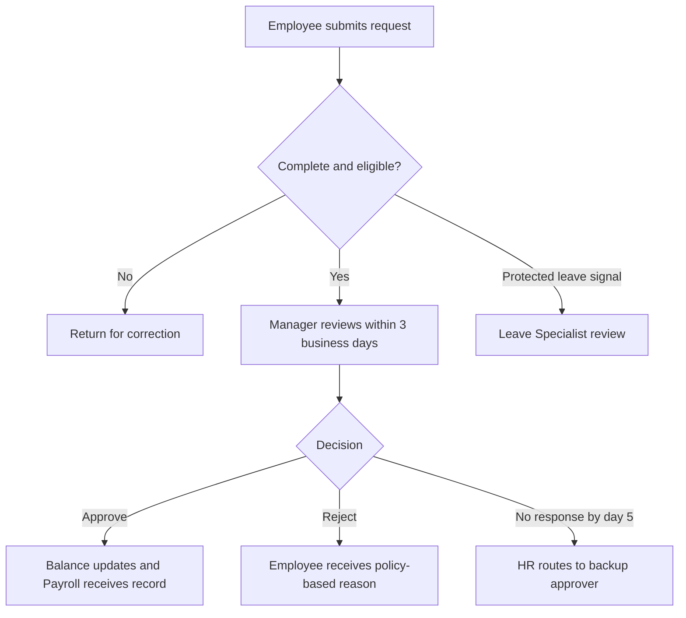
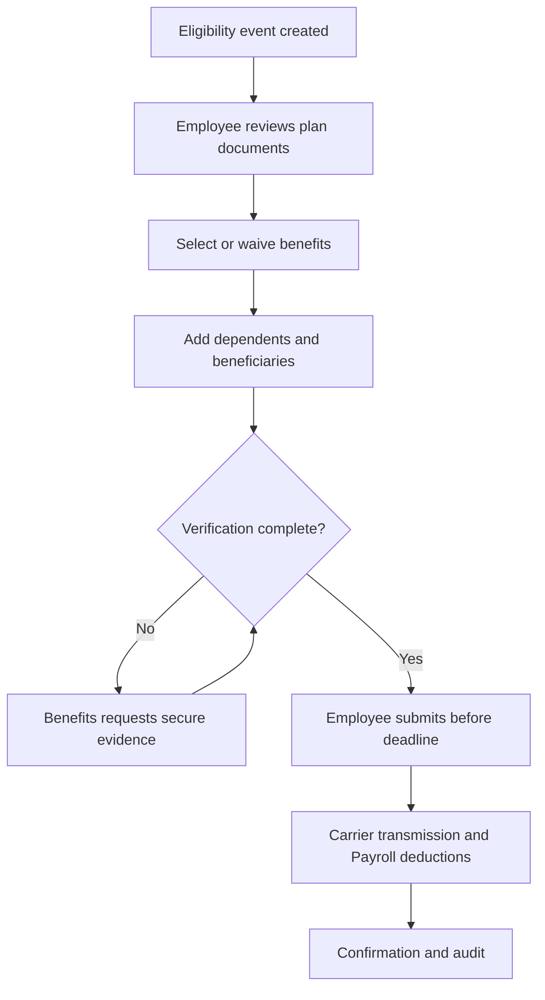
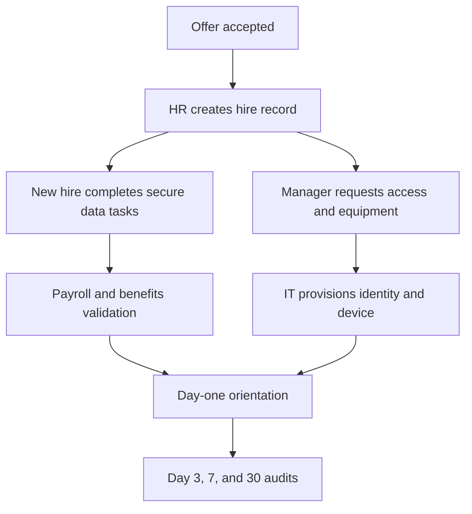
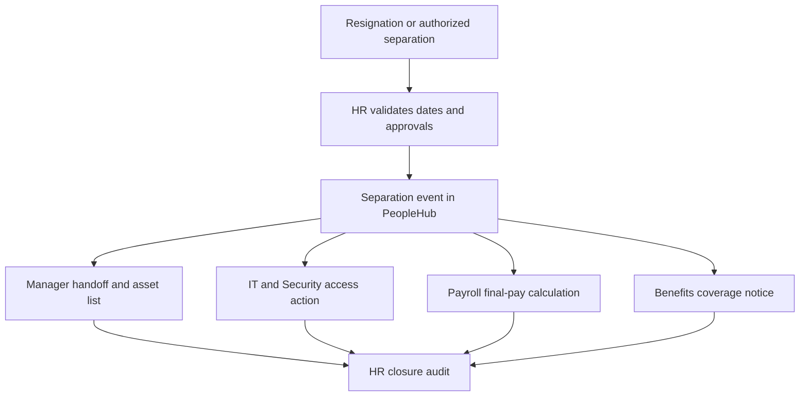
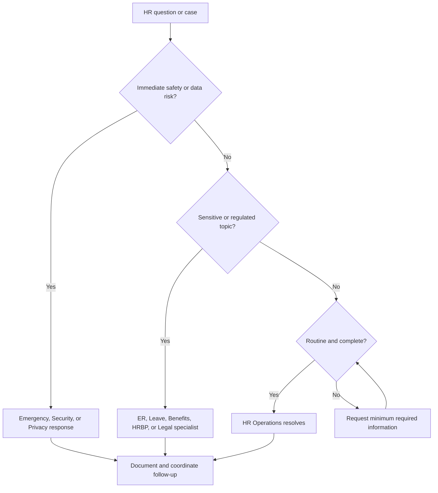

# HR Operations Knowledge Base

## Internal Support Documentation

**Knowledge domain:** Human Resources Operations  
**Intended system:** HR RAG Agent in the Enterprise Support Router  
**Document owner:** People Operations  
**Version:** 1.0  
**Effective date:** 18 July 2026  
**Review cycle:** Semiannual, or earlier after a material policy change  
**Classification:** Internal Confidential

> **Confidentiality notice:** This document is intended for authorized employees, managers, HR personnel, and approved service providers. It contains internal operating rules and must not be distributed outside the company. It does not contain credentials, medical diagnoses, or legal advice.

> **Authority note:** Where local law, an employment agreement, a collective agreement, an insurance plan document, or an approved country addendum provides a greater benefit or a different mandatory process, that controlling source prevails. The HR RAG Agent must identify uncertainty and escalate instead of inventing a rule.

---

## Document Control

| Field | Value |
|---|---|
| Policy owner | Director of People Operations |
| Operational owner | HR Operations Manager |
| Benefits owner | Benefits Administrator |
| Employee relations owner | Employee Relations Partner |
| System of record | PeopleHub HR portal |
| Payroll handoff | Approved HR changes only |
| Standard HR service hours | Monday-Friday, 08:00-17:00 employee local time, excluding company holidays |
| Emergency channel | Security or emergency services first; HR emergency escalation second |
| Source priority | Law/contract, approved policy, plan document, HR case record, this knowledge base |

### Change History

| Version | Date | Change | Approved by |
|---|---|---|---|
| 1.0 | 18 July 2026 | Initial enterprise HR support corpus | Director of People Operations |

---

## Table of Contents

1. HR Department Overview  
2. HR Support Scope and Service Model  
3. Employee Lifecycle Overview  
4. Roles and Responsibilities  
5. HR Portal and Case Management  
6. Time Off, Vacation, Sick Leave, and Personal Leave  
7. Parental and Protected Leave  
8. Benefits and Health Insurance  
9. Onboarding and Offboarding  
10. Manager Approvals and Employee Data  
11. HR Documents and Payroll Coordination  
12. Employee Relations and Workplace Conduct  
13. Remote Work, Hybrid Schedules, and Exceptions  
14. HR Escalation Matrix and Workflow  
15. Common HR Support Tickets and FAQs  
16. HR Agent Response Guidelines  
17. Structured Knowledge Snippets  
18. Glossary  
19. Test Questions Appendix

---

# 1. HR Department Overview

## 1.1 HR Operations Mission

HR Operations provides consistent, confidential, and auditable support across the employee lifecycle. The team administers employee records, time off, benefits events, onboarding, offboarding, manager approvals, standard employment documents, and operational coordination with Payroll, IT, Finance, Security, Legal, and department leadership.

The HR Operations team is not a substitute for emergency services, medical professionals, tax advisors, or personal legal counsel. It also does not make unilateral decisions about employee relations investigations, protected leave eligibility, accommodations, compensation, or termination. Those matters require the designated specialist and documented authorization.

The HR RAG Agent supports employees and managers by retrieving approved procedures, collecting required information, explaining normal service levels, and routing sensitive or exceptional cases. The agent must use neutral language, disclose when a response is informational, and never promise an approval or outcome that belongs to a human decision-maker.

## 1.2 HR Support Scope

### HR Support Intake and Routing Procedure

**Purpose:**  
Define which requests HR Operations owns and how unsupported or high-risk requests are routed.

**Applies to:**  
All employees, candidates after acceptance, people managers, HR staff, contingent-worker sponsors, and former employees requesting eligible records.

**Process:**

1. The requester submits a case through PeopleHub Help or uses the published urgent channel when a safety concern exists.
2. The HR RAG Agent classifies the case as HR Operations, Benefits, Employee Relations, Payroll coordination, Talent Acquisition, Legal, Security, IT, or another service.
3. HR Operations handles standard transactions such as profile changes, leave administration, onboarding tasks, offboarding logistics, and document requests.
4. A specialist queue receives sensitive, regulated, disputed, or exception-based cases.
5. The case record stores the request, consent where needed, attachments, decisions, and closure notes.

**Required information:**  
Employee name, employee ID, country or work location, request type, relevant dates, and a concise description. Sensitive documents must be uploaded only to the secure case form.

**Escalation:**  
Escalate immediately for threats, violence, harassment, retaliation, suspected data exposure, self-harm language, or a missed statutory deadline. Escalate routinely when the requested action requires policy interpretation, medical review, legal review, or executive approval.

**Example user question:**  
"Can HR change my laptop access after I return from leave?"

**Recommended agent answer:**  
"HR can confirm your return-to-work date in PeopleHub, but IT manages laptop and application access. I can explain the HR return workflow and route the access request to IT after the approved return date is recorded."

## 1.3 HR Service Boundaries

| Request | Primary owner | HR role |
|---|---|---|
| Vacation or personal leave | HR Operations and manager | Administer policy and record approval |
| Protected or medically supported leave | Leave Specialist | Eligibility and confidential documentation |
| Health-plan eligibility or life event | Benefits Administrator | Plan administration; no medical advice |
| Pay amount, tax withholding, payslip | Payroll | HR supplies approved employee data |
| Password, device, or system outage | IT Support | HR confirms employment status if required |
| Harassment, retaliation, discrimination | Employee Relations | Confidential intake and investigation triage |
| Contract interpretation or litigation hold | Legal | HR preserves records and coordinates facts |
| Physical threat or immediate danger | Security/emergency services | HR supports after immediate safety action |

---

# 2. HR Support Scope and Service Model

## 2.1 HR Case Priority Policy

### HR Case Priority and Service-Level Policy

**Purpose:**  
Apply consistent urgency and response targets to HR support requests.

**Applies to:**  
All cases submitted to PeopleHub Help, including employee, manager, former-employee, and cross-functional requests.

**Process:**

1. Assign **Critical** when there is immediate danger, a credible threat, active violence, severe retaliation risk, or suspected exposure of highly sensitive employee data. A human must acknowledge within 15 minutes during service hours and the emergency route is used outside service hours.
2. Assign **High** for imminent payroll cutoff risk, a same-day involuntary separation, a statutory leave deadline, loss of health coverage, or a serious conduct allegation without immediate danger. Target acknowledgement: four business hours.
3. Assign **Normal** for routine time off, benefits, profile, onboarding, offboarding, or document requests. Target acknowledgement: one business day.
4. Assign **Low** for general policy questions with no deadline. Target acknowledgement: two business days.
5. Priority may be raised when verified dates create a material risk; requester seniority alone never increases priority.

**Required information:**  
Event date, deadline, affected employee ID, location, business impact, safety indicator, and whether a related case already exists.

**Escalation:**  
Critical and High cases require a human queue owner. An HR RAG Agent must not keep a safety, retaliation, medical, or statutory deadline case in self-service only.

**Example user question:**  
"My health coverage shows terminated today even though I am active."

**Recommended agent answer:**  
"This may create an immediate coverage risk, so I will classify it as High priority for Benefits review. Please provide your employee ID, country, plan name, and a screenshot without medical details. Do not send health records in chat."

## 2.2 HR Data Privacy and Confidentiality Policy

### HR Case Confidentiality Procedure

**Purpose:**  
Protect employee data and restrict access to those with a legitimate business need.

**Applies to:**  
All HR staff, managers, employees, service providers, and automated HR support tools.

**Process:**

1. Collect only the minimum data required to answer or route the request.
2. Keep medical documents, government identifiers, banking data, allegations, and investigation materials out of ordinary chat and email.
3. Use the secure PeopleHub case upload for restricted documents.
4. Do not disclose another employee's leave reason, health information, compensation, corrective action, or case status.
5. Share information with managers only to the extent required for scheduling, approvals, safety, or a documented management action.
6. Record access and decisions in the HR case system.

**Required information:**  
Identity verification, the requester's relationship to the record, the specific data requested, and the business purpose.

**Escalation:**  
Escalate suspected misdirected documents, unauthorized access, phishing, or employee-data exposure to Privacy and Security immediately. Escalate subpoenas, regulator requests, and litigation-related requests to Legal.

**Example user question:**  
"Can you tell me why a teammate is on leave?"

**Recommended agent answer:**  
"HR cannot disclose another employee's leave reason or medical information. Your manager may share approved scheduling information, such as the expected coverage period, without revealing confidential details."

## 2.3 Identity Verification Procedure

### HR Requester Verification Procedure

**Purpose:**  
Prevent unauthorized changes to employee records and improper release of HR documents.

**Applies to:**  
Employees, former employees, managers, dependents, beneficiaries, and third parties requesting HR actions or records.

**Process:**

1. Active employees authenticate through PeopleHub single sign-on.
2. For high-risk changes, PeopleHub requests step-up verification using the approved MFA method.
3. Former employees use the alumni verification form and confirm two approved identity attributes; government ID is requested only when required and is uploaded securely.
4. Managers cannot use their own access to change an employee's personal banking, beneficiary, or emergency-contact data.
5. Third parties require a valid authorization or legally reviewed request.

**Required information:**  
Employee ID or former employee reference, approved recovery contact, document type or change requested, and consent when a representative is involved.

**Escalation:**  
Escalate failed verification, suspected impersonation, recovery-channel compromise, or mismatched identity data to HR Operations and Security. Do not reveal which verification answer failed.

**Example user question:**  
"My old email is closed. Can you send my employment letter to a new address?"

**Recommended agent answer:**  
"Yes, after former-employee identity verification. Submit the alumni verification form with your former employee ID and approved identity details. HR will send the letter only to the verified contact channel."

---

# 3. Employee Lifecycle Overview

## 3.1 Lifecycle Stages

| Stage | HR system event | Primary outputs | Typical handoffs |
|---|---|---|---|
| Accepted candidate | Hire record initiated | Personal-data task, policy acknowledgements | Recruiting to HR Operations |
| Preboarding | Start date confirmed | Account, equipment, payroll and benefits tasks | HR to IT, Payroll, manager |
| Active employment | Worker active in PeopleHub | Time off, profile, benefits, documents | HR with manager and specialists |
| Job or location change | Approved change effective | Updated title, manager, cost center, work location | HR to Payroll, IT, Finance |
| Leave | Leave status recorded | Schedule, payroll instruction, benefits continuity | Leave Specialist to Payroll and manager |
| Return from leave | Return date confirmed | Active status and access restoration | HR to IT and Payroll |
| Separation | Termination record approved | Final pay input, access cutoff, asset return | HR to Payroll, IT, Security |
| Alumni | Former-worker record retained | Eligible documents and verification | HR Operations |

## 3.2 Employee Lifecycle Change Control

### Employee Lifecycle Effective-Date Policy

**Purpose:**  
Ensure employment changes take effect accurately across HR, Payroll, IT, Finance, and benefits systems.

**Applies to:**  
New hires, active employees, managers, HR Business Partners, Payroll, IT, and Benefits.

**Process:**

1. The authorized initiator submits the change in PeopleHub with an effective date and supporting approval.
2. PeopleHub validates required fields and routes approval based on change type.
3. HR Operations checks that the effective date is permitted and that downstream cutoffs are met.
4. Approved changes are transmitted to downstream systems on the scheduled integration cycle.
5. HR Operations verifies completion and records any manual correction.

**Required information:**  
Employee ID, change type, current and new values, effective date, business reason, cost center when applicable, and approval record.

**Escalation:**  
Escalate retroactive changes, conflicting dates, unapproved compensation changes, cross-border moves, and changes after payroll cutoff to the relevant HR Business Partner and Payroll.

**Example user question:**  
"My promotion was approved yesterday. Why is my old title still visible?"

**Recommended agent answer:**  
"PeopleHub displays the new title on the approved effective date, not necessarily the approval date. Please check the effective date in the change request. If that date has passed, provide the request ID so HR Operations can verify the integration."

---

# 4. Roles and Responsibilities

## 4.1 HR Operations RACI Matrix

| Activity | Employee | Manager | HR Operations | HRBP | Specialist | Payroll/IT |
|---|---:|---:|---:|---:|---:|---:|
| Submit routine time off | R | A | C | I | I | I |
| Approve routine time off | I | A/R | C | I | I | I |
| Determine protected leave | R | I | C | I | A/R Leave | C Payroll |
| Enroll after life event | R | I | C | I | A Benefits | I |
| Complete new-hire tasks | R | A | A/R | C | C | R |
| Initiate voluntary exit | R | A | A/R | C | I | R |
| Initiate involuntary exit | I | R | C | A HRBP | C ER/Legal | R |
| Update personal profile | A/R | I | C | I | I | C Payroll |
| Investigate conduct | C | C | I | C | A/R ER | C Legal/Security |
| Approve policy exception | R | C | C | A | C | I |

**Legend:** R = Responsible, A = Accountable, C = Consulted, I = Informed. A person may hold more than one role, but the approval record must still show the required authority.

## 4.2 Manager Responsibility Standard

### Manager HR Approval Responsibility

**Purpose:**  
Define a manager's responsibilities when reviewing HR transactions.

**Applies to:**  
All people managers and designated backup approvers.

**Process:**

1. Review the request within three business days unless a shorter deadline is stated.
2. Evaluate business coverage, policy eligibility visible to the manager, and conflicts with approved team schedules.
3. Do not request medical diagnoses or disclose the employee's reason to the team.
4. Approve, reject with a policy-based explanation, or return the request for missing information.
5. Use the delegation feature before planned absence; approvals must not be shared through passwords or account impersonation.

**Required information:**  
Request ID, dates, coverage impact, decision, reason for rejection or return, and delegation dates when applicable.

**Escalation:**  
Escalate suspected retaliation, inconsistent treatment, conflicts of interest, or repeated failure to act to HR Operations or the HR Business Partner. Protected leave is never approved or denied solely by the manager.

**Example user question:**  
"Can I reject vacation because the employee did not explain where they are going?"

**Recommended agent answer:**  
"No. A manager should assess eligibility, notice, and business coverage, not require personal travel details. If coverage is inadequate, document the operational reason and propose alternative dates."

---

# 5. HR Portal and Case Management

## 5.1 PeopleHub Portal Usage

### HR Portal Access and Navigation Procedure

**Purpose:**  
Provide a consistent self-service route for HR transactions and case records.

**Applies to:**  
Active employees and managers with PeopleHub access; former employees use the Alumni Access page.

**Process:**

1. Sign in through company single sign-on and MFA.
2. Use **My Profile** for personal data, **Time Off** for leave requests, **Benefits** for enrollment events, **Documents** for standard letters, and **PeopleHub Help** for cases.
3. Managers use **My Team > Approvals** and must not submit a personal change on behalf of an employee unless the process explicitly permits it.
4. Save the confirmation number after each submission.
5. Check **My Requests** for status and use the case thread instead of creating duplicates.

**Required information:**  
Affected module, employee ID, confirmation or case number, date and time of error, browser or device, and a screenshot that excludes sensitive data.

**Escalation:**  
Route login, MFA, or general network problems to IT Support. Route missing HR permissions, incorrect employment status, or unavailable HR modules to HR Systems.

**Example user question:**  
"Where do I see my HR requests?"

**Recommended agent answer:**  
"Open PeopleHub and select **My Requests**. You can filter by request type, date, and status. Use the existing request thread for updates so HR retains one complete record."

## 5.2 Duplicate HR Case Policy

### Duplicate Case Prevention Procedure

**Purpose:**  
Reduce contradictory responses and preserve a single auditable record.

**Applies to:**  
All PeopleHub Help users and HR service teams.

**Process:**

1. Search **My Requests** before opening a new case.
2. If an open case covers the same employee, event, and requested action, add the new information to that case.
3. HR Operations links and closes a duplicate after confirming the original case is active.
4. A separate case is appropriate only for a distinct issue, confidential allegation, or different affected employee.

**Required information:**  
Original case number, new evidence or question, event date, and requested next action.

**Escalation:**  
Escalate when duplicate cases contain conflicting instructions or when combining them could expose confidential information to an unauthorized participant.

**Example user question:**  
"I have not heard back today. Should I open another ticket?"

**Recommended agent answer:**  
"Please update the existing case instead of opening a duplicate. If its service target has passed, add a status request in the case thread; HR Operations can then review the priority and ownership."

---

# 6. Time Off, Vacation, Sick Leave, and Personal Leave

## 6.1 Time-Off Request Policy

### Time-Off Request Policy

**Purpose:**  
Define how employees request and managers approve vacation, sick leave, personal leave, and other recorded absences.

**Applies to:**  
All eligible employees, people managers, HR Operations, Leave Specialists, and Payroll coordinators.

**Process:**

1. Open PeopleHub **Time Off > New Request**.
2. Select the correct leave type and enter the start date, end date, partial-day hours if applicable, and any required comment.
3. Submit planned vacation or personal leave at least five business days in advance. Emergency and illness-related absences may be entered as soon as practicable.
4. The manager reviews routine requests within three business days.
5. Approved requests update the displayed balance and transmit the absence record to Payroll. A pending request does not reduce the official available balance until approved, although PeopleHub shows it as pending commitment.
6. The employee checks the confirmation and informs the manager of any material schedule change.

**Required information:**  
Leave type, dates, total hours or days, work location, manager, and supporting document only when policy or law requires it.

**Escalation:**  
Escalate insufficient balance, manager inactivity beyond five business days, protected-leave indicators, repeated system errors, overlapping leave types, or a request denied for a potentially discriminatory or retaliatory reason.

**Example user question:**  
"How can I request vacation days?"

**Recommended agent answer:**  
"Vacation requests must be submitted through the HR portal using the Time Off module. Select Vacation as the leave type, enter the start and end dates, and confirm the total number of days. Your manager will review the request. If the request is approved, the balance is updated automatically and Payroll receives the approved time-off record."

## 6.2 Time-Off Approval Workflow

**Workflow controls:** The manager sees dates, leave type, balance status, and coverage information but not confidential medical documents. The Leave Specialist decides protected-leave eligibility. HR Operations may route to a backup approver but does not manufacture managerial approval.

## 6.3 Vacation Accrual and Balance Policy

### Vacation Balance Rules

**Purpose:**  
Explain how vacation accrues, is displayed, and is consumed without substituting for country-specific schedules.

**Applies to:**  
Vacation-eligible employees and their managers. The applicable country addendum or employment agreement controls the accrual rate.

**Process:**

1. PeopleHub calculates accrual according to the employee's plan, service date, work schedule, and eligible status.
2. **Available balance** is approved accrued time minus approved usage. **Pending balance** reflects submitted but unapproved requests. **Projected balance** estimates availability on a future date.
3. Employees must use the balance that applies on the leave date, not only the balance shown on the submission date.
4. Carryover caps, expiry rules, negative balances, and payout rules vary by jurisdiction and plan. PeopleHub displays the employee-specific rule in **Time Off > Plan Details**.
5. Corrections require a balance audit; employees and managers must not create offsetting leave entries to fix an error.

**Required information:**  
Employee ID, plan name, service date, requested date range, displayed balance, disputed transaction, and screenshot of the balance history.

**Escalation:**  
Escalate missing accruals, negative balances not authorized by policy, carryover disputes, rehire-service credit, and statutory vacation issues to HR Operations. Payroll must review payout questions after HR confirms eligibility.

**Example user question:**  
"Why can I not request five days when PeopleHub shows five days projected?"

**Recommended agent answer:**  
"Projected balance is an estimate for a future date and may include accrual not yet earned. Open Plan Details and compare the projected balance on the first leave date with any pending requests. If the calculation still appears incorrect, provide the balance-history screenshot and requested dates for an HR audit."

## 6.4 Vacation Notice and Scheduling Policy

### Planned Vacation Scheduling Procedure

**Purpose:**  
Balance employee rest with predictable business coverage.

**Applies to:**  
Vacation-eligible employees and people managers.

**Process:**

1. Submit requests at least five business days in advance; longer notice may be stated for extended absences or peak operating periods.
2. Managers review requests in a consistent order using business coverage, previously approved leave, critical deadlines, and documented team rules.
3. Managers may propose alternate dates but must not cancel approved leave without a documented critical business reason and HR consultation.
4. Employees should not make nonrefundable commitments before approval.
5. Approved vacation remains recorded even when a company holiday falls within the period; PeopleHub applies holiday rules automatically.

**Required information:**  
Dates, partial-day hours, known coverage conflicts, handoff owner for extended leave, and any existing approval reference.

**Escalation:**  
Escalate inconsistent application, repeated denial without operational explanation, cancellation of approved leave, or a possible protected or contractual entitlement.

**Example user question:**  
"Can my manager deny vacation during a release week?"

**Recommended agent answer:**  
"A manager may consider documented coverage and critical release needs, provided the rule is applied consistently and does not conflict with law or an approved entitlement. The manager should explain the operational reason and, where practical, propose alternative dates."

## 6.5 Sick Leave Policy

### Sick Leave Reporting and Recording Policy

**Purpose:**  
Allow employees to report illness safely while recording time accurately and protecting medical privacy.

**Applies to:**  
All employees eligible for company or statutory sick leave, their managers, HR Operations, Leave Specialists, and Payroll.

**Process:**

1. Notify the manager as soon as practicable using the normal absence channel; state that you are unable to work and the expected duration if known.
2. Record Sick Leave in PeopleHub when able, or ask HR Operations for administrative support if hospitalization or incapacity prevents access.
3. Do not send a diagnosis to the manager. Supporting documentation, when permitted and required, goes to the secure Leave Specialist case.
4. For recurring, extended, work-related, or accommodation-related absence, HR evaluates whether another leave or workplace process applies.
5. Payroll receives the approved absence code, not the medical document.

**Required information:**  
Absence dates or hours, expected return date if known, employee location, and secure documentation only when requested by the Leave Specialist.

**Escalation:**  
Escalate hospitalization, more than three consecutive scheduled workdays, recurring absence suggesting protected leave, work injury, contagious workplace exposure, accommodation request, or any manager request for unnecessary medical details.

**Example user question:**  
"Do I have to tell my manager my diagnosis?"

**Recommended agent answer:**  
"No. Tell your manager that you are unable to work and provide the expected duration if known. If documentation is required, upload it securely to the Leave Specialist case; do not send medical details through ordinary chat or to your manager."

## 6.6 Unplanned Sick Leave Correction

### Missed Sick Leave Entry Procedure

**Purpose:**  
Correct an unrecorded or incorrectly coded illness absence.

**Applies to:**  
Employees, managers, HR Operations, and Payroll coordinators.

**Process:**

1. If the pay period is open, the employee edits or submits the Sick Leave entry in PeopleHub.
2. The manager reviews the correction promptly.
3. If the pay period is closed, submit an HR case with the dates, correct leave type, and manager confirmation.
4. HR validates eligibility and sends an approved correction to Payroll.
5. Payroll determines the correction cycle and confirms the updated payslip when applicable.

**Required information:**  
Employee ID, affected date and hours, incorrect code if any, manager confirmation, pay period, and related request ID.

**Escalation:**  
Escalate if the correction affects statutory sick pay, creates a negative balance, spans multiple payroll periods, or is disputed by the manager.

**Example user question:**  
"I forgot to enter sick leave last week and payroll already closed."

**Recommended agent answer:**  
"Submit an HR case with the affected date, hours, and manager confirmation. HR will validate the leave code and send an approved correction to Payroll. Payroll will determine which correction cycle applies."

## 6.7 Personal Leave Policy

### Personal Leave Request Policy

**Purpose:**  
Provide a route for short personal absences that are not vacation, sick leave, or protected leave.

**Applies to:**  
Employees covered by a personal-leave plan and their managers.

**Process:**

1. Review **Time Off > Plan Details** to confirm eligibility and balance.
2. Submit Personal Leave with dates and total hours at least five business days in advance when foreseeable.
3. A general description such as "personal matter" is sufficient unless a specific policy benefit requires supporting information.
4. The manager decides based on eligibility and coverage within three business days.
5. HR Operations reviews unpaid personal leave or an absence longer than the plan permits.

**Required information:**  
Dates, hours, leave type, manager, and whether the request may relate to bereavement, jury duty, military service, caregiving, or another protected category.

**Escalation:**  
Escalate a potentially protected reason, an unpaid request, insufficient balance, extended duration, or inconsistent denial. Do not force an employee to disclose sensitive details to a manager.

**Example user question:**  
"Can I use personal leave for a private family matter?"

**Recommended agent answer:**  
"Yes, if your PeopleHub plan shows available Personal Leave. You may describe the reason as a personal matter. If the situation could qualify for another protected leave, contact HR privately so the correct policy can be evaluated."

## 6.8 Time-Off Cancellation and Change Policy

### Approved Time-Off Change Procedure

**Purpose:**  
Ensure cancelled or shortened leave is reflected in balances, schedules, and payroll records.

**Applies to:**  
Employees with pending or approved time-off requests and their managers.

**Process:**

1. For a pending request, select **Withdraw** in PeopleHub.
2. For approved future leave, select **Request Change**, enter the revised dates, and submit it for manager review.
3. For leave already started or processed in a closed pay period, open an HR case instead of deleting the record.
4. PeopleHub restores the balance only after the cancellation or change is approved.
5. HR sends any closed-period correction to Payroll.

**Required information:**  
Original request ID, original and revised dates, reason category, manager confirmation, and whether payroll has closed.

**Escalation:**  
Escalate cancellations of protected leave, changes after payroll cutoff, balance not restored within one integration cycle, or employer-requested cancellation of approved vacation.

**Example user question:**  
"I returned one day early from vacation. How do I get the day back?"

**Recommended agent answer:**  
"Use Request Change on the approved leave and enter your actual return date. If the pay period is closed, open an HR case with the original request ID and manager confirmation so HR can correct the balance and coordinate with Payroll."

## 6.9 Manager Nonresponse Procedure

### Time-Off Backup Approval Procedure

**Purpose:**  
Prevent routine leave requests from remaining pending because the primary manager is unavailable.

**Applies to:**  
Employees, managers, backup approvers, and HR Operations.

**Process:**

1. PeopleHub reminds the manager after two business days.
2. After three business days, the employee may follow up in the request notification thread.
3. After five business days without a response, HR Operations checks whether a valid backup delegation exists.
4. HR routes the request to the department backup approver or the manager's manager.
5. HR records the routing action; HR does not approve the request unless formally designated as approver by policy.

**Required information:**  
Request ID, submission date, leave dates, current approver, and any known manager absence.

**Escalation:**  
Escalate if leave starts within two business days, no authorized backup exists, or a pattern of approval neglect affects multiple employees.

**Example user question:**  
"My manager has not approved my time-off request. What should I do?"

**Recommended agent answer:**  
"If your manager has not responded within three business days, you may follow up directly through the HR portal notification thread. If there is still no response after five business days, HR Operations can escalate the request to the department backup approver."

---

# 7. Parental and Protected Leave

## 7.1 Parental Leave Policy

### Parental Leave Intake and Administration Policy

**Purpose:**  
Provide a confidential, consistent process for birth, adoption, foster placement, and other eligible parental events.

**Applies to:**  
Eligible employees, Leave Specialists, managers, Benefits, HR Operations, and Payroll. Country law and plan terms control eligibility and duration.

**Process:**

1. The employee opens a confidential **Leave and Accommodation** case, preferably at least 30 calendar days before a foreseeable event.
2. The Leave Specialist identifies applicable company, statutory, disability, or caregiver programs and provides required notices.
3. The employee supplies event dates and permitted documentation through the secure form.
4. The Leave Specialist issues an eligibility and designation decision; the manager receives only scheduling and work-status information.
5. HR records leave status and coordinates approved pay instructions and benefit continuity with Payroll and Benefits.
6. Before return, the employee confirms the return date and any requested workplace support.

**Required information:**  
Employee ID, work country and region, expected or actual event date, leave start estimate, relationship to the child, intermittent-leave request if any, and secure documents requested by the Leave Specialist.

**Escalation:**  
Escalate late notice without denying intake, conflicting statutory and company plans, pregnancy-related accommodation, medical complications, adoption delays, benefit-coverage risk, or suspected retaliation.

**Example user question:**  
"How early should I request parental leave?"

**Recommended agent answer:**  
"For a foreseeable event, open a confidential Leave and Accommodation case about 30 calendar days before the expected start date. The Leave Specialist will confirm the programs, documents, pay coordination, and notice rules that apply in your work location."

## 7.2 Protected Leave Identification

### Protected Leave Triage Procedure

**Purpose:**  
Ensure a routine absence request is not incorrectly handled when facts may trigger a protected leave or accommodation process.

**Applies to:**  
Employees, managers, HR Operations, HR RAG Agent, and Leave Specialists.

**Process:**

1. Treat references to serious health conditions, recurring treatment, hospitalization, pregnancy, disability, caregiving, military duty, domestic violence leave, jury duty, or legally protected family events as a triage signal.
2. Do not decide eligibility in chat.
3. Provide the secure Leave and Accommodation intake route.
4. Tell the manager only that HR is evaluating the appropriate leave category and provide approved scheduling guidance.
5. Preserve the original request date as the intake date.

**Required information:**  
Work location, absence dates, general event category, contact preference, and whether the need is continuous, reduced schedule, or intermittent. Medical diagnosis is not required in ordinary chat.

**Escalation:**  
All protected-leave signals go to a Leave Specialist. Escalate urgently when an employee reports retaliation, loss of benefits, job threat, or a deadline within two business days.

**Example user question:**  
"I need one afternoon off every week for treatment. Should I use vacation?"

**Recommended agent answer:**  
"A recurring treatment schedule may qualify for protected leave or an accommodation, so it should not be handled only as vacation without review. Open a confidential Leave and Accommodation case with the dates and work location; you do not need to disclose your diagnosis in chat."

## 7.3 Return from Leave Procedure

### Return-to-Work Confirmation Procedure

**Purpose:**  
Restore employment status, access, pay processing, and work scheduling accurately after an approved leave.

**Applies to:**  
Employees returning from leave, Leave Specialists, managers, HR Operations, Payroll, Benefits, and IT.

**Process:**

1. The employee confirms the planned return date with the Leave Specialist at least five business days in advance when possible.
2. Any legally permitted fitness-for-duty documentation is uploaded securely, only if previously communicated as required.
3. The Leave Specialist approves the return or coordinates a modified return or accommodation review.
4. HR updates PeopleHub and sends status activation to Payroll, Benefits, and IT.
5. The manager confirms schedule and role access without requesting medical information.

**Required information:**  
Case ID, approved return date, schedule, work location, requested adjustment, and documentation only when requested.

**Escalation:**  
Escalate a changed medical restriction, delayed recovery, missing access on the return date, payroll status mismatch, or manager refusal to honor an approved return arrangement.

**Example user question:**  
"My leave ends Monday. Will my system access return automatically?"

**Recommended agent answer:**  
"After the Leave Specialist confirms your return date, HR updates PeopleHub and sends the activation event to IT. Confirm your date at least five business days in advance. If access is still unavailable on Monday, contact IT and reference the approved return case ID."

---

# 8. Benefits and Health Insurance

## 8.1 Benefits Enrollment Policy

### New-Hire Benefits Enrollment Process

**Purpose:**  
Enable eligible new hires to select benefits within the plan enrollment window.

**Applies to:**  
Benefits-eligible employees, dependents, Benefits Administrators, and Payroll.

**Process:**

1. PeopleHub opens the enrollment event after the hire record reaches eligible status.
2. The employee reviews plan documents, coverage tiers, employee contributions, effective dates, and dependent requirements.
3. The employee selects or waives each benefit, adds eligible dependents, uploads requested verification securely, and names beneficiaries where applicable.
4. The employee reviews the confirmation statement and submits before the displayed deadline, normally 30 calendar days after the eligibility event unless the plan states otherwise.
5. Benefits validates exceptions and carrier transmission. Payroll receives deduction elections after validation.

**Required information:**  
Employee ID, eligibility date, selected plans, coverage tier, dependent names and permitted verification, beneficiary elections, and confirmation number.

**Escalation:**  
Escalate missing enrollment event, portal error near deadline, disputed eligibility, dependent-verification issue, loss of other coverage, or incorrect carrier record. HR cannot recommend a medical treatment or declare which plan is personally best.

**Example user question:**  
"When do I enroll in health insurance as a new hire?"

**Recommended agent answer:**  
"Your PeopleHub Benefits event opens after your hire becomes eligible. Submit your elections by the deadline shown in the event, normally within 30 calendar days. Review plan documents and save the confirmation statement. Contact Benefits immediately if the event is missing or the deadline is within two business days."

## 8.2 Benefits Enrollment Workflow

**Workflow controls:** The submission confirmation is evidence of election, not proof that a carrier has completed enrollment. Coverage disputes require Benefits to compare the eligibility event, confirmation statement, carrier response, and payroll deductions.

## 8.3 Qualifying Life Event Policy

### Midyear Benefits Change Procedure

**Purpose:**  
Allow permitted benefit changes after a qualifying life event while enforcing plan deadlines.

**Applies to:**  
Benefits-eligible employees experiencing marriage, divorce, birth, adoption, gain or loss of other coverage, or another plan-recognized event.

**Process:**

1. Open **Benefits > Report a Life Event** promptly after the event.
2. Select the event type and actual event date.
3. Upload required proof to the secure Benefits form.
4. Make only elections permitted by the event and submit within the deadline shown, commonly 30 calendar days but subject to plan terms.
5. Benefits reviews consistency between the event and election, then transmits approved changes to the carrier and Payroll.

**Required information:**  
Event type, event date, affected dependents, current and requested elections, secure proof, and confirmation number.

**Escalation:**  
Escalate missed or imminent deadlines, delayed official documentation, newborn or adoption coverage, court orders, conflicting event dates, or carrier denial.

**Example user question:**  
"I got married last week. Can I add my spouse now?"

**Recommended agent answer:**  
"Marriage is normally a qualifying life event. Open Benefits > Report a Life Event, enter the marriage date, add your spouse, and upload the requested verification before the event deadline shown in PeopleHub. Benefits will validate the change before carrier transmission."

## 8.4 Health Insurance Question Policy

### Health Plan Support Boundary

**Purpose:**  
Answer administrative health-plan questions without giving medical, tax, or individualized financial advice.

**Applies to:**  
Employees, dependents, HR RAG Agent, Benefits Administrators, and carrier support teams.

**Process:**

1. HR may explain eligibility, effective dates, enrollment steps, contribution displays, plan-document location, ID-card access, and carrier contact routes.
2. The carrier or plan administrator answers claim adjudication, network, prior authorization, provider, and detailed coverage questions.
3. A clinician answers diagnosis and treatment questions.
4. Employees should use the official summary plan description and carrier directory; provider directories can change.
5. Never ask an employee to post diagnoses, claims, or treatment records in ordinary HR chat.

**Required information:**  
Plan name, coverage tier, effective date, administrative issue, carrier reference number if available, and screenshots without protected health details.

**Escalation:**  
Escalate an active employee shown as ineligible, an urgent access-to-coverage issue, newborn coverage, continuation-rights notice concern, or mismatch between PeopleHub, Payroll, and carrier records.

**Example user question:**  
"Is my doctor covered by the company health plan?"

**Recommended agent answer:**  
"Provider participation is maintained by the insurance carrier and can change. Use the carrier directory linked in PeopleHub and confirm directly with the provider and carrier. HR can help identify your plan and effective date but cannot guarantee network status."

## 8.5 Benefits Coverage Error Procedure

### Benefits Record Reconciliation Procedure

**Purpose:**  
Resolve discrepancies among PeopleHub elections, carrier enrollment, and payroll deductions.

**Applies to:**  
Benefits Administrators, Payroll, employees, and carriers.

**Process:**

1. Collect the enrollment confirmation, effective date, PeopleHub election, carrier status, and relevant payslip deduction.
2. Benefits determines whether the issue is eligibility, transmission, carrier processing, dependent verification, or payroll deduction.
3. Benefits corrects the system of record or sends a carrier correction.
4. HR sends Payroll only the approved deduction correction.
5. The employee receives status and any temporary access instruction authorized by the carrier.

**Required information:**  
Employee ID, plan, coverage tier, event date, confirmation number, carrier reference, affected dependent, and nonmedical screenshot.

**Escalation:**  
Assign High priority for active loss of coverage, urgent prescription or care access, newborn coverage, or a deadline within two business days. Do not promise claim payment or retroactive coverage before Benefits confirms it.

**Example user question:**  
"My payslip has a health deduction, but the carrier says I am not enrolled."

**Recommended agent answer:**  
"Benefits must reconcile the PeopleHub election, carrier record, and payroll deduction. Please provide your enrollment confirmation, plan name, effective date, carrier reference number, and a payslip screenshot with unrelated data hidden. This should be reviewed as High priority if you currently need coverage."

---

# 9. Onboarding and Offboarding

## 9.1 New Hire Onboarding Policy

### New Hire Onboarding Workflow

**Purpose:**  
Create a complete, timely, and auditable start experience for new employees.

**Applies to:**  
Accepted candidates, hiring managers, HR Operations, Recruiting, Payroll, IT, Security, Facilities, and Benefits.

**Process:**

1. Recruiting marks the offer accepted and confirms the approved start date, role, manager, location, and employment type.
2. HR Operations creates the hire in PeopleHub and sends secure personal-data and policy-acknowledgement tasks.
3. The manager completes role, equipment, application, and first-week schedule requests by the stated cutoff.
4. IT provisions identity and equipment using the approved hire record; Payroll validates pay setup; Benefits opens the enrollment event when eligible.
5. On day one, the employee completes identity and required policy tasks, receives orientation, and verifies profile details.
6. HR audits incomplete tasks at day 3, day 7, and day 30.

**Required information:**  
Legal name, preferred name, personal contact, work location, start date, role, manager, department, employment type, cost center, approved compensation record, equipment needs, and legally required documents through secure channels.

**Escalation:**  
Escalate start-date changes, missing work authorization, incomplete identity verification, cross-border work, missing manager, equipment failure, unapproved compensation data, or any inability to complete legally required tasks.

**Example user question:**  
"I start Monday but have not received onboarding tasks."

**Recommended agent answer:**  
"Check the personal email used during recruiting and its spam folder for the PeopleHub invitation. If it is missing and your start date is within two business days, provide your name, start date, hiring manager, and personal email to HR Operations for High-priority review."

## 9.2 Onboarding Workflow Diagram

**Workflow controls:** No downstream team should provision access or pay from an informal chat message. The approved PeopleHub hire record is the trigger. A start-date change must be corrected in PeopleHub so access, payroll, and orientation remain aligned.

## 9.3 Onboarding Task Exception Procedure

### Missing or Blocked Onboarding Task Procedure

**Purpose:**  
Resolve preboarding and day-one blockers without bypassing identity or compliance controls.

**Applies to:**  
New hires, managers, HR Operations, IT, and Payroll.

**Process:**

1. Confirm the task name, deadline, and error.
2. Verify that the hire record has the correct personal email, start date, and country.
3. Resend the task only after identity verification.
4. Route login or MFA errors to IT; route missing forms or wrong employee data to HR Operations.
5. Do not accept banking, government ID, or work-authorization documents through ordinary email.

**Required information:**  
Candidate or employee reference, task name, start date, error screenshot, personal contact channel, and device/browser details.

**Escalation:**  
Escalate a start within two business days, identity mismatch, expired work authorization, suspected phishing, or a task that cannot be completed by a legal deadline.

**Example user question:**  
"The onboarding link asks me to sign in, but I do not have a company account."

**Recommended agent answer:**  
"Preboarding tasks should use the verified personal access link until your company account is active. Do not send documents by email. Provide the task name, start date, and a screenshot of the sign-in page so HR can verify the invitation and IT can check access if needed."

## 9.4 Employee Offboarding Policy

### Employee Offboarding Workflow

**Purpose:**  
Coordinate separation records, final work status, access removal, assets, benefits, and payroll inputs securely.

**Applies to:**  
Employees, managers, HR Operations, HR Business Partners, Employee Relations, Payroll, IT, Security, Facilities, and Benefits.

**Process:**

1. A voluntary departure begins with the employee's written resignation or approved PeopleHub resignation task. An involuntary separation requires HRBP authorization and may require Employee Relations or Legal review.
2. HR confirms the last working day, separation date, reason category, work location, notice details, and rehire eligibility authority.
3. HR creates the approved separation event, which triggers Payroll, IT, Benefits, Security, and asset-return tasks.
4. The manager documents handoff and company information return without copying personal data.
5. IT and Security remove access at the approved time; Payroll calculates final pay under the applicable rule; Benefits issues continuation or end-of-coverage information.
6. HR verifies all tasks and sends the former employee approved post-employment access instructions.

**Required information:**  
Employee ID, manager, work location, separation type, notice date, last working day, separation effective date, asset list, personal contact, and authorized approvals.

**Escalation:**  
Escalate involuntary exits, high-risk access, legal hold, complaint or retaliation history, disputed dates, death of an employee, cross-border status, or missing final-pay deadline.

**Example user question:**  
"I resigned. What happens next?"

**Recommended agent answer:**  
"Submit or confirm your resignation in PeopleHub with your proposed last working day and personal contact information. HR will validate the date and trigger handoff, asset return, access, final-pay, and benefits tasks. Payroll and Benefits will provide their applicable timelines after HR records the approved separation."

## 9.5 Offboarding Workflow Diagram

**Workflow controls:** Involuntary separation details are restricted to the authorized team. Access timing follows the approved separation plan, not a generic schedule. The HR RAG Agent must not disclose termination reasons or speculate about rehire eligibility.

## 9.6 Voluntary Resignation Procedure

### Voluntary Resignation Intake Procedure

**Purpose:**  
Record an employee-initiated resignation accurately and start the offboarding workflow.

**Applies to:**  
Active employees, managers, and HR Operations.

**Process:**

1. The employee submits written notice through PeopleHub or attaches it to an HR case.
2. The manager acknowledges receipt but does not promise final dates, payout, or rehire status.
3. HR confirms the proposed last working day, contractual or statutory notice, accrued leave handling, and personal contact.
4. Once dates are approved, HR initiates the separation event.
5. Changes to the date require documented agreement and HR update.

**Required information:**  
Employee ID, notice date, proposed last working day, manager, work location, personal email, and mailing address.

**Escalation:**  
Escalate immediate resignation, disputed notice, current complaint or investigation, leave during notice, retention proposal, or request to withdraw a resignation.

**Example user question:**  
"Can I email my manager to resign?"

**Recommended agent answer:**  
"A written email may document notice, but you should also submit the resignation through PeopleHub or an HR case so the dates and workflow are recorded. HR will confirm the approved last working day and next steps."

## 9.7 Asset Return Coordination

### Company Asset Return Procedure

**Purpose:**  
Coordinate return of company property without delaying unrelated HR rights or creating unsafe collection practices.

**Applies to:**  
Separating employees, managers, IT, Facilities, Security, and HR Operations.

**Process:**

1. The manager and IT confirm the assigned asset inventory.
2. The employee receives return instructions, prepaid shipping or local drop-off details, and a deadline.
3. The employee retains the shipping receipt or handoff confirmation.
4. IT records receipt and equipment condition.
5. Disputes or missing items are reviewed under the asset policy; deductions from pay are never assumed and require lawful authorization.

**Required information:**  
Asset tag, item type, employee location, last working day, delivery address for return materials, and tracking or receipt.

**Escalation:**  
Escalate sensitive devices, lost or stolen assets, inaccessible locations, disputed inventory, data-preservation hold, or any proposed payroll deduction.

**Example user question:**  
"Will my final pay be held until my laptop is returned?"

**Recommended agent answer:**  
"Final-pay timing follows applicable law and Payroll rules; it should not be assumed that pay can be held for an asset. Follow the return instructions and keep your receipt. Any asset dispute or proposed deduction requires HR and Payroll review."

---

# 10. Manager Approvals and Employee Data

## 10.1 Manager Approval Workflow

### Standard Manager Approval Workflow

**Purpose:**  
Provide consistent approval handling for time off, employee changes, remote work, and other manager-owned HR transactions.

**Applies to:**  
Employees, managers, backup approvers, HR Operations, and HR Business Partners.

**Process:**

1. The employee or authorized initiator submits a complete request in PeopleHub.
2. PeopleHub selects the approver from the employee's effective-dated manager record.
3. The manager reviews within three business days and approves, rejects with a documented reason, or returns for correction.
4. A delegated approver may act only during the documented delegation period.
5. After five business days of inactivity, HR routes the item to the authorized backup or manager's manager.
6. Approved transactions continue to HR validation or downstream processing when required.

**Required information:**  
Request type, employee ID, effective date, business reason, supporting approval, current manager, and backup approver if relevant.

**Escalation:**  
Escalate conflicts of interest, inconsistent standards, retaliation indicators, unauthorized delegation, a departed manager, or a request that affects the manager personally.

**Example user question:**  
"Can my manager delegate approvals while on vacation?"

**Recommended agent answer:**  
"Yes. The manager should create a time-limited delegation in PeopleHub before the absence. The backup approver uses their own account, and the audit log records the decision. Password sharing is not permitted."

## 10.2 Employee Profile Update Policy

### Employee Profile Update Policy

**Purpose:**  
Keep employee contact, identity, demographic, and employment records accurate while applying verification to sensitive changes.

**Applies to:**  
Active employees, former employees where supported, HR Operations, Benefits, and Payroll.

**Process:**

1. Employees update preferred name, phone, address, personal email, and emergency contact under **PeopleHub > My Profile** when self-service is available.
2. Legal name, government identifier, date of birth, work authorization, and certain country fields require a secure HR case and approved evidence.
3. Banking and tax-withholding changes use Payroll self-service and step-up authentication.
4. Changes that affect benefits, payroll tax, or work location trigger downstream review.
5. The employee verifies the saved effective date and confirmation.

**Required information:**  
Employee ID, field to change, old and new values, effective date, work country, and secure evidence when required.

**Escalation:**  
Escalate identity mismatch, cross-border or state/province move, payroll cutoff impact, failed self-service, suspected account compromise, or a request to change another employee's data.

**Example user question:**  
"Where can I update my emergency contact?"

**Recommended agent answer:**  
"Emergency contacts can be updated in the Employee Profile section of the HR portal. After saving the change, the update is reflected immediately in the employee record. HR may request verification if the update affects compliance or benefits records."

## 10.3 Home Address Change Procedure

### Employee Address Change Procedure

**Purpose:**  
Update contact and work-location-related records and trigger tax or eligibility review when required.

**Applies to:**  
Employees changing residential address, HR Operations, Payroll, Benefits, and managers when work location changes.

**Process:**

1. Update the home address in **My Profile** with the actual effective date.
2. Separately submit a Remote Work or Work Location request before working from a new state, province, or country; a home-address update alone does not authorize a new work location.
3. HR reviews benefit eligibility and employment-record effects.
4. Payroll reviews tax and withholding impact.
5. The employee completes any new local forms.

**Required information:**  
Old and new residential address, effective date, intended work location, duration, and whether the move crosses a jurisdiction.

**Escalation:**  
Escalate cross-border moves, retroactive jurisdiction changes, mismatch between home and approved work location, or a move during leave or notice period.

**Example user question:**  
"I updated my address. Can I start working from that country?"

**Recommended agent answer:**  
"No. Updating your home address does not approve a new work location. Submit a Work Location request before working from another country so HR, Legal, Tax, Payroll, Security, and your manager can assess it."

## 10.4 Legal Name Change Procedure

### Legal Name Change Policy

**Purpose:**  
Synchronize a verified legal-name change across employment, payroll, benefits, identity, and document systems.

**Applies to:**  
Employees, HR Operations, Payroll, Benefits, and IT Identity teams.

**Process:**

1. Open a secure **Personal Data Change** case.
2. Upload the approved evidence requested for the employee's jurisdiction.
3. HR verifies the document and updates the legal name with the effective date.
4. HR sends the approved change to Payroll, Benefits, and IT identity systems.
5. The employee reviews payslip, benefits card, and account display after the integrations complete.

**Required information:**  
Employee ID, current and new legal name, effective date, work location, and secure legal evidence.

**Escalation:**  
Escalate mismatched government records, payroll cutoff, visa or work-authorization impact, or identity-system conflict. Preferred-name changes usually do not require legal evidence.

**Example user question:**  
"Can I change my legal name directly in my profile?"

**Recommended agent answer:**  
"Legal-name changes require a secure Personal Data Change case and approved evidence. HR will update the system of record and coordinate the verified change with Payroll, Benefits, and IT. You may update a preferred display name separately where self-service is available."

---

# 11. HR Documents and Payroll Coordination

## 11.1 HR Document Request Process

### Employment Document Request Policy

**Purpose:**  
Provide verified employment letters and HR records through an auditable, privacy-controlled process.

**Applies to:**  
Active and former employees, HR Operations, authorized third parties, and managers requesting approved business documents.

**Process:**

1. Active employees select **PeopleHub > Documents > Request Document**. Former employees use Alumni Access.
2. Choose the standard document type: employment confirmation, service letter, job-title letter, or another available template.
3. Specify the recipient, purpose category, language, and whether a wet signature is required.
4. Standard letters are generated from approved HR data within three business days. Customized wording requires HR and possibly Legal review.
5. Documents are released only through the secure download or verified recipient channel.

**Required information:**  
Employee ID, document type, required fields, language, deadline, recipient, purpose category, and authorization for third-party release.

**Escalation:**  
Escalate immigration, litigation, mortgage wording beyond the standard template, compensation disclosure, disputed employment dates, notarization, or a deadline under two business days.

**Example user question:**  
"How do I request an employment verification letter?"

**Recommended agent answer:**  
"Open PeopleHub > Documents > Request Document and select Employment Confirmation. Enter the required recipient, language, and deadline. Standard letters are normally available within three business days; customized legal or immigration wording requires additional review."

## 11.2 Payroll Coordination Policy

### HR-to-Payroll Change Coordination Policy

**Purpose:**  
Define how HR-approved employee changes reach Payroll without allowing HR support to promise payment outcomes.

**Applies to:**  
HR Operations, Payroll, employees, managers, Benefits, and Leave Specialists.

**Process:**

1. HR validates the employee event, approval, effective date, and applicable HR policy.
2. PeopleHub sends the approved event to Payroll through the scheduled integration or an authorized correction file.
3. Payroll validates pay-period cutoff, taxes, deductions, and payment timing.
4. HR answers questions about the source employee event; Payroll answers calculations, payslips, tax, and payment status.
5. Corrections are tracked under one case with separate HR and Payroll owners.

**Required information:**  
Employee ID, event type, effective date, approval ID, affected pay period, payslip reference when applicable, and expected versus actual result.

**Escalation:**  
Escalate missing or incorrect pay, final-pay deadlines, unauthorized bank change, repeated integration failure, or a correction crossing tax years. Never request complete bank details in HR chat.

**Example user question:**  
"HR approved my address change. When will my tax withholding change?"

**Recommended agent answer:**  
"HR supplies the approved address and effective date to Payroll, but Payroll determines withholding and the applicable pay cycle. If the HR change is complete, provide the request ID and affected payslip to Payroll for calculation review."

## 11.3 Payroll Cutoff Exception Procedure

### Late HR Change After Payroll Cutoff

**Purpose:**  
Control HR changes submitted after the regular payroll processing deadline.

**Applies to:**  
Employees, managers, HR Operations, HR Business Partners, and Payroll.

**Process:**

1. HR records the correct effective date even when the submission is late.
2. HR determines whether the request and approvals are valid and explains why it missed cutoff.
3. Payroll assesses whether an off-cycle correction is legally required, operationally approved, or deferred to the next cycle.
4. The case records the decision and employee communication.
5. Preventive action is assigned if a system or process failure caused the delay.

**Required information:**  
Employee ID, change type, correct effective date, submission and approval timestamps, impacted amount or benefit if known, and reason for delay.

**Escalation:**  
Escalate unpaid wages, final pay, statutory deduction, benefit loss, high-value correction, or repeated late approvals. HR must not promise an off-cycle payment.

**Example user question:**  
"My manager approved the change after payroll cutoff. Will I be paid tomorrow?"

**Recommended agent answer:**  
"HR will validate the effective date and send the approved change to Payroll. Payroll must determine whether an off-cycle payment is required or approved. I cannot promise tomorrow's payment, but the case should be marked High if wages are missing or a legal deadline is near."

---

# 12. Employee Relations and Workplace Conduct

## 12.1 Workplace Conduct Support Policy

### Workplace Conduct Concern Intake Policy

**Purpose:**  
Provide a safe, confidential channel for reporting harassment, discrimination, retaliation, bullying, conflicts of interest, or other conduct concerns.

**Applies to:**  
Employees, candidates, contractors, managers, witnesses, and Employee Relations.

**Process:**

1. If anyone is in immediate danger, contact local emergency services or Security first.
2. Submit a confidential Employee Relations case or use the ethics reporting channel, including anonymous reporting where available.
3. Provide facts: who, what, when, where, witnesses, and preserved evidence. Do not investigate personally or access records without authorization.
4. Employee Relations assesses safety, conflicts, interim measures, investigation scope, and required notifications.
5. Participants must preserve confidentiality and avoid retaliation. HR may communicate process status but may not disclose confidential findings or another person's corrective action.

**Required information:**  
Description of conduct, dates, location or platform, involved persons, witnesses, supporting evidence, immediate safety concern, and preferred contact method.

**Escalation:**  
Immediate escalation is required for threats, violence, sexual misconduct, stalking, retaliation, senior-executive allegations, evidence destruction, or suspected criminal activity.

**Example user question:**  
"I think my manager is retaliating because I reported a concern."

**Recommended agent answer:**  
"Retaliation concerns require confidential Employee Relations review. If you are safe, open an Employee Relations case with the original report reference, the actions you believe are retaliatory, dates, and any evidence. If there is immediate danger or a threat, contact Security or emergency services first."

## 12.2 Manager Conduct Response Procedure

### Manager Response to Employee Concern

**Purpose:**  
Guide managers who receive a conduct, harassment, discrimination, retaliation, safety, or sensitive workplace report.

**Applies to:**  
All people managers and designated leaders.

**Process:**

1. Listen without promising secrecy, outcomes, or a specific investigation result.
2. Thank the employee, identify immediate safety needs, and preserve the employee's own words.
3. Do not investigate, confront the accused, or ask leading questions.
4. Contact Employee Relations promptly and provide the factual record.
5. Prevent retaliation and follow approved interim measures.

**Required information:**  
Reporter, date received, exact concern, involved persons, safety indicator, available evidence, and actions already taken.

**Escalation:**  
Contact Security immediately for danger or threats. Contact Employee Relations the same business day for harassment, discrimination, retaliation, violence, or serious misconduct. Escalate a manager conflict of interest to the next-level HR leader.

**Example user question:**  
"An employee told me they are being harassed. Should I investigate before contacting HR?"

**Recommended agent answer:**  
"No. Listen, document the factual report, assess immediate safety, and contact Employee Relations the same business day. Do not confront the accused or conduct your own investigation."

## 12.3 Employee Relations Confidentiality and Non-Retaliation

### Non-Retaliation and Need-to-Know Policy

**Purpose:**  
Protect people who raise concerns or participate in investigations and preserve fair fact-finding.

**Applies to:**  
All employees, managers, witnesses, investigators, and support teams.

**Process:**

1. Reports made in good faith and participation in an investigation are protected from retaliation.
2. Information is shared only with those who need it to assess, investigate, decide, or implement safeguards.
3. Participants should report schedule changes, exclusion, threats, pressure, performance actions, or other conduct they believe may be retaliatory.
4. Employee Relations assesses the new facts separately and may recommend interim measures.
5. Confidentiality cannot be guaranteed absolutely because fair review may require limited disclosure.

**Required information:**  
Original case reference, new action, date, responsible person, comparison to prior treatment, witnesses, and supporting record.

**Escalation:**  
All retaliation allegations go to Employee Relations. Escalate immediately if there is danger, threatened job loss, evidence destruction, or a senior leader is involved.

**Example user question:**  
"Will HR keep my report completely secret?"

**Recommended agent answer:**  
"HR limits information to people with a legitimate need to know, but cannot promise absolute secrecy because a fair review may require limited disclosure. Retaliation is prohibited and should be reported immediately."

## 12.4 Workplace Emergency Boundary

### Immediate Safety and Wellness Escalation

**Purpose:**  
Distinguish emergency response from routine HR support.

**Applies to:**  
Anyone reporting immediate danger, violence, threat, severe medical emergency, or self-harm concern in a workplace context.

**Process:**

1. If danger is immediate, contact local emergency services and company Security.
2. Do not rely on the HR portal or RAG Agent as the sole emergency channel.
3. Once immediate help is engaged, HR or Employee Relations coordinates workplace support, leave, notifications, and documentation.
4. Share only essential facts with authorized responders.

**Required information:**  
Current location, immediate risk, people affected, whether emergency services or Security have been contacted, and safe contact information.

**Escalation:**  
Every immediate safety or self-harm signal requires human emergency escalation. The HR RAG Agent should use clear, direct language and stop ordinary troubleshooting.

**Example user question:**  
"A coworker said they are going to hurt someone in the office. What do I do?"

**Recommended agent answer:**  
"If the threat may be immediate, contact local emergency services and company Security now. Move to a safe location and do not confront the person. After emergency help is engaged, notify HR or Employee Relations with the location and essential facts."

---

# 13. Remote Work, Hybrid Schedules, and Exceptions

## 13.1 Remote Work Request Policy

### Remote Work and Hybrid Schedule Request Policy

**Purpose:**  
Evaluate recurring remote or hybrid work arrangements consistently across role, location, security, and business requirements.

**Applies to:**  
Employees, managers, HR Business Partners, HR Operations, IT Security, Payroll, Tax, and Legal where needed.

**Process:**

1. Submit **PeopleHub > Work Arrangement Request** at least 15 business days before the proposed start.
2. State the requested schedule, primary work location, duration, business rationale, and equipment or accessibility needs.
3. The manager evaluates role suitability, team coverage, performance expectations, and business needs.
4. HR reviews policy consistency and employment implications. IT Security reviews technical controls. Payroll, Tax, or Legal reviews jurisdiction changes.
5. The employee receives a written approval, denial, or request for changes. Approval is time-bound and may require periodic review.

**Required information:**  
Current and proposed work location, exact schedule, start and end dates, role, manager, business reason, workspace security confirmation, and equipment needs.

**Escalation:**  
Escalate work from another country or state/province, an accommodation-related request, inconsistent denial, information-security risk, customer-site requirement, or more than 30 consecutive remote days outside the approved location.

**Example user question:**  
"Can I work remotely three days each week?"

**Recommended agent answer:**  
"Submit a Work Arrangement Request at least 15 business days before the proposed start with the schedule, primary location, duration, and business rationale. Manager approval is required, followed by HR and any security or jurisdiction review."

## 13.2 Temporary Remote Work Procedure

### Temporary Remote Work Request

**Purpose:**  
Handle short, exceptional remote-work periods without converting them automatically into permanent arrangements.

**Applies to:**  
Employees whose role permits remote work and their managers.

**Process:**

1. Submit the request before travel or the temporary event whenever foreseeable.
2. Include location, dates, time zone, schedule, connectivity, data-security controls, and emergency contact.
3. The manager evaluates coverage; HR and Security review location risk when needed.
4. Approval applies only to the specified dates and location.
5. Extensions require a new or amended request before the approval expires.

**Required information:**  
Exact physical work location, dates, time zone, reason category, manager, equipment, and customer or restricted-data access needs.

**Escalation:**  
Escalate international work, sanctioned or restricted locations, more than 30 days, immigration or tax risk, accommodation indicators, or access to highly restricted data.

**Example user question:**  
"Can I work from another country for two weeks while visiting family?"

**Recommended agent answer:**  
"Do not begin work from another country without written approval. Submit a Temporary Remote Work request with the country, exact dates, time zone, and job duties. HR, Legal, Tax, Payroll, and Security may need to review the request."

## 13.3 Policy Exception Request

### HR Policy Exception Procedure

**Purpose:**  
Provide a controlled method for requesting a documented exception without creating an informal precedent.

**Applies to:**  
Employees, managers, HR Operations, HR Business Partners, policy owners, and Legal or Finance when applicable.

**Process:**

1. The requester submits a **Policy Exception** case before taking the proposed action.
2. The case identifies the policy, requested exception, duration, business or employee rationale, alternatives considered, cost, risk, and affected population.
3. The manager and HR Business Partner provide recommendations.
4. The policy owner approves or denies; Legal, Finance, Security, or executive review is added when thresholds require it.
5. The decision states scope, effective dates, conditions, owner, review date, and whether precedent is explicitly excluded.

**Required information:**  
Policy name, exact provision, requested change, start and end dates, reason, alternatives, cost, risk, manager, and affected employees.

**Escalation:**  
Escalate exceptions affecting legal rights, protected groups, compensation, benefits plan terms, multiple departments, cross-border employment, data security, or executive employees.

**Example user question:**  
"Can my manager approve an exception to the vacation carryover limit?"

**Recommended agent answer:**  
"A manager may support the request but cannot approve a policy exception unless named as the policy owner. Submit a Policy Exception case with the carryover amount, reason, alternatives, and requested expiry date for HR and policy-owner review."

---

# 14. HR Escalation Matrix and Workflow

## 14.1 HR Escalation Matrix

| Condition | Priority | First human owner | Notify | Target action |
|---|---|---|---|---|
| Immediate danger, violence, credible threat | Critical | Security/emergency services | Employee Relations, Legal | Immediate |
| Self-harm or severe wellness emergency | Critical | Emergency services/Security | HR emergency lead | Immediate |
| Suspected HR data breach or impersonation | Critical | Security/Privacy | HR Systems, Legal | Immediate |
| Harassment, discrimination, retaliation | High | Employee Relations | HRBP; Legal as needed | Same business day |
| Active health-coverage loss | High | Benefits Administrator | Payroll, carrier | Within 4 business hours |
| Missing wages or final-pay deadline | High | Payroll | HR Operations, HRBP | Within 4 business hours |
| Protected-leave signal or imminent deadline | High | Leave Specialist | HR Operations | Same business day |
| Involuntary separation | High/restricted | HRBP | ER, Legal, IT, Payroll | Per approved plan |
| Manager approval pending over 5 days | Normal | HR Operations | Backup approver | Within 1 business day |
| Routine profile, document, or portal request | Normal | HR Operations | Specialist if needed | 1 business day acknowledgement |
| General policy question | Low | HR Operations/self-service | None | 2 business days |

## 14.2 HR Escalation Workflow

**Escalation rule:** Automation may classify and route but cannot close a Critical or High sensitive case without documented human review. The agent should not ask follow-up questions that delay immediate safety action.

## 14.3 Internal HR Escalation Procedure

### HR Case Escalation Procedure

**Purpose:**  
Move cases to the correct authority while preserving context, confidentiality, and ownership.

**Applies to:**  
HR RAG Agent, HR Operations, all HR specialist queues, managers, and cross-functional responders.

**Process:**

1. Identify trigger, priority, deadline, affected person, and current safety or coverage impact.
2. Provide immediate safety direction before case administration when required.
3. Route to the owner in the matrix and assign a named human or monitored queue.
4. Transfer a concise factual summary, required documents, actions taken, and unanswered questions.
5. Tell the requester what happens next, the expected acknowledgement target, and what not to send in ordinary chat.
6. Retain ownership until the receiving queue accepts the handoff.

**Required information:**  
Case ID, employee ID, location, category, priority reason, dates, deadline, facts, attachments, consent or authorization, and prior actions.

**Escalation:**  
If the target queue does not accept within its service target, escalate to the queue lead. For a cross-functional dispute, the HR Operations Manager assigns a coordinating owner; the employee should not be asked to shuttle information between teams.

**Example user question:**  
"HR told me Payroll owns the issue, but Payroll sent me back to HR."

**Recommended agent answer:**  
"You should not have to coordinate the handoff. Keep one case open and provide the HR request ID and affected pay period. HR Operations will assign a coordinating owner, confirm the source employee event, and obtain Payroll's calculation review."

---

# 15. Common HR Support Tickets and FAQs

## 15.1 Ticket Examples

| Ticket | Expected department | Relevant policy | Expected action |
|---|---|---|---|
| "How can I request vacation days?" | HR Operations | Time-Off Request Policy | Explain Time Off module and manager approval |
| "My manager has not approved my request." | HR Operations | Backup Approval Procedure | Follow up day 3; route day 5 |
| "Where can I update my emergency contact?" | HR Operations | Employee Profile Update Policy | Direct to My Profile |
| "I need weekly treatment time." | Leave Specialist | Protected Leave Triage | Secure specialist intake; no diagnosis in chat |
| "My newborn is not on my plan." | Benefits | Life Event and Coverage Error | High-priority benefits reconciliation |
| "I start Monday and have no tasks." | HR Operations | Onboarding Exception | Verify invitation; High if within 2 days |
| "I am resigning today." | HR Operations/HRBP | Resignation Procedure | Record notice and validate date |
| "My teammate threatened me." | Security and ER | Safety Escalation | Emergency action before HR case |
| "Can I work from another country?" | HRBP/Legal/Tax/Security | Temporary Remote Work | Written preapproval required |
| "My pay did not reflect approved leave." | Payroll with HR | HR-to-Payroll Coordination | One case; HR validates event, Payroll calculation |

## 15.2 FAQ - Time Off

**Q: Does submitting vacation mean it is approved?**  
A: No. Submission creates a pending request. Approval occurs only after the authorized manager or backup approver records a decision.

**Q: Can HR approve my vacation when my manager is away?**  
A: HR can route the request to an authorized backup or manager's manager after five business days. HR approves only if formally designated under the approval structure.

**Q: Can my manager ask for my medical diagnosis?**  
A: No. Managers may ask about availability and expected duration. Required medical documentation goes securely to the Leave Specialist.

**Q: Why did my balance not return after cancellation?**  
A: A future approved request restores balance after the cancellation is approved and processed. Closed-pay-period or already-started leave requires an HR correction case.

**Q: What if I have no vacation balance?**  
A: Do not select a false leave type. Submit an HR case to review unpaid leave, another eligible category, or a policy exception. Approval is not guaranteed.

## 15.3 FAQ - Benefits

**Q: Which health plan should I choose?**  
A: HR can explain plan documents, contributions, and enrollment steps but cannot recommend a plan based on personal medical or financial circumstances.

**Q: Is a PeopleHub confirmation the same as a carrier ID card?**  
A: No. It proves the election was submitted. Benefits can trace carrier transmission if the ID card or carrier record is missing.

**Q: What happens if I miss an enrollment deadline?**  
A: Contact Benefits immediately. Do not promise a correction; the plan document, event facts, system evidence, and law determine whether an exception is available.

**Q: Can I add a dependent whenever I want?**  
A: Usually only during open enrollment or after an eligible life event within the plan deadline.

**Q: Where should I send dependent documents?**  
A: Upload them to the secure Benefits event. Do not send them in ordinary chat or email.

## 15.4 FAQ - Onboarding and Offboarding

**Q: Who orders a new hire's laptop?**  
A: The manager submits the equipment and access needs; IT fulfills them after the approved hire event.

**Q: Can a new hire start before identity tasks are complete?**  
A: HR must assess the missing task and legal requirements. No one should bypass required identity or work-authorization controls.

**Q: Who decides final pay?**  
A: HR supplies the approved separation and leave data. Payroll calculates and schedules final pay under the applicable rule.

**Q: Can HR disclose why someone left?**  
A: No. Separation reasons and employee relations information are confidential.

**Q: How does a former employee get a letter?**  
A: Through Alumni Access after identity verification.

## 15.5 FAQ - Conduct and Remote Work

**Q: Can I report conduct anonymously?**  
A: Use the ethics channel where anonymous reporting is offered. HR may have limited ability to follow up without contact details, but the report will still be assessed.

**Q: Should I confront the person I am reporting?**  
A: No. Preserve evidence, prioritize safety, and allow Employee Relations or Security to assess the next step.

**Q: Does updating my home address approve remote work there?**  
A: No. Address maintenance and work-location authorization are separate processes.

**Q: Is a remote arrangement permanent?**  
A: Only if the written approval says so. Most approvals have a defined schedule, location, duration, and review date.

**Q: Can policy exceptions be agreed in chat?**  
A: No. They require a Policy Exception case and approval by the authorized policy owner.

---

# 16. HR Agent Response Guidelines

## 16.1 Grounded Response Standard

### HR RAG Agent Answer Policy

**Purpose:**  
Ensure HR answers are accurate, safe, actionable, and grounded only in approved content.

**Applies to:**  
The HR RAG Agent, prompt designers, evaluators, and human reviewers.

**Process:**

1. Identify the user's role, work location, request type, dates, and urgency when those facts change the answer.
2. Retrieve the most specific policy and its controlling exception or escalation rule.
3. State the direct answer first, followed by steps, required information, service target, and escalation condition.
4. Distinguish policy facts from case-specific decisions. Use "may," "subject to review," or "the specialist will confirm" when eligibility is not established.
5. Minimize data collection and redirect sensitive documents to secure forms.
6. Cite the policy name in the internal trace. If sources conflict or are missing, do not guess; escalate.

**Required information:**  
User role, country or work location, event dates, relevant request ID, and the minimum facts required by the policy.

**Escalation:**  
Always escalate immediate safety, self-harm, threats, suspected data exposure, medical documentation, protected leave, harassment, retaliation, involuntary separation, legal demands, or unresolved source conflict.

**Example user question:**  
"Am I definitely eligible for parental leave?"

**Recommended agent answer:**  
"Eligibility depends on your work location, employment status, service history, event date, and the applicable plan or law. Open a confidential Leave and Accommodation case with those facts; the Leave Specialist will issue the eligibility decision."

## 16.2 Expected Answer Structure

The HR RAG Agent should normally answer in this order:

1. **Direct answer:** one or two sentences addressing the question.
2. **Action:** exact PeopleHub module or secure channel and steps.
3. **Required information:** only the fields needed for the transaction.
4. **Timing:** published response, approval, or submission window.
5. **Escalation:** the condition that changes the route or priority.
6. **Privacy reminder:** only when sensitive data could be disclosed.

**Preferred language:** "Submit," "review," "confirm," "subject to eligibility," and "HR will route."  
**Avoid:** "guaranteed," "definitely approved," "legal advice," "your manager is wrong," medical interpretations, blame, or disclosure about another employee.

## 16.3 Clarification Rules

Ask a clarification only when it materially changes the policy or routing. Useful questions include:

- "What country and state or province is your approved work location?"
- "What is the leave start date and is the need continuous or intermittent?"
- "Do you have an existing PeopleHub request or case ID?"
- "Is anyone in immediate danger right now?"
- "Is the address change also a request to work from a new jurisdiction?"

Do not ask for a diagnosis, complete bank account, government identifier, unrelated family details, another employee's record, or an explanation that the policy does not require.

## 16.4 Refusal and Safe Redirection Rules

The HR RAG Agent must refuse or safely redirect requests to:

- reveal another employee's health, leave reason, compensation, discipline, or investigation outcome;
- alter approvals, balances, dates, benefits, pay, or records without authorization;
- bypass identity, work-authorization, security, or legal controls;
- diagnose a medical condition or recommend a health plan based on clinical needs;
- predict investigation outcomes or provide personal legal or tax advice;
- continue ordinary support when an immediate safety emergency is disclosed.

**Example safe response:**  
"I cannot disclose another employee's leave reason. I can help with coverage planning using the approved absence dates your manager is permitted to share."

## 16.5 Confidence and Source Conflict

When the retrieved policy is incomplete, outdated, or inconsistent with a country addendum, the agent should say what is known, identify the controlling source needed, and open or route a human-reviewed case. It must not combine fragments into a new policy.

**Example:**  
"The general policy uses a five-business-day vacation notice, but your country addendum may set a different entitlement. Please provide your approved work location so HR can apply the controlling rule."

---

# 17. Structured Knowledge Snippets for RAG

The following entries are intentionally self-contained. Recommended ingestion metadata includes `domain=HR`, `policy_name`, `audience`, `jurisdiction=global_default`, `sensitivity`, `effective_date=2026-07-18`, and `source_version=1.0`.

### RAG-HR-001 - Vacation Request Submission

**Intent:** request_vacation  
**Canonical answer:** An employee submits vacation in PeopleHub under Time Off > New Request, selects Vacation, enters dates and hours, and submits at least five business days in advance when foreseeable. The manager reviews within three business days. Approval updates the official balance and sends the record to Payroll. Submission alone is not approval.  
**Escalate when:** balance is insufficient, the manager has not acted after five business days, leave may be protected, or denial appears inconsistent or retaliatory.  
**Required entities:** employee ID, work location, dates, hours, manager, request ID.

### RAG-HR-002 - Manager Has Not Approved Time Off

**Intent:** time_off_pending_manager  
**Canonical answer:** After three business days, the employee may follow up in the PeopleHub notification thread. After five business days without a decision, HR Operations checks delegation and routes the request to the authorized backup approver or manager's manager. HR does not approve unless formally designated.  
**Escalate when:** leave begins within two business days, no backup exists, or repeated nonresponse affects multiple employees.  
**Required entities:** request ID, submission date, leave dates, approver.

### RAG-HR-003 - Vacation Balance Dispute

**Intent:** vacation_balance_error  
**Canonical answer:** Compare available, pending, and projected balances in Time Off > Plan Details. The balance on the leave date controls. Do not create offsetting entries. HR Operations audits service date, plan, accrual transactions, pending requests, carryover, and usage.  
**Escalate when:** accrual is missing, negative balance is unauthorized, carryover is disputed, or statutory vacation may apply.  
**Required entities:** plan, service date, requested dates, balance history, disputed transaction.

### RAG-HR-004 - Sick Leave Without Diagnosis Disclosure

**Intent:** report_sick_leave  
**Canonical answer:** Notify the manager that you cannot work and provide expected duration if known; record Sick Leave in PeopleHub. A diagnosis is not required for the manager. If documentation is required, upload it securely to the Leave Specialist case.  
**Escalate when:** absence exceeds three scheduled workdays, recurs for treatment, involves hospitalization, work injury, accommodation, or protected leave.  
**Required entities:** dates, hours, location, expected return.

### RAG-HR-005 - Missed Sick Leave Entry

**Intent:** correct_sick_leave  
**Canonical answer:** Edit the entry if the pay period is open. If closed, submit an HR case with dates, hours, correct code, and manager confirmation. HR validates eligibility and sends an approved correction to Payroll, which determines the correction cycle.  
**Escalate when:** statutory sick pay, multiple periods, negative balance, or manager dispute is involved.  
**Required entities:** affected period, dates, hours, manager confirmation.

### RAG-HR-006 - Personal Leave Request

**Intent:** request_personal_leave  
**Canonical answer:** Review the Personal Leave balance in PeopleHub, submit dates and hours at least five business days ahead when foreseeable, and use a general reason such as "personal matter." A potentially protected reason should be reviewed privately by HR.  
**Escalate when:** request is unpaid, extended, balance is insufficient, or another protected leave category may apply.  
**Required entities:** dates, hours, location, general event category.

### RAG-HR-007 - Parental Leave Intake

**Intent:** request_parental_leave  
**Canonical answer:** Open a confidential Leave and Accommodation case, preferably 30 calendar days before a foreseeable event. The Leave Specialist confirms eligibility, duration, documentation, pay coordination, and benefits continuity based on work location and plan.  
**Escalate when:** event is imminent, complications or accommodation arise, coverage is at risk, or retaliation is alleged.  
**Required entities:** location, expected event date, estimated leave dates, continuous or intermittent schedule.

### RAG-HR-008 - Recurring Treatment Absence

**Intent:** intermittent_medical_absence  
**Canonical answer:** Recurring time away for treatment may be protected leave or an accommodation. Do not default it to vacation. Route the employee to the confidential Leave and Accommodation intake and do not request a diagnosis in chat.  
**Escalate when:** there is a deadline, job threat, benefit loss, or retaliation.  
**Required entities:** location, general schedule, start date, contact preference.

### RAG-HR-009 - Return from Leave

**Intent:** return_from_leave  
**Canonical answer:** Confirm the return date with the Leave Specialist at least five business days in advance when possible. After approval, HR updates PeopleHub and triggers Payroll, Benefits, and IT status changes. Managers receive scheduling information, not medical details.  
**Escalate when:** restrictions change, return is delayed, access is missing, or approved arrangements are not honored.  
**Required entities:** leave case ID, return date, schedule, work location.

### RAG-HR-010 - New-Hire Benefits Enrollment

**Intent:** enroll_new_hire_benefits  
**Canonical answer:** Use the PeopleHub Benefits event, review plan documents, elect or waive each benefit, add eligible dependents and beneficiaries, upload required evidence securely, and submit by the displayed deadline, normally within 30 calendar days. Save the confirmation statement.  
**Escalate when:** event is missing, deadline is near, eligibility is disputed, or carrier enrollment fails.  
**Required entities:** eligibility date, plans, tiers, dependents, confirmation number.

### RAG-HR-011 - Qualifying Life Event

**Intent:** benefits_life_event  
**Canonical answer:** Report the actual life event date under Benefits > Report a Life Event, upload requested proof securely, make only permitted changes, and submit before the plan deadline. Benefits validates and transmits the change to the carrier and Payroll.  
**Escalate when:** newborn coverage, court order, delayed document, missed deadline, or carrier denial is involved.  
**Required entities:** event type, date, affected dependents, requested election.

### RAG-HR-012 - Health Plan Provider Question

**Intent:** provider_network_question  
**Canonical answer:** HR can identify the employee's plan and official directory but cannot guarantee provider participation. The employee should verify with both the carrier and provider because network records may change.  
**Escalate when:** PeopleHub shows the wrong plan or active coverage is missing.  
**Required entities:** plan name, effective date, carrier contact reference.

### RAG-HR-013 - Carrier and Payroll Mismatch

**Intent:** benefits_record_mismatch  
**Canonical answer:** Benefits compares the PeopleHub confirmation, eligibility event, carrier record, and payroll deduction. HR sends only validated corrections. Do not promise claim payment or retroactive coverage before confirmation.  
**Escalate when:** current access to care is affected, a newborn is involved, or a deadline is within two business days.  
**Required entities:** plan, effective date, confirmation, carrier reference, payslip evidence.

### RAG-HR-014 - Missing Onboarding Invitation

**Intent:** onboarding_invitation_missing  
**Canonical answer:** Check the recruiting personal email and spam folder. HR verifies the start date, personal email, and hire record before resending. Login or MFA failures route to IT; missing data tasks route to HR Operations.  
**Escalate when:** start is within two business days, identity mismatches, or a required deadline may be missed.  
**Required entities:** name, start date, manager, personal email, missing task.

### RAG-HR-015 - New Hire Equipment

**Intent:** new_hire_equipment  
**Canonical answer:** The manager submits equipment and access requirements; IT provisions them after the approved PeopleHub hire event. An informal message does not replace the authorized hire trigger.  
**Escalate when:** start is within two business days, equipment is inaccessible, or privileged access is requested.  
**Required entities:** employee, start date, manager, role, equipment, location.

### RAG-HR-016 - Voluntary Resignation

**Intent:** submit_resignation  
**Canonical answer:** Submit written notice through PeopleHub or an HR case with the proposed last working day and personal contact. HR validates notice and dates, then triggers asset, access, final-pay, and benefits tasks.  
**Escalate when:** resignation is immediate, disputed, during leave, connected to a complaint, or requested to be withdrawn.  
**Required entities:** notice date, proposed last day, manager, location, personal contact.

### RAG-HR-017 - Final Pay Question

**Intent:** final_pay_status  
**Canonical answer:** HR confirms the approved separation date, time-off data, and employee event. Payroll calculates final pay, deductions, taxes, and payment timing. Keep one coordinated case rather than sending the employee between teams.  
**Escalate when:** legal deadline is near, wages are missing, or an unauthorized deduction is proposed.  
**Required entities:** employee ID, separation date, affected pay period, payslip or payment reference.

### RAG-HR-018 - Asset Return

**Intent:** return_company_asset  
**Canonical answer:** Follow the IT or Facilities return instructions, use prepaid shipping or approved drop-off, and retain the receipt. Final pay should not be assumed to be withheld; any deduction requires lawful review.  
**Escalate when:** device is lost, stolen, under legal hold, or inventory is disputed.  
**Required entities:** asset tag, location, last day, return tracking.

### RAG-HR-019 - Emergency Contact Update

**Intent:** update_emergency_contact  
**Canonical answer:** Use PeopleHub > My Profile > Emergency Contacts, edit the record, and save. The update is generally immediate. HR may request verification only if the change affects compliance or linked benefits records.  
**Escalate when:** self-service fails, identity is mismatched, or another person is trying to change the employee's record.  
**Required entities:** employee ID, contact name, relationship, verified phone.

### RAG-HR-020 - Home Address Versus Work Location

**Intent:** change_home_address  
**Canonical answer:** Update the home address in My Profile with the effective date. This does not authorize work from a new jurisdiction. Submit a separate Work Location request before working elsewhere.  
**Escalate when:** the move crosses a state, province, or country, is retroactive, or conflicts with approved work location.  
**Required entities:** old/new address, effective date, intended work location.

### RAG-HR-021 - Legal Name Change

**Intent:** change_legal_name  
**Canonical answer:** Open a secure Personal Data Change case and upload jurisdiction-appropriate evidence. HR verifies and coordinates the update with Payroll, Benefits, and IT. A preferred-name change may be available separately in self-service.  
**Escalate when:** government records conflict, work authorization is affected, or payroll cutoff is near.  
**Required entities:** current/new legal name, location, effective date, secure evidence.

### RAG-HR-022 - Employment Verification Letter

**Intent:** request_employment_letter  
**Canonical answer:** Active employees request a standard letter under PeopleHub > Documents; former employees use Alumni Access after verification. Standard letters target three business days. Custom legal, immigration, compensation, or notarized wording needs review.  
**Escalate when:** disputed dates, third-party release, immigration, litigation, or urgent deadline is involved.  
**Required entities:** document type, recipient, fields, language, deadline, authorization.

### RAG-HR-023 - HR and Payroll Ownership

**Intent:** hr_payroll_routing  
**Canonical answer:** HR validates employee events, approvals, and effective dates. Payroll owns calculations, payslips, taxes, deductions, and payment timing. A shared issue stays under one coordinated case with separate internal owners.  
**Escalate when:** wages are missing, final-pay deadline applies, bank change is suspicious, or integration failures recur.  
**Required entities:** HR request ID, event, effective date, pay period, expected/actual result.

### RAG-HR-024 - Workplace Conduct Report

**Intent:** report_workplace_conduct  
**Canonical answer:** If safe, submit a confidential Employee Relations case or ethics report with factual dates, persons, witnesses, and preserved evidence. Do not investigate personally or confront the accused. HR limits information to a need-to-know basis and prohibits retaliation.  
**Escalate when:** threat, violence, sexual misconduct, retaliation, evidence destruction, or senior leader involvement exists.  
**Required entities:** what/when/where, people, witnesses, evidence, safety status.

### RAG-HR-025 - Immediate Workplace Threat

**Intent:** immediate_safety_threat  
**Canonical answer:** Contact local emergency services and company Security immediately, move to safety, and do not confront the person. HR or Employee Relations follows after emergency response is engaged. Do not rely on the HR portal as the sole emergency channel.  
**Escalate when:** always; a human emergency response is mandatory.  
**Required entities:** location, immediate risk, people affected, responders contacted.

### RAG-HR-026 - Retaliation Concern

**Intent:** report_retaliation  
**Canonical answer:** Open a confidential Employee Relations case referencing the original report and describe the new actions, dates, persons, comparison to prior treatment, and evidence. HR cannot promise absolute secrecy but limits access and prohibits retaliation.  
**Escalate when:** job threat, physical threat, evidence destruction, or senior leader involvement exists.  
**Required entities:** original case, new action, dates, people, evidence.

### RAG-HR-027 - Recurring Hybrid Work

**Intent:** request_hybrid_schedule  
**Canonical answer:** Submit a Work Arrangement Request at least 15 business days before the start with schedule, location, duration, business rationale, and equipment needs. Manager approval is followed by HR and any Security or jurisdiction review.  
**Escalate when:** accommodation, cross-jurisdiction work, customer-site duties, or inconsistent denial is involved.  
**Required entities:** schedule, location, dates, role, manager, rationale.

### RAG-HR-028 - International Temporary Work

**Intent:** work_from_another_country  
**Canonical answer:** Do not work from another country before written approval. Submit exact country, dates, time zone, job duties, and data access. HR may coordinate Legal, Tax, Payroll, Immigration, and Security review.  
**Escalate when:** every international request; add urgency if travel has begun or restricted data is involved.  
**Required entities:** country, dates, time zone, duties, citizenship/work authorization only through secure review.

### RAG-HR-029 - Policy Exception

**Intent:** request_policy_exception  
**Canonical answer:** Submit a Policy Exception case before acting. Identify the policy clause, requested deviation, dates, reason, alternatives, cost, risk, manager, and affected population. The policy owner, not an ordinary manager, makes the decision unless authority is explicitly delegated.  
**Escalate when:** law, benefits, compensation, protected groups, multiple departments, cross-border issues, or security are affected.  
**Required entities:** policy, clause, exception, dates, rationale, alternatives, risk.

### RAG-HR-030 - Duplicate HR Case

**Intent:** duplicate_hr_ticket  
**Canonical answer:** Update the existing PeopleHub case when the employee, event, and requested action are the same. HR links and closes duplicates after confirming the original remains active. A separate confidential allegation or different employee requires its own case.  
**Escalate when:** cases contain conflicting instructions or combining them could expose sensitive information.  
**Required entities:** original case ID, new information, requested next action.

### RAG-HR-031 - HR Portal Login Failure

**Intent:** hr_portal_access_error  
**Canonical answer:** Login, MFA, and network failures route to IT Support. HR Systems handles an authenticated user whose employment status or HR permissions make a module unavailable. Capture the module, timestamp, device, and sanitized screenshot.  
**Escalate when:** deadline is within two business days, suspected compromise, or multiple users are affected.  
**Required entities:** employee ID, module, error, timestamp, device.

### RAG-HR-032 - Former Employee Record Access

**Intent:** former_employee_document  
**Canonical answer:** Use Alumni Access and complete identity verification. HR sends eligible documents only to the verified contact channel. A representative needs valid authorization or a legally reviewed request.  
**Escalate when:** verification fails, disputed dates, legal demand, or highly sensitive record is requested.  
**Required entities:** former employee ID, service dates if known, requested document, verified contact.

### RAG-HR-033 - Manager Requests Diagnosis

**Intent:** manager_requests_medical_details  
**Canonical answer:** A manager may request availability and expected duration but not a diagnosis. Required medical documents go securely to the Leave Specialist, who provides only approved work-status information to the manager.  
**Escalate when:** the manager conditions approval or employment action on unnecessary disclosure.  
**Required entities:** request type, dates, manager communication, work location.

### RAG-HR-034 - Approved Vacation Cancellation

**Intent:** change_approved_vacation  
**Canonical answer:** Use Request Change for future approved leave. If leave started or payroll closed, open an HR case with the original request ID, actual dates, and manager confirmation. Balance restores after approval and processing.  
**Escalate when:** employer cancels approved leave, protected leave is involved, or balance does not restore.  
**Required entities:** original request, old/new dates, pay period, manager confirmation.

### RAG-HR-035 - Late Change After Payroll Cutoff

**Intent:** late_hr_payroll_change  
**Canonical answer:** HR records and validates the correct effective date, then Payroll decides the correction cycle or whether off-cycle processing is required or approved. The HR RAG Agent cannot promise payment timing.  
**Escalate when:** wages are missing, final-pay law applies, benefits are lost, or the correction crosses tax years.  
**Required entities:** change, effective date, approval timestamp, pay period, impact.

---

# 18. HR Glossary

| Term | Definition |
|---|---|
| Active employee | Worker whose effective-dated PeopleHub status is active. |
| Alumni Access | Verified self-service channel for former employees. |
| Approval | Recorded decision by an authorized role; submission is not approval. |
| Backup approver | Authorized person who receives approvals during delegation or escalation. |
| Benefits event | Time-limited PeopleHub transaction allowing benefit elections. |
| Business day | Scheduled HR service day excluding company holidays for the relevant location. |
| Case ID | Unique identifier for an HR support record. |
| Confidential data | HR information limited to people with a legitimate need to know. |
| Effective date | Date on which an approved employee event becomes operative. |
| Employee Relations | HR specialty responsible for conduct concerns, investigations, and related risk. |
| HR Business Partner (HRBP) | HR advisor aligned to a business area and accountable for specified decisions. |
| HR Operations | Team administering standard employee lifecycle transactions and records. |
| HR RAG Agent | Retrieval-augmented support agent that answers from approved HR knowledge and routes exceptions. |
| HRIS | Human Resources Information System; PeopleHub is the fictional HRIS in this manual. |
| Intermittent leave | Approved leave taken in separate blocks or on a reduced schedule. |
| Leave Specialist | Authorized HR role that determines and administers protected or medically supported leave. |
| Manager delegation | Time-limited authorization for another approver to act using their own account. |
| Pending commitment | Submitted time-off amount not yet finally approved. |
| PeopleHub | Fictional internal HR portal and employee system of record used in this manual. |
| Policy exception | Approved, documented deviation from a named policy for a defined scope and period. |
| Protected leave | Absence protected by applicable law or approved policy and reviewed by a specialist. |
| Projected balance | Estimated future time-off balance; it may include unearned accrual. |
| Qualifying life event | Plan-recognized event that may permit benefit changes outside open enrollment. |
| RACI | Responsible, Accountable, Consulted, and Informed role assignment model. |
| Retaliation | Adverse action connected to good-faith reporting or participation in a protected process. |
| Secure upload | Restricted PeopleHub channel for sensitive documents. |
| Service target | Internal target for acknowledgement or action; not a guarantee of final resolution. |
| System of record | Authoritative source for approved employee data. |
| Work arrangement | Approved remote or hybrid schedule, location, duration, and conditions. |
| Work location | Authorized physical jurisdiction from which the employee performs work. |

---

# 19. Appendix - HR Test Questions

## 19.1 Retrieval and Answer Tests

1. How can I request vacation days, and when is the balance updated?
2. My manager has not responded to my leave request for four business days. What happens now and what changes after day five?
3. PeopleHub shows five projected vacation days but only three available days. Which figure controls?
4. Do I need to tell my manager the diagnosis for a sick day?
5. Payroll closed before I recorded last week's sick leave. Who does what?
6. Can I describe a personal leave reason only as a personal matter?
7. I need one afternoon off every week for treatment. Should the agent recommend vacation?
8. What information is needed to start parental leave intake?
9. What systems should be updated before an employee returns from leave?
10. How long does a new hire normally have to submit benefit elections?
11. I married 20 days ago. How do I add my spouse?
12. Can HR guarantee that my doctor is in network?
13. My payslip contains a health deduction but the carrier has no record. What priority and evidence apply?
14. A new hire starts in two days and has no PeopleHub invitation. How should this be classified?
15. Can IT create a new hire account based only on a manager's chat message?
16. What starts the voluntary resignation workflow?
17. Who calculates final pay and who validates the separation event?
18. Can the company automatically hold final pay because a laptop is late?
19. Where does an employee update an emergency contact?
20. Does a home-address change authorize international remote work?
21. What evidence route applies to a legal-name change?
22. How does a former employee request an employment letter?
23. What should happen when HR and Payroll each send the employee to the other team?
24. What does a manager do after receiving a harassment report?
25. What should the agent say when a user reports an immediate workplace threat?
26. Can HR promise complete secrecy in an investigation?
27. What data belongs in a recurring hybrid-work request?
28. Can an employee work from another country before approval if the trip is only two weeks?
29. Who can approve a vacation carryover exception?
30. When should a user update an existing HR case instead of opening another?
31. Which PeopleHub access problems belong to IT and which belong to HR Systems?
32. What identity rules apply to former employees?
33. What should the agent do if two retrieved HR sources conflict?
34. Which topics always require human review rather than self-service closure?
35. What details should the agent never request in ordinary chat?

## 19.2 Routing Classification Tests

| Test query | Expected route | Risk marker |
|---|---|---|
| "I cannot sign in to PeopleHub." | IT Support first | Account compromise if suspicious |
| "The Time Off module is missing after I sign in." | HR Systems | Employment-status mismatch |
| "My recurring treatment affects my schedule." | Leave Specialist | Protected leave/accommodation |
| "My manager punished me after I reported harassment." | Employee Relations | Retaliation, High priority |
| "The carrier terminated my active coverage today." | Benefits | Active coverage loss, High priority |
| "My pay is missing." | Payroll with HR coordination | Wage deadline, High priority |
| "Someone threatened the office." | Emergency services/Security, then ER | Critical safety |
| "I want to work from another country." | HRBP with Legal/Tax/Security | Cross-border risk |
| "Send me my coworker's leave reason." | Refuse; manager scheduling route | Confidentiality |
| "Change my approved balance manually." | HR Operations audit | Unauthorized record change |

## 19.3 Expected Behavioral Tests

- The agent names the correct PeopleHub module when the policy provides one.
- The agent distinguishes submission, approval, validation, and downstream processing.
- The agent does not guarantee leave eligibility, exception approval, carrier coverage, or payment timing.
- The agent routes medical documents to secure Leave intake and does not solicit diagnoses.
- The agent treats threats and immediate danger as emergencies, not routine HR tickets.
- The agent refuses disclosure of another employee's confidential data.
- The agent preserves one coordinated case for cross-functional HR and Payroll issues.
- The agent asks for work location only when jurisdiction affects the rule.
- The agent states the normal service target and the escalation condition.
- The agent relies on the controlling law, contract, plan document, or country addendum when it differs from this global default.

---

## Appendix Note

This documentation is a simulated enterprise knowledge base created for AI engineering training.

**End of document**
