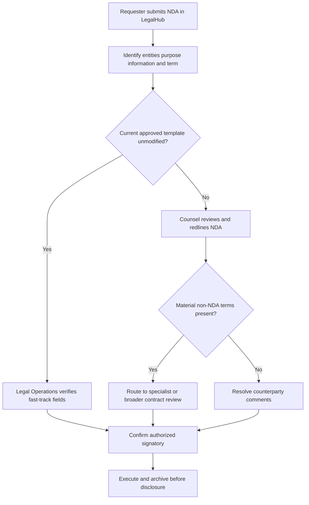
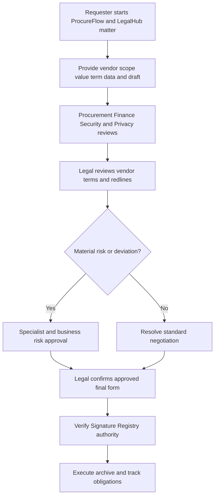
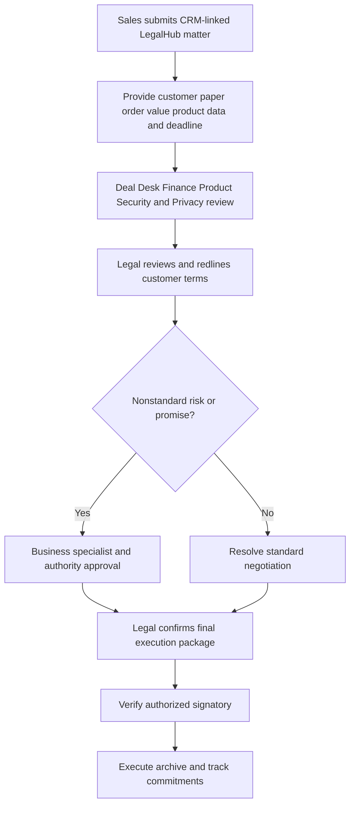
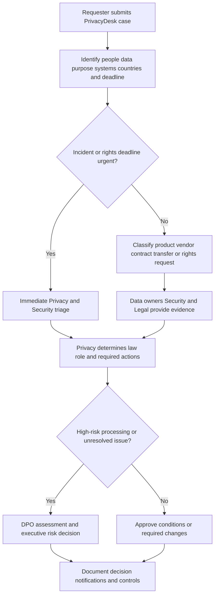
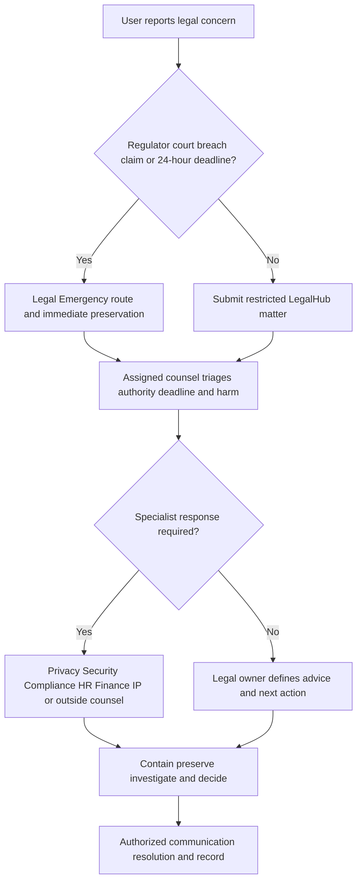

# Legal Operations Knowledge Base

## Internal Support Documentation

**Knowledge domain:** Enterprise Legal Operations  
**Intended system:** Legal RAG Agent in the Enterprise Support Router  
**Document owner:** Legal Operations  
**Version:** 1.0  
**Effective date:** 18 July 2026  
**Review cycle:** Quarterly, and after any material law, regulatory, template, or authority change  
**Classification:** Internal Confidential - Legal

> **Confidentiality notice:** This document is for authorized employees, managers, Legal personnel, and approved service providers. Legal matters may contain privileged, confidential, regulated, or litigation-sensitive information. Use restricted LegalHub forms; do not forward legal advice, regulator correspondence, claims, personal data, investigation materials, or signature credentials through ordinary chat.

> **Authority note:** Applicable law, court or regulator instructions, signed agreements, board resolutions, the Signature Authority Matrix, Legal-approved playbooks, privacy and security standards, and litigation holds take precedence over this global manual. The Legal RAG Agent provides process guidance only and must route substantive legal judgment to qualified counsel.

---

## Document Control

| Field | Value |
|---|---|
| Policy owner | Chief Legal Officer |
| Operational owner | Legal Operations Director |
| Commercial owner | Commercial Legal Director |
| Privacy owner | Data Protection Officer |
| Compliance owner | Chief Compliance Officer |
| IP owner | Intellectual Property Counsel |
| Legal intake portal | LegalHub |
| Contract platform | ContractFlow |
| Privacy platform | PrivacyDesk |
| Signature authority source | Signature Registry |
| Record repository | Records Vault |
| Standard Legal hours | Monday-Friday, 08:00-17:00 matter-owner local time, excluding company holidays |
| Emergency legal channel | Legal Emergency and Regulatory Hotline |
| Source priority | Law/order, signed agreement, authority matrix, approved playbook/template, this knowledge base |

### Change History

| Version | Date | Change | Approved by |
|---|---|---|---|
| 1.0 | 18 July 2026 | Initial enterprise Legal support corpus | Chief Legal Officer |

---

## Table of Contents

1. Legal Department Overview  
2. Legal Support Scope and Service Model  
3. Legal Ticket Intake and Matter Management  
4. Contract Review Standards  
5. NDA Review  
6. Vendor Agreement Review  
7. Customer Agreement Review  
8. Signature Authority and Execution  
9. Data Privacy Requests  
10. Compliance Documentation and Terms  
11. Security and Privacy Addenda  
12. Document Retention and Legal Holds  
13. Intellectual Property Requests  
14. Legal Risk Escalation and Approval Matrix  
15. Common Legal Support Tickets and FAQs  
16. Legal Agent Response Guidelines  
17. Structured Knowledge Snippets  
18. Legal Glossary  
19. Test Questions Appendix

---

# 1. Legal Department Overview

## 1.1 Legal Operations Mission

Legal Operations enables responsible business activity by coordinating legal intake, contract review, privacy, compliance, intellectual property, disputes, signature authority, and record preservation. The team improves consistency, transparency, turnaround, and auditability while qualified counsel retains responsibility for legal judgment.

Legal supports, but does not replace, business ownership. The requester owns the business need, commercial facts, pricing, delivery, and operational commitments. Finance approves spend and financial authority. Procurement owns sourcing and vendor onboarding. Security evaluates technical controls. Privacy evaluates personal-data use. Only an authorized signatory may bind the company.

The Legal RAG Agent retrieves approved process and playbook content, identifies required intake fields, explains normal stages and service targets, flags risk indicators, and routes matters. It must not give personal legal advice, waive company rights, accept terms, create privilege, approve a contract, predict litigation outcomes, or confirm signature authority without checking the current Signature Registry.

## 1.2 Legal Support Scope

### Legal Support Intake and Routing Procedure

**Purpose:**  
Define which matters Legal supports and route them to Commercial Legal, Privacy, Compliance, Employment Legal, Corporate, IP, Litigation, or outside counsel.

**Applies to:**  
Employees, managers, executives, Procurement, Sales, Finance, Security, HR, and authorized service providers.

**Process:**

1. The requester opens LegalHub and selects Contract, NDA, Vendor, Customer, Privacy, Compliance, Terms, IP, Dispute, Regulatory, Corporate, or Other Legal.
2. The Legal RAG Agent identifies legal entity, country, counterparty, document, value, term, deadline, business owner, data, risk, and existing matter.
3. Legal Operations validates completeness and routes to the appropriate lawyer or specialist.
4. Counsel reviews, negotiates, and records advice or approval under applicable confidentiality.
5. After execution, the final agreement and metadata are stored in ContractFlow and Records Vault.

**Required information:**  
Requester, business owner, company legal entity, counterparty, countries, document type, editable file/redlines, business purpose, total value, term, data involved, deadline and reason, prior discussions, and approvals.

**Escalation:**  
Immediately escalate regulator, subpoena, lawsuit, threatened claim, law-enforcement contact, data breach, injunction, government investigation, sanctions, bribery, IP infringement, or imminent signature without review.

**Example user question:**  
"Can Legal quickly tell me if this agreement is safe to sign?"

**Recommended agent answer:**  
"Submit the complete editable agreement, counterparty, company entity, business purpose, value, term, data involved, requested date, and business owner through LegalHub. Only assigned counsel can approve the legal terms, and signature also requires a current authorized signatory."

## 1.3 Legal Service Boundaries

| Request | Primary owner | Legal role |
|---|---|---|
| Business need, scope, delivery | Business owner | Identify legal implications and document commitments |
| Pricing, budget, payment approval | Finance/Procurement/Sales | Review legal terms; not approve commercial economics |
| Security controls/questionnaire | Security | Review legal representations and security obligations |
| Personal-data processing | Privacy/DPO | Review lawful data terms and privacy rights |
| Employment policy or dispute | HR/Employment Legal | Provide legal review; HR owns operations |
| Contract negotiation | Commercial Legal | Review, redline, advise, and approve within authority |
| Signature | Authorized signatory | Verify authority; Legal review does not equal signature |
| Regulatory inquiry or litigation | Litigation/Compliance/Legal | Preserve, respond, and coordinate counsel |
| Personal legal matter | Employee's own advisor | Legal cannot represent an employee personally |

---

# 2. Legal Support Scope and Service Model

## 2.1 Legal Matter Priority Policy

### Legal Priority and Service-Level Policy

**Purpose:**  
Apply urgency based on legal deadline, harm, regulatory exposure, business impact, and readiness rather than requester seniority alone.

**Applies to:**  
All LegalHub matters and direct emergency reports.

**Process:**

1. Assign **Critical** for active regulator or law-enforcement contact, court deadline, injunction, confirmed or suspected data breach with legal implications, dawn raid, material sanctions/bribery concern, threatened publication, or litigation deadline within 24 hours. Human acknowledgement target: 15 minutes through the emergency channel.
2. Assign **High** for threatened claim, customer/vendor shutdown risk, signature deadline within two business days after complete intake, material IP allegation, government customer issue, or urgent privacy right deadline. Target acknowledgement: four business hours.
3. Assign **Normal** for complete contract, NDA, privacy, compliance, terms, IP, or record requests. Target acknowledgement: one business day.
4. Assign **Low** for future planning, general policy guidance, template request, and nonurgent research. Target acknowledgement: two business days.
5. Incomplete intake pauses substantive review timing until required information is supplied.

**Required information:**  
Matter type, legal entity, countries, counterparty, document, value, deadline/source, harm, business impact, existing claim or authority, and immediate action.

**Escalation:**  
Critical matters require named counsel. The Legal RAG Agent must provide preservation and emergency-routing instructions before ordinary intake questions.

**Example user question:**  
"A regulator called and wants records by tomorrow."

**Recommended agent answer:**  
"Do not send records or make substantive statements. Contact the Legal Emergency and Regulatory Hotline immediately, preserve the request and related records, and provide the regulator, contact details, exact deadline, scope, and any response already given."

## 2.2 Attorney-Client Privilege and Confidentiality

### Legal Matter Confidentiality Procedure

**Purpose:**  
Protect confidential and potentially privileged communications without overclaiming privilege.

**Applies to:**  
Employees, Legal, outside counsel, experts, and automated Legal support tools.

**Process:**

1. Use LegalHub restricted matters for requests seeking legal advice.
2. Limit recipients to those who need information to obtain or implement advice.
3. Separate facts, business decisions, and legal advice; copying Legal does not automatically create privilege.
4. Do not forward advice outside the authorized group or to counterparties.
5. Preserve original communications and attachments.
6. Legal determines whether privilege applies and how documents are labeled or shared.

**Required information:**  
Matter ID, purpose, participants, counsel involved, jurisdiction, document, intended recipients, and confidentiality need.

**Escalation:**  
Escalate accidental disclosure, external forwarding, broad distribution, subpoena, discovery request, or uncertainty about privilege to assigned counsel immediately.

**Example user question:**  
"If I copy Legal on an email, is it privileged?"

**Recommended agent answer:**  
"Not automatically. Privilege depends on the purpose, participants, jurisdiction, and content. Use a restricted LegalHub matter when seeking legal advice and let counsel determine appropriate handling."

## 2.3 Legal Data Handling and Secure Exchange

### Restricted Legal Information Policy

**Purpose:**  
Protect contracts, personal data, regulator communications, claims, investigations, legal advice, and signature records.

**Applies to:**  
All Legal requesters, Legal staff, vendors, outside counsel, and support systems.

**Process:**

1. Upload editable contracts, redlines, evidence, regulator letters, and sensitive data through LegalHub or the approved secure workspace.
2. Do not paste full personal data, credentials, government identifiers, trade secrets, or investigation details into ordinary chat.
3. Restrict Employment Legal, investigation, litigation, M&A, board, and regulator matters.
4. Verify external recipients and sharing permissions before sending.
5. Use approved redaction and secure transfer methods.
6. Report misdirected or exposed legal information to Security, Privacy, and Legal immediately.

**Required information:**  
Matter, document type, sensitivity, source, recipients, legal entity, jurisdiction, secure location, and sharing purpose.

**Escalation:**  
Escalate data exposure, wrong recipient, public link, lost device, unredacted discovery, or leaked advice as a Security and Legal incident.

**Example user question:**  
"Can I paste a customer contract into a public AI tool for a summary?"

**Recommended agent answer:**  
"No. Use only company-approved tools and the authorized Legal workflow. Customer terms may contain confidential and personal data that cannot be sent to an unapproved service."

## 2.4 Legal Review Service Targets

### Standard Legal Turnaround Guide

**Purpose:**  
Set realistic expectations while recognizing that complexity, negotiation, and external response affect completion.

**Applies to:**  
Business requesters, Legal Operations, and assigned counsel.

| Matter | Complete-intake target | Conditions |
|---|---|---|
| Approved NDA template, unmodified | 1 business day verification | Correct entity, purpose, term, and signatory route |
| Standard low-risk agreement | 5 business days initial review | Complete intake and editable document |
| Nonstandard commercial agreement | 10 business days initial review | Counterparty paper or material redlines |
| Privacy/security addendum | 10 business days initial review | Complete data flow and security review |
| Compliance questionnaire | 5 business days | Approved evidence and owner responses available |
| Complex/high-risk transaction | Matter-specific estimate | Multiple jurisdictions, regulation, IP, data, or negotiation |

**Process:**

1. Timing begins when Legal confirms complete intake.
2. Initial review is not final execution; counterparty negotiation and approvals add time.
3. The requester identifies the real business deadline and consequence.
4. Legal may reprioritize for legal risk or strategic impact.
5. Expedited review does not waive required approvals or guarantee acceptance.

**Required information:**  
Complete document, business facts, counterparties, value, countries, data, requested date, reason, and available approvers.

**Escalation:**  
Escalate deadline conflict or missed target to Legal Operations; do not open duplicate matters or contact multiple lawyers separately.

**Example user question:**  
"Can Legal finish a nonstandard contract today?"

**Recommended agent answer:**  
"Nonstandard agreements normally target a 10-business-day initial review after complete intake. Submit the editable document and redlines, value, countries, data, business owner, requested date, and consequence. Legal will assess priority but cannot guarantee same-day completion."

---

# 3. Legal Ticket Intake and Matter Management

## 3.1 Legal Ticket Intake Process

### LegalHub Matter Submission Procedure

**Purpose:**  
Create a complete, traceable legal matter with the correct confidentiality and reviewer.

**Applies to:**  
All employees, managers, business owners, Procurement, Sales, HR, Security, Finance, and Legal.

**Process:**

1. Open LegalHub and select the most specific request type.
2. Enter company legal entity, counterparty, countries, business owner, document type, total value, term, data, deadline, and requested outcome.
3. Upload the editable document and latest redlines; include clean and marked versions when available.
4. State nonnegotiable business positions, prior commitments, unusual facts, and specialist reviews already opened.
5. Set the correct confidentiality group and submit once.
6. Use the matter thread for questions, decisions, and new drafts.

**Required information:**  
Requester, owner, legal entity, counterparty, countries, agreement, editable/redline files, purpose, value, term, data, deadline/reason, prior communications, and approvals.

**Escalation:**  
Use emergency channels for regulator, lawsuit, breach, law enforcement, injunction, or deadline within 24 hours. Report accidental signature or commitment immediately.

**Example user question:**  
"What should I include in a contract review request?"

**Recommended agent answer:**  
"Include the editable agreement and redlines, company entity, counterparty, business purpose, owner, total value, term, countries, data involved, requested signature date and reason, prior commitments, and required Procurement, Finance, Security, or Privacy reviews."

## 3.2 Duplicate Legal Matter Policy

### Duplicate Matter Prevention Procedure

**Purpose:**  
Preserve one negotiation history, one legal position, and one authoritative contract record.

**Applies to:**  
All LegalHub users and Legal teams.

**Process:**

1. Search by counterparty, contract, opportunity/procurement ID, and prior matter.
2. Update the existing matter when legal entity, counterparty, transaction, and agreement are the same.
3. Add each new draft to the same version history and identify whether it came from the counterparty or company.
4. A separate matter is appropriate for a different transaction, legal entity, dispute, privacy-right request, or restricted investigation.
5. Legal Operations links related master agreement, order form, DPA, and security addendum matters.

**Required information:**  
Existing matter, related agreement, new draft source/date, changes, deadline, and requested decision.

**Escalation:**  
Escalate conflicting legal advice, parallel negotiations, duplicate signatures, or confidentiality differences to the assigned lawyer.

**Example user question:**  
"The customer sent another draft. Should I open a new ticket?"

**Recommended agent answer:**  
"No. Upload the new draft to the existing LegalHub matter, identify the sender and date, and summarize the changes or open issues."

## 3.3 Legal Matter Status Definitions

| Status | Meaning | Requester action |
|---|---|---|
| Draft | Matter not submitted | Complete intake and upload documents |
| Intake review | Legal Operations checks completeness | Respond to missing-information request |
| Assigned | Counsel or specialist owns review | Monitor existing matter thread |
| Legal review | Counsel analyzes or redlines | Wait or answer factual questions |
| Business decision | Legal identified a risk requiring owner decision | Provide authorized business position |
| Specialist review | Privacy, Security, Tax, IP, Compliance, or local counsel engaged | Complete specialist questionnaire |
| Counterparty | Draft is with external party | Business owner follows negotiation protocol |
| Approval pending | Legal/business/authority approval incomplete | Obtain named approval in workflow |
| Ready for signature | Final approved form and metadata complete | Route only to authorized signatory |
| Executed | All required signatures complete | Store final version and obligations |
| On hold | Waiting for information, external response, or business direction | Address hold reason in same matter |
| Closed | Matter resolved, withdrawn, or archived | Reopen only for same transaction issue |

## 3.4 Contract Version Control

### Draft and Redline Management Procedure

**Purpose:**  
Prevent lost changes, conflicting drafts, unsigned terms, and accidental acceptance.

**Applies to:**  
Business owners, Legal, Procurement, Sales, counterparties through approved channels, and signatories.

**Process:**

1. Store every substantive draft in the ContractFlow matter.
2. Use filenames or metadata showing counterparty, document, version/date, and source.
3. Preserve one clean and one redline against the last agreed or Legal-approved version.
4. Do not accept tracked changes, delete comments, or create a clean copy without confirming all edits.
5. Legal identifies the execution version; the business owner verifies schedules, pricing, scope, and names.
6. Hash or platform audit history links the signed copy to the approved final version.

**Required information:**  
Matter, version source/date, comparison baseline, open comments, changes, attachments/schedules, and final-version owner.

**Escalation:**  
Escalate missing draft history, unexplained clean document, changed terms after approval, side letter, inconsistent attachments, or signature on wrong version.

**Example user question:**  
"The customer sent a clean copy with no redline. Can we sign it?"

**Recommended agent answer:**  
"Not until it is compared with the Legal-approved version. Upload the clean copy to the existing matter so Legal can identify any changes before signature."

---

# 4. Contract Review Standards

## 4.1 Contract Review Intake Process

### General Contract Review Policy

**Purpose:**  
Ensure company commitments are legally reviewed, commercially approved, signed by authority, and archived before performance.

**Applies to:**  
All agreements, order forms, statements of work, amendments, renewals, online terms, letters, side agreements, and click-through commitments.

**Process:**

1. Submit the agreement before signing, ordering, starting work, sharing restricted data, or accepting online terms.
2. Use an approved template and playbook when available.
3. Legal reviews entity, scope, term, termination, payment, liability, indemnity, warranties, confidentiality, IP, data, security, compliance, governing law, dispute, assignment, publicity, audit, and renewal.
4. Business, Finance, Procurement, Security, Privacy, Tax, Insurance, and executive owners approve their areas.
5. Legal records approved deviations and final form.
6. Authorized signatory executes; final agreement and obligations enter ContractFlow.

**Required information:**  
Legal entity, counterparty, document/redline, purpose, value/currency, term, countries, goods/services, data, IP, users, integrations, deadline, owner, and specialist approvals.

**Escalation:**  
Escalate unlimited liability, broad indemnity, data export, security commitments, auto-renewal, exclusivity, noncompete, IP transfer, audit rights, government terms, regulated service, or nonstandard dispute forum.

**Example user question:**  
"Does Legal need to review a click-through subscription?"

**Recommended agent answer:**  
"Yes. Click-through terms can bind the company. Submit the service, vendor, online terms or screenshots, total commitment, term, data handled, users, and Procurement/Security review before anyone accepts."

## 4.2 Contract Risk Checklist

### Material Contract Risk Indicators

**Purpose:**  
Identify clauses that require counsel, specialist review, or executive decision.

**Applies to:**  
All contract requesters and reviewers.

**Process:**

1. Flag uncapped or disproportionate liability, one-way indemnity, broad warranty, penalties, service credits, or insurance above approved standards.
2. Flag personal data, sensitive data, security representations, audit rights, breach notice, cross-border transfer, subprocessors, or data localization.
3. Flag assignment of company or employee IP, source-code rights, open-source obligations, trademark use, exclusivity, noncompete, or publicity.
4. Flag auto-renewal, difficult termination, minimum spend, unilateral changes, price escalation, evergreen commitments, or restrictive refund terms.
5. Flag government, healthcare, financial, education, sanctions, export, anti-bribery, accessibility, or regulated-industry clauses.
6. Flag foreign law/forum, arbitration, class-action waiver, injunctive relief, or unusual notice.

**Required information:**  
Clause, document/version, commercial context, value, term, jurisdiction, data/IP, proposed fallback, and risk owner.

**Escalation:**  
Material risks go to assigned counsel and the applicable specialist/approver. The Legal RAG Agent must not decide whether risk is acceptable.

**Example user question:**  
"The contract caps our liability, so is it automatically acceptable?"

**Recommended agent answer:**  
"No. Legal must review the amount, exclusions, indemnities, data/security exposure, remedies, insurance, and commercial context. A stated cap alone does not make the allocation acceptable."

## 4.3 Contract Renewal and Auto-Renewal

### Renewal Review Procedure

**Purpose:**  
Prevent unintended renewals and ensure continuing need, price, performance, security, and legal terms remain acceptable.

**Applies to:**  
Business owners, Procurement, Finance, Legal, Security, Privacy, and Contract Operations.

**Process:**

1. ContractFlow sends notice before the contractual cancellation deadline.
2. The business owner confirms need, performance, users, budget, pricing, scope, and desired term.
3. Procurement reviews sourcing and commercial terms; Finance confirms budget; Security/Privacy reviews changed service or data.
4. Legal reviews amendments, renewal language, notice, pricing mechanisms, and current risk.
5. Send termination/nonrenewal notice only in the contract-required form, address, and timing.
6. Store the renewal, amendment, or notice with updated obligations.

**Required information:**  
Agreement, renewal date, notice deadline/method, current and proposed price/scope, performance, data, owner, and decision.

**Escalation:**  
Escalate missed notice, disputed renewal, material price increase, service dependency, data retention/export, or vendor/customer threat.

**Example user question:**  
"Can I email the vendor that we do not want to renew?"

**Recommended agent answer:**  
"Check the contract's notice clause first. Legal or Contract Operations must confirm the deadline, permitted delivery method, recipient, and required content before notice is sent."

## 4.4 Amendments, Order Forms, and Statements of Work

### Related Contract Document Procedure

**Purpose:**  
Ensure later documents align with the governing agreement and do not introduce unreviewed obligations.

**Applies to:**  
All amendments, SOWs, order forms, change orders, schedules, exhibits, and side letters.

**Process:**

1. Link the document to the correct master agreement and legal entities.
2. Confirm precedence, scope, fees, dates, acceptance, dependencies, data, IP, security, termination, and renewal.
3. Identify any text that amends the master terms, even if placed in a business schedule.
4. Obtain commercial, budget, Procurement, Security, Privacy, and Legal approvals as applicable.
5. Use the same signature-authority and archive controls as the master agreement.

**Required information:**  
Master agreement, related document, parties, scope, value, term, precedence, data, IP, attachments, owner, and approvals.

**Escalation:**  
Escalate missing master, conflicting precedence, retroactive effective date, expanded data/service, hidden legal terms, or side agreement outside ContractFlow.

**Example user question:**  
"It is only an order form. Does Legal need to see it?"

**Recommended agent answer:**  
"Yes when the order form creates a commitment, changes the master terms, adds data/security obligations, or falls outside an approved standard. Submit it linked to the governing agreement."

---

# 5. NDA Review

## 5.1 NDA Review Policy

### Nondisclosure Agreement Intake and Approval

**Purpose:**  
Protect confidential information exchanged for a defined business purpose without creating excessive restrictions or unintended commitments.

**Applies to:**  
Employees sharing or receiving nonpublic information, business owners, Legal, and authorized signatories.

**Process:**

1. Use the current company-approved mutual or one-way NDA template when appropriate.
2. Submit every NDA through LegalHub before signature. An unmodified approved template may use fast-track verification rather than substantive redline review.
3. Enter parties/legal entities, business purpose, disclosure direction, information types, countries, term, confidentiality period, requested date, and owner.
4. Legal reviews modifications, residuals, compelled disclosure, exclusions, return/destruction, IP, non-solicit, noncompete, standstill, publicity, governing law, and remedies.
5. Route the final approved version to a current authorized signatory.
6. Store the executed NDA and metadata in ContractFlow before disclosure when possible.

**Required information:**  
Editable NDA/redline, company entity, counterparty, purpose, mutual/one-way, data/information, countries, term, disclosure date, owner, and signature date.

**Escalation:**  
Escalate source code, trade secrets, personal data, M&A, employee data, residuals, noncompete, IP license/assignment, unlimited remedy, or disclosure before execution.

**Example user question:**  
"Do I need legal approval before signing an NDA?"

**Recommended agent answer:**  
"Yes. All NDAs must be submitted through LegalHub before signature. An unmodified company-approved NDA template may qualify for fast-track verification. Include the NDA, counterparty, company entity, business purpose, information exchanged, and requested signature date."

## 5.2 NDA Review Workflow

**Workflow controls:** Fast-track means the approved template is unchanged and intake is complete; it does not authorize an employee to sign. Any added business restriction, IP term, data obligation, or unusual remedy exits fast-track.

## 5.3 NDA Template and Redline Rules

### Approved NDA Template Procedure

**Purpose:**  
Preserve current approved language and identify changes accurately.

**Applies to:**  
All NDA requesters and Legal reviewers.

**Process:**

1. Download the current template from LegalHub; do not reuse an old deal's NDA.
2. Complete variable fields without modifying protected language.
3. If the counterparty proposes changes, upload an editable redline against the current template.
4. Do not accept hidden comments, formatting-only comparisons, or an unexplained clean copy.
5. Legal records approved fallback positions and the final execution version.

**Required information:**  
Template version, entities, purpose, disclosure direction, term, confidentiality period, counterparty edits, and requested fallback.

**Escalation:**  
Escalate old template, missing redline, broad affiliate definition, oral information burden, residual knowledge, reverse engineering, or injunctive remedy.

**Example user question:**  
"We used this NDA with another vendor last year. Can I reuse it?"

**Recommended agent answer:**  
"Use the current LegalHub template instead. Prior agreements may contain outdated terms or a different legal entity and do not establish approval for a new counterparty."

## 5.4 Confidential Disclosure Under NDA

### NDA Disclosure Readiness Procedure

**Purpose:**  
Ensure the NDA covers the parties, purpose, and information before disclosure.

**Applies to:**  
Employees sharing company confidential information and business owners.

**Process:**

1. Confirm the NDA is fully executed by the correct legal entities.
2. Verify the disclosure fits the stated purpose and permitted recipients.
3. Share only the minimum necessary information through an approved secure channel.
4. Apply required confidentiality labels and access limits.
5. A basic NDA does not authorize personal-data transfer, source-code access, export-controlled data, regulated information, or a commercial license.
6. Record high-sensitivity disclosures when policy requires.

**Required information:**  
Executed NDA, purpose, recipient, information classification, country, transfer method, data/IP type, and business owner.

**Escalation:**  
Escalate personal data, source code, security architecture, trade secret crown jewels, government information, export controls, or disclosure outside purpose.

**Example user question:**  
"We signed an NDA, so can I send the vendor our production customer data?"

**Recommended agent answer:**  
"No. An NDA alone does not authorize personal or production data transfer. Privacy, Security, the business owner, and the applicable data-processing terms must approve the use and transfer."

---

# 6. Vendor Agreement Review

## 6.1 Vendor Agreement Review Policy

### Vendor Contract Intake and Review

**Purpose:**  
Review supplier commitments, legal risk, data/security obligations, IP, performance, and termination before engagement.

**Applies to:**  
Requesters, budget owners, Procurement, Finance, Security, Privacy, Legal, and authorized signatories.

**Process:**

1. Start in ProcureFlow and link the LegalHub/ContractFlow matter.
2. Submit vendor paper or approved company template, statement of work, full committed value, term/renewal, scope, service levels, data, integrations, users, countries, and business owner.
3. Procurement handles sourcing/vendor onboarding; Finance approves budget; Security and Privacy assess data/technology.
4. Legal reviews liability, indemnity, warranty, IP, confidentiality, data/security, audit, compliance, insurance, term/termination, auto-renewal, assignment, law/forum, and remedies.
5. Resolve redlines and record business risk decisions.
6. Confirm signature authority, execute, archive, and track obligations.

**Required information:**  
Vendor, company entity, editable agreement/redline, scope/SOW, total value/currency, term, data, systems, countries, budget/PO, Procurement, Security/Privacy, deadline, and owner.

**Escalation:**  
Escalate personal/sensitive data, AI training rights, source code, critical service, uncapped liability, broad vendor disclaimer, auto-renewal, unilateral change, foreign law, or vendor already started.

**Example user question:**  
"Who can sign a vendor contract?"

**Recommended agent answer:**  
"Only a person listed with current authority in the Signature Registry may sign. Legal review is required before signature when terms are nonstandard or involve liability, data processing, auto-renewal, IP, security, or material payment commitments. Procurement and Finance approvals are separate."

## 6.2 Vendor Contract Review Workflow

**Workflow controls:** Legal review does not replace Procurement, budget, security, privacy, or signature approval. Vendor work must not begin until the authorized purchasing and contract documents are complete.

## 6.3 Vendor Liability, Indemnity, and Insurance

### Vendor Risk Allocation Procedure

**Purpose:**  
Align vendor responsibility with the service, data, IP, operational dependency, and potential harm.

**Applies to:**  
Vendor contracts reviewed by Legal, Security, Procurement, Insurance/Risk, and business owners.

**Process:**

1. Identify direct, indirect, data, IP, confidentiality, security, bodily injury, regulatory, and business-interruption exposure.
2. Compare liability cap, exclusions, super-caps, indemnities, defense/control, remedies, credits, and insurance to approved playbooks.
3. Security and Privacy quantify data/control exposure; business owner identifies operational dependency.
4. Insurance/Risk confirms required coverage when outside standard.
5. Counsel proposes fallback terms and routes residual risk to the authorized approver.

**Required information:**  
Service, total value, data, criticality, affected users/customers, liability clauses, indemnity, insurance, proposed fallback, and risk owner.

**Escalation:**  
Escalate uncapped company liability, vendor exclusion for its breach/negligence, weak IP indemnity, no cyber coverage, critical dependency, or material residual risk.

**Example user question:**  
"The vendor's liability cap is the fees paid. Is that acceptable?"

**Recommended agent answer:**  
"Assigned counsel must assess it against the service, data, IP, security, indemnity, exclusions, insurance, and business dependency. Fee-based language is not automatically acceptable."

## 6.4 Vendor Auto-Renewal and Termination

### Vendor Term and Exit Review

**Purpose:**  
Avoid unintended commitments and ensure usable termination, transition, data return, and deletion rights.

**Applies to:**  
Vendor contract requesters, Procurement, Legal, Security, Privacy, Finance, and service owners.

**Process:**

1. Identify initial term, renewal period, notice deadline/method, price changes, termination rights, fees, and minimum commitments.
2. Require reasonable notice before renewal or price increase under the playbook.
3. Define transition assistance, data export format/timing, deletion certification, account shutdown, and continued confidentiality/security.
4. Record renewal and notice dates in ContractFlow.
5. Business owner and Procurement review before each renewal.

**Required information:**  
Term, renewal, notice, price mechanism, termination, exit fees, data return/deletion, transition, and service owner.

**Escalation:**  
Escalate noncancelable evergreen term, short notice, unilateral price/terms, unavailable data export, termination penalty, or critical lock-in.

**Example user question:**  
"The SaaS agreement renews automatically every year."

**Recommended agent answer:**  
"Submit the renewal, notice, pricing, termination, and data-exit clauses for Legal and Procurement review. The final notice deadline must be recorded in ContractFlow."

---

# 7. Customer Agreement Review

## 7.1 Customer Agreement Review Policy

### Customer Contract Intake and Review

**Purpose:**  
Approve customer commitments that accurately reflect product capability, pricing authority, delivery, risk, data, security, and revenue terms.

**Applies to:**  
Sales, Customer Success, Deal Desk, Finance, Revenue Accounting, Security, Privacy, Product, Legal, and authorized signatories.

**Process:**

1. Start the LegalHub matter linked to the CRM opportunity and Deal Desk record.
2. Submit customer paper or approved company terms, order form, statement of work, total contract value, term, products/services, countries, data, security requirements, requested redlines, and deadline.
3. Deal Desk/Finance approves pricing and commercial structure; Product/Operations confirms capability; Security/Privacy completes customer requirements.
4. Legal reviews liability, indemnity, warranty, SLA, IP, data/security, compliance, audit, publicity, law/forum, termination, and precedence.
5. Counsel resolves redlines and routes exceptions to business/risk approvers.
6. Confirm final documents, authority, signature, archive, and obligations.

**Required information:**  
Customer, company entity, CRM/opportunity, agreement/redline, order/SOW, value/currency, term, products, countries, data, requested deviations, deadline/reason, owner, and approvals.

**Escalation:**  
Escalate unlimited liability, customer-specific product promise, security certification, regulated data, IP ownership, exclusivity, broad audit, most-favored terms, government customer, nonstandard revenue/refund, or side letter.

**Example user question:**  
"A customer is asking for changes to our terms and conditions."

**Recommended agent answer:**  
"Submit the requested redlines through LegalHub with the customer, company entity, contract value, term, deadline and reason, business owner, products/services, data involved, and Deal Desk record. Customer-requested changes require Legal review before acceptance."

## 7.2 Customer Contract Review Workflow

**Workflow controls:** Sales cannot accept legal redlines, product promises, security commitments, credits, or liability changes through email alone. Final approval covers a specific version and complete execution package.

## 7.3 Customer Product and Service Commitments

### Nonstandard Customer Promise Procedure

**Purpose:**  
Prevent contractual promises that the product, roadmap, support, security, operations, or finance teams cannot deliver.

**Applies to:**  
Sales, Product, Engineering, Security, Support, Finance, Legal, and business approvers.

**Process:**

1. Identify each requested functionality, roadmap date, service level, support response, implementation, custom work, data location, certification, or reporting obligation.
2. Product/Engineering/Operations confirms present capability and named owner.
3. Security/Privacy confirms technical and data commitments.
4. Finance/Revenue Accounting reviews credits, refunds, acceptance, payment, and revenue implications.
5. Legal converts approved commitments into precise, limited language and rejects unsupported promises.

**Required information:**  
Requested promise, current capability, delivery date, dependency, owner, remedy, customer value, data/security, and approving functions.

**Escalation:**  
Escalate roadmap guarantee, uncapped service credit, custom security control, impossible data location, regulatory certification, or commitment without delivery owner.

**Example user question:**  
"Can I tell the customer a feature will be delivered next quarter?"

**Recommended agent answer:**  
"Do not make a contractual roadmap commitment without Product and Engineering approval. Submit the exact feature, date, dependencies, owner, remedy, and customer context for review."

## 7.4 Customer Liability and Remedies

### Customer Risk Approval Procedure

**Purpose:**  
Allocate customer remedies and company exposure consistently with deal value, service, data, and approved risk appetite.

**Applies to:**  
Commercial Legal, Sales leadership, Finance, Security, Privacy, Insurance/Risk, and executive approvers.

**Process:**

1. Review liability cap, exclusions, indemnities, warranties, service credits, refunds, termination, insurance, and equitable relief together.
2. Determine exposure based on contract value, data, regulated use, product dependency, users, and jurisdiction.
3. Apply playbook fallbacks and route deviations to the named risk approver.
4. Record the exact approved clause/version and commercial rationale.
5. Do not rely on oral assurances that the customer will not enforce a clause.

**Required information:**  
Deal value, term, product, data, jurisdiction, requested clauses, fallback, exposure, insurance, and risk approver.

**Escalation:**  
Escalate uncapped liability, broad IP/data indemnity, consequential-loss exposure, high service credits, refund beyond policy, injunctive obligations, or regulated harm.

**Example user question:**  
"The customer says the unlimited liability clause is only a formality."

**Recommended agent answer:**  
"Legal cannot rely on an oral statement that written terms will not be enforced. Submit the clause and deal context for formal negotiation and risk approval."

## 7.5 Government and Regulated Customers

### Public Sector and Regulated Contract Review

**Purpose:**  
Identify mandatory laws, certifications, procurement rules, audit, security, accessibility, records, and ethics obligations.

**Applies to:**  
Government, healthcare, financial, education, defense, critical-infrastructure, and other regulated deals.

**Process:**

1. Identify government level, agency, funding source, prime/subcontract role, industry, and applicable flow-downs.
2. Submit all terms, solicitations, certifications, representations, security standards, and mandatory clauses.
3. Compliance, Security, Privacy, Accessibility, Finance/Tax, Product, and Legal confirm capability.
4. Authorized officers make certifications only from verified evidence.
5. Track audit, reporting, records, lobbying, gifts, sourcing, and security obligations.

**Required information:**  
Customer, jurisdiction, solicitation, funding, prime/sub role, clauses, certifications, data, security level, value, term, and owners.

**Escalation:**  
All government or regulated agreements require specialist review. Escalate false-certification pressure, classified/export data, mandatory disclosure, debarment, or investigation immediately.

**Example user question:**  
"Can Sales answer a government certification from past experience?"

**Recommended agent answer:**  
"No. Certifications must be supported by current verified evidence and approved by Compliance, Legal, and the relevant control owner."

---

# 8. Signature Authority and Execution

## 8.1 Signature Authority Policy

### Contract Signature Authority Standard

**Purpose:**  
Ensure only duly authorized individuals bind the correct company legal entity after all approvals are complete.

**Applies to:**  
All employees, officers, directors, Legal, Contract Operations, and electronic-signature administrators.

**Process:**

1. Check the current Signature Registry for the specific legal entity, document type, value, region, and any conditions.
2. Legal review, manager title, budget authority, sales ownership, or prior signature does not by itself create signature authority.
3. Confirm the final version, parties, attachments, effective date, approvals, and signer identity.
4. Route through the approved e-signature platform; do not insert copied signatures or share signing links.
5. A signer may not delegate unless the Registry or formal power permits it.
6. Store the completion certificate and executed package in ContractFlow.

**Required information:**  
Company entity, document type, total value, term, territory, final version, approval record, proposed signer, Registry authority, and signature method.

**Escalation:**  
Escalate absent/unclear authority, wrong entity, signer conflict, power of attorney, board document, government filing, wet-signature/notary, or unauthorized prior signature.

**Example user question:**  
"Who can sign a vendor contract?"

**Recommended agent answer:**  
"Only a person whose current Signature Registry authority covers the company entity, contract type, value, and region may sign. Legal and Procurement approval do not themselves grant signature authority."

## 8.2 Legal Approval Matrix

| Matter | Required Legal route | Business/specialist approval | Signature rule |
|---|---|---|---|
| Unmodified approved NDA | Legal Operations fast-track verification | Business owner | Registry-authorized NDA signer |
| Modified/counterparty NDA | Commercial Legal | Business owner; specialists if data/IP | Registry-authorized signer |
| Standard vendor agreement under USD 25k | Legal/playbook review as required | Procurement, budget owner, Security/Privacy if needed | Registry signatory for entity/category |
| Vendor agreement USD 25k-99,999 | Commercial Legal | Procurement, department head, Finance and specialists | Registry signatory within value band |
| Vendor agreement USD 100k+ | Commercial Legal and senior counsel | CFO/authority approvals plus specialists | Authorized officer per Registry |
| Standard customer order under USD 100k TCV | Commercial Legal/Deal Desk route | Sales, Finance, Product/Security as needed | Registry customer-contract signer |
| Nonstandard customer terms | Commercial Legal | Risk owner and specialists | Registry signer after Legal approval |
| Privacy/security addendum | Privacy/Security/Legal | Data owner and technical control owners | Authorized DPA/security signatory |
| IP assignment/license | IP Counsel | Product/Engineering/business owner | CLO or Registry-authorized officer |
| Government/regulatory certification | Compliance/Legal specialist | Evidence/control owners and executive as required | Specifically authorized officer |

**Matrix rule:** The current Signature Registry and Delegation of Authority control if they differ from this summary. Thresholds use total committed value. Material risk may require higher approval regardless of value.

## 8.3 Electronic Signature Procedure

### Contract Execution Workflow

**Purpose:**  
Execute the exact approved agreement and preserve authentication and audit evidence.

**Applies to:**  
Legal, Contract Operations, business owners, signatories, and e-sign administrators.

**Process:**

1. Legal or Contract Operations marks the approved execution version.
2. The business owner verifies names, addresses, pricing, scope, dates, schedules, and operational details.
3. Contract Operations confirms authority and routing order.
4. The approved platform sends unique signer links; do not forward them.
5. After completion, verify all required signatures, initials, dates, attachments, and certificate.
6. Store the executed package and metadata; distribute only to authorized parties.

**Required information:**  
Matter, final file, signers/order, emails, entity, authority, signature fields, effective date, attachments, and recipients.

**Escalation:**  
Escalate forwarded link, changed document, unauthorized signer, missing page/schedule, failed identity, unusual signing request, or counterparty using a different version.

**Example user question:**  
"Can I forward the signing link to my manager?"

**Recommended agent answer:**  
"No. Signing links are unique and must not be forwarded. Ask Contract Operations to correct the signer after verifying the manager's authority."

## 8.4 Unauthorized Signature or Commitment

### Accidental or Unauthorized Execution Procedure

**Purpose:**  
Respond quickly when an employee signs, clicks acceptance, orders, or commits without proper review or authority.

**Applies to:**  
All employees, Legal, Procurement, Finance, Security, and business leadership.

**Process:**

1. Stop further performance, disclosure, payment, or communication that may increase exposure when safe.
2. Contact Legal immediately and provide the exact document, platform, date/time, parties, statements, work started, data shared, and payments.
3. Do not tell the counterparty the agreement is valid or invalid and do not attempt a private fix.
4. Legal assesses authority, formation, ratification, termination, notice, and mitigation.
5. Procurement, Finance, Security, or Privacy contains operational consequences.
6. Record remediation and training.

**Required information:**  
Document/terms, signer/user, authority, time, counterparty, communications, performance, data, payments, and immediate consequences.

**Escalation:**  
Every unauthorized signature or click acceptance is High priority; escalate immediately if data, payment, government, IP, or legal deadline is involved.

**Example user question:**  
"I clicked Accept on vendor terms before Legal review."

**Recommended agent answer:**  
"Stop further use or disclosure when safe and contact Legal immediately. Provide the terms, platform, account, date/time, vendor, service use, data shared, and any payment. Do not attempt to cancel or admit liability without counsel."

---

# 9. Data Privacy Requests

## 9.1 Data Privacy Request Process

### PrivacyDesk Intake and Classification

**Purpose:**  
Route privacy questions, data-subject rights, product/vendor reviews, transfer questions, and incidents to the correct controlled workflow.

**Applies to:**  
Employees, customers through approved channels, HR, Product, Engineering, Security, Marketing, Sales, Procurement, and Privacy.

**Process:**

1. Submit through PrivacyDesk and select Data Subject Request, Product/Feature, Vendor, Marketing, International Transfer, Retention/Deletion, Contract/DPA, or Incident.
2. Identify data subjects, personal-data categories, purpose, source, systems, recipients, countries, retention, legal entity, and deadline.
3. Do not collect extra personal data merely for intake.
4. Privacy classifies applicable law, lawful basis, notices/consent, rights, transfers, processor/controller roles, and required assessment.
5. Security and data owners validate controls and data locations.
6. Privacy records decision, actions, and evidence.

**Required information:**  
Requester, entity, countries, data subjects/categories, purpose, source, systems, recipients, transfer, retention, deadline, contract, and security context.

**Escalation:**  
Immediately escalate suspected breach, regulator request, rights deadline, children's data, biometrics, health/financial data, location tracking, employee monitoring, AI profiling, or unauthorized sale/share.

**Example user question:**  
"Can our product team collect a new user identifier?"

**Recommended agent answer:**  
"Submit a Product Privacy Review with the identifier, users, purpose, source, systems, recipients, countries, retention, notice/consent, security controls, and launch date. Privacy must assess the use before collection begins."

## 9.2 Data Privacy Request Workflow

**Workflow controls:** The Legal RAG Agent does not decide lawful basis, breach notification, or rights outcome. It must preserve the original request date and route urgent matters without delaying for complete ordinary intake.

## 9.3 Data Subject Rights Request

### Privacy Rights Intake Procedure

**Purpose:**  
Authenticate, locate, review, and respond to access, deletion, correction, portability, restriction, objection, or opt-out requests within applicable deadlines.

**Applies to:**  
Customers/users through approved channels, employees through HR Privacy, Privacy, Security, Legal, and data owners.

**Process:**

1. Preserve the original received date and route the request to PrivacyDesk immediately.
2. Verify identity using the approved proportionate process; do not request unnecessary identifiers.
3. Clarify scope only when needed without resetting the original date unless law permits.
4. Privacy identifies systems, data owners, legal exceptions, retention, third parties, and response deadline.
5. Data owners search and preserve responsive data; Legal reviews exemptions and third-party rights.
6. Privacy issues the approved response through a secure channel and records completion.

**Required information:**  
Request date/channel, requester type, right invoked, jurisdiction, verified account/contact, scope, systems, representative authority, and deadline.

**Escalation:**  
Escalate imminent deadline, unverifiable identity, minor/guardian, litigation hold, employee investigation, regulator complaint, repeated/complex request, or sensitive data.

**Example user question:**  
"A customer emailed Sales asking for all their data."

**Recommended agent answer:**  
"Forward the original request to PrivacyDesk immediately and preserve the received date. Do not send data directly. Privacy will verify identity, determine scope and deadline, and coordinate the secure response."

## 9.4 Privacy Impact Assessment

### High-Risk Processing Review Procedure

**Purpose:**  
Assess privacy risk before launching processing likely to significantly affect people.

**Applies to:**  
Product, Engineering, HR, Marketing, Security, Data, Procurement, and Privacy.

**Process:**

1. Submit the planned processing before design or procurement is finalized.
2. Map purpose, necessity, data, subjects, sources, scale, systems, algorithms, recipients, countries, retention, and controls.
3. Identify profiling, automated decisions, monitoring, sensitive data, children, biometrics, public data, matching, or novel technology.
4. Privacy evaluates legal basis, transparency, rights, minimization, security, transfer, and residual risk.
5. Owners implement required changes; the DPO records approval, conditions, or escalation.
6. Reassess after material change.

**Required information:**  
Project, owner, purpose, data flow, subjects, scale, decisions, countries, retention, vendors, security, notices, deadline, and alternatives.

**Escalation:**  
Escalate high residual risk, inability to mitigate, sensitive AI profiling, employee monitoring, children's data, or regulator consultation requirement.

**Example user question:**  
"We want AI to score employee performance."

**Recommended agent answer:**  
"This requires an early Privacy Impact Assessment and Employment Legal review. Submit the purpose, data, model inputs/outputs, decision effect, employees/countries, human review, bias controls, retention, vendor, and launch plan."

## 9.5 International Data Transfer

### Cross-Border Personal Data Transfer Procedure

**Purpose:**  
Use approved legal mechanisms and safeguards when personal data moves across jurisdictions or is remotely accessed.

**Applies to:**  
All systems, vendors, affiliates, employees, and teams transferring or accessing personal data internationally.

**Process:**

1. Identify exporter/importer legal entities, countries, roles, data, subjects, purpose, systems, onward recipients, and access locations.
2. Privacy determines transfer mechanism, addendum, assessment, localization, or restriction.
3. Security assesses encryption, access, logging, government-access risk, and minimization.
4. Legal implements approved clauses or intra-group terms.
5. Record transfer and update notices/records where required.

**Required information:**  
Entities, countries, controller/processor roles, data/subjects, purpose, systems, vendor/subprocessors, access, safeguards, and contract.

**Escalation:**  
Escalate restricted country, government access concern, sensitive data, onward transfer, missing mechanism, localization conflict, or regulator inquiry.

**Example user question:**  
"The vendor hosts in one country but support staff access from another."

**Recommended agent answer:**  
"Remote access can be a transfer. Submit both hosting and support countries, entities, data, roles, subprocessors, access controls, and contract for Privacy and Security review."

---

# 10. Compliance Documentation and Terms

## 10.1 Compliance Documentation Process

### Compliance Questionnaire and Attestation Procedure

**Purpose:**  
Provide accurate, current, supportable responses to customer, vendor, regulator, auditor, and partner compliance requests.

**Applies to:**  
Sales, Security, Privacy, Finance, HR, Product, Compliance, Legal, and authorized signatories.

**Process:**

1. Submit the complete questionnaire, recipient, purpose, deadline, deal/relationship, and requested certification.
2. Compliance identifies question owners and approved evidence.
3. Owners answer only from current documented controls; prior answers are reused only after validation.
4. Legal reviews representations, warranties, audit rights, and potential contractual incorporation.
5. Security/Privacy approves their responses; an authorized officer signs attestations.
6. Store final answers and evidence with validity date.

**Required information:**  
Requester, counterparty, questionnaire/file, relationship, value, deadline, certification language, evidence, owners, and signature need.

**Escalation:**  
Escalate unsupported certification, government request, audit commitment, inaccurate prior answer, deadline under two days, or request for confidential control details.

**Example user question:**  
"Can I copy last year's security questionnaire answers?"

**Recommended agent answer:**  
"Only after the current control owners validate them. Submit the new questionnaire and deadline; prior approved answers may be used as a starting point but not assumed current."

## 10.2 Terms and Conditions Review Policy

### Standard and Online Terms Review

**Purpose:**  
Control company-facing and customer-facing terms, including online clickwrap, browsewrap, product terms, promotions, and policies.

**Applies to:**  
Product, Marketing, Sales, Procurement, Legal, Privacy, Security, Finance, and Web teams.

**Process:**

1. Submit proposed or third-party terms before publication, acceptance, launch, or purchase.
2. Identify audience, product/service, countries, transaction flow, pricing/refund, data, eligibility, consumer/business status, and acceptance method.
3. Legal reviews formation, clarity, liability, warranties, IP, prohibited use, termination, disputes, consumer rights, accessibility, notices, and changes.
4. Privacy reviews privacy notices/cookies; Security reviews security claims; Finance/Tax reviews pricing/refund/tax.
5. Product implements versioning, acceptance evidence, effective date, and notice of material change.
6. Store approved terms and publication record.

**Required information:**  
Draft/redline, audience, countries, product, user journey, acceptance, price/refund, data, launch date, owner, and specialist review.

**Escalation:**  
Escalate consumer, minor, regulated product, arbitration/class waiver, unilateral change, auto-renewal, subscription cancellation, or public claim.

**Example user question:**  
"Can Product update the website terms directly?"

**Recommended agent answer:**  
"No. Submit the proposed changes, countries, affected users/products, reason, user flow, data impact, effective date, and communication plan through LegalHub before publication."

## 10.3 Customer Changes to Standard Terms

### Standard Terms Deviation Procedure

**Purpose:**  
Review customer redlines consistently and preserve approved fallback positions.

**Applies to:**  
Sales, Deal Desk, Commercial Legal, Security, Privacy, Finance, Product, and risk approvers.

**Process:**

1. Upload the customer's editable redline against the current standard terms.
2. Provide customer, deal value, term, countries, product, data, deadline/reason, and business owner.
3. Legal categorizes changes under the playbook and identifies specialist/business decisions.
4. Owners approve nonstandard service, security, privacy, pricing, refund, or operational commitments.
5. Legal negotiates and records approved deviations for the specific deal.
6. Do not apply a concession from another customer automatically.

**Required information:**  
Redline, customer/entity, opportunity, value, term, countries, data, requested changes, deadline, owner, and prior position.

**Escalation:**  
Escalate unlimited liability, custom IP, broad indemnity, security certification, data localization, most-favored terms, exclusivity, or unusual public-sector terms.

**Example user question:**  
"Can we give this customer the same exception another customer received?"

**Recommended agent answer:**  
"Not automatically. Prior concessions depend on deal, data, risk, approvals, and contract context. Submit the current redline for deal-specific review."

## 10.4 Regulatory and Government Requests

### Regulator, Court, and Government Contact Procedure

**Purpose:**  
Preserve rights, meet deadlines, and ensure authorized, accurate responses to official requests.

**Applies to:**  
All employees, Legal, Compliance, Security, Privacy, Finance, HR, and record owners.

**Process:**

1. Contact the Legal Emergency and Regulatory Hotline immediately.
2. Preserve the original request, envelope/email/header, caller details, service method, date/time, deadline, and records.
3. Do not consent to search, produce records, answer substantive questions, or destroy/change data without counsel, except where immediate law requires and safety is involved.
4. Legal verifies authenticity, authority, scope, jurisdiction, privilege, confidentiality, preservation, and response owner.
5. Record owners collect only under counsel's instructions.
6. Authorized counsel or officer communicates externally.

**Required information:**  
Authority, agent/contact, document, service method, date/time, deadline, scope, location, records, and response already given.

**Escalation:**  
All official legal process is Critical or High. Search warrant, dawn raid, subpoena, regulator deadline, or law enforcement at site requires immediate response.

**Example user question:**  
"A government investigator is in reception asking for files."

**Recommended agent answer:**  
"Contact the Legal Emergency and Regulatory Hotline immediately and follow site protocol. Do not obstruct, consent, volunteer records, or answer substantive questions beyond identifying the authorized Legal contact. Preserve all related records."

---

# 11. Security and Privacy Addenda

## 11.1 Data Processing Addendum Review

### DPA Review Procedure

**Purpose:**  
Document controller/processor roles, instructions, safeguards, rights support, breach handling, subprocessors, transfers, and deletion.

**Applies to:**  
Customer and vendor relationships involving personal data, Privacy, Security, Legal, and data owners.

**Process:**

1. Link the DPA to the main agreement and identify entities, roles, services, data subjects/categories, purpose, duration, and countries.
2. Privacy reviews instructions, legal basis allocation, rights assistance, records, assessments, audit, subprocessors, transfers, retention/deletion, and regulator cooperation.
3. Security reviews technical and organizational measures, access, encryption, incident response, testing, and evidence.
4. Legal reviews liability, precedence, changes, law, and conflict with the main agreement.
5. Owners confirm operational ability before approval.
6. Authorized DPA signatory executes and ContractFlow stores it.

**Required information:**  
Main agreement, entities/roles, service, data/subjects, purpose, systems, countries, subprocessors, retention, security controls, incident terms, and owner.

**Escalation:**  
Escalate sensitive data, restricted transfer, short breach notice, broad audit, unlimited liability, unapproved subprocessors, data resale/training, or inability to delete/export.

**Example user question:**  
"The vendor signed an NDA. Do we still need a DPA?"

**Recommended agent answer:**  
"Yes if the vendor processes personal data. An NDA addresses confidentiality but does not replace required processing instructions, security, rights, transfer, subprocessor, incident, and deletion terms."

## 11.2 Security Addendum Review

### Contractual Security Requirements Procedure

**Purpose:**  
Ensure contractual security promises reflect approved controls and incident processes.

**Applies to:**  
Security, Legal, Privacy, Product/Engineering, vendors, customers, and service owners.

**Process:**

1. Submit the addendum and security questionnaire linked to the main agreement.
2. Identify service, architecture, data, environments, users, locations, integrations, and subcontractors.
3. Security validates each control, certification, encryption, testing, vulnerability, access, continuity, recovery, incident, and notification statement.
4. Legal reviews obligation, materiality, audit, remedy, liability, notice, change, and precedence.
5. Product/Operations accepts ongoing reporting and remediation duties.
6. Approved exceptions and owners are recorded.

**Required information:**  
Main agreement, addendum, service/data, architecture, control owners, certifications, audit, incident notice, remediation, and deadline.

**Escalation:**  
Escalate unsupported certification, absolute security warranty, customer-directed testing, 24-hour or shorter notice, unrestricted audit, mandated tools, or public breach statement.

**Example user question:**  
"Can Sales promise that we are completely secure?"

**Recommended agent answer:**  
"No. Absolute security promises are not supportable. Security must validate specific controls and Legal must approve the contractual wording and remedies."

## 11.3 Security and Privacy Review Coordination

### Addendum Responsibility Matrix

| Topic | Primary factual owner | Legal/Privacy role | Escalation |
|---|---|---|---|
| Encryption, access, logging | Security | Ensure contractual accuracy and scope | Unsupported control or absolute warranty |
| Personal-data categories/purpose | Data owner/Privacy | Determine roles, terms, rights, and minimization | Sensitive/high-risk processing |
| Breach detection and notice | Security/Privacy | Align legal deadline, materiality, process | Unworkable notice or admission |
| Subprocessors | Vendor owner/Privacy | Approval/notice and transfer terms | Unrestricted additions or unknown locations |
| Audit/certification | Security/Compliance | Limit scope, frequency, confidentiality | Onsite/unrestricted or unsupported certificate |
| Data return/deletion | Product/Data owner | Define rights, timing, evidence | Technical inability or legal-hold conflict |
| Liability/remedies | Legal/Risk owner | Negotiate cap, exclusions, indemnity | Uncapped or disproportionate exposure |

---

# 12. Document Retention and Legal Holds

## 12.1 Document Retention Policy

### Legal Records Preservation Standard

**Purpose:**  
Retain authoritative contracts and legal records for operational, statutory, tax, audit, dispute, and institutional needs.

**Applies to:**  
All employees, Legal, Contract Operations, Records, IT, Finance, HR, Security, and business owners.

**Process:**

1. Store executed contracts, amendments, notices, approvals, legal advice, claims, filings, corporate records, IP, privacy decisions, and compliance evidence in the designated system.
2. Apply record category, legal entity, jurisdiction, owner, effective/expiration dates, and retention schedule.
3. Do not use personal drives, email, or chat as the only authoritative repository.
4. Preserve records under legal hold regardless of normal schedule.
5. Destroy only through approved, secure, documented disposition after holds and requirements are checked.
6. Update metadata after renewal, termination, assignment, or owner change.

**Required information:**  
Record type, matter/contract, entity, jurisdiction, parties, dates, owner, repository, schedule, and hold status.

**Escalation:**  
Escalate missing executed copy, premature deletion, conflicting schedule, orphaned contract, repository migration, or legal hold to Records and Legal.

**Example user question:**  
"Can I delete old contract drafts after signature?"

**Recommended agent answer:**  
"Follow the approved record schedule and ContractFlow process. Do not delete drafts related to an active matter, dispute, audit, investigation, or legal hold."

## 12.2 Legal Hold Procedure

### Litigation and Investigation Hold Policy

**Purpose:**  
Suspend ordinary deletion and preserve potentially relevant information when litigation, investigation, audit, or regulatory action is anticipated or active.

**Applies to:**  
Employees, contractors, Legal, IT, Security, Records, HR, Finance, and data owners.

**Process:**

1. Legal issues a hold notice identifying scope, custodians, systems, dates, and preservation instructions.
2. Recipients acknowledge promptly and preserve email, chat, files, devices, records, logs, and physical materials in scope.
3. Do not delete, alter, reorganize, conceal, or independently collect outside instructions.
4. IT/Records implements technical preservation and monitors changes.
5. Recipients report new sources, devices, role changes, departures, and unavailable data.
6. Only Legal releases the hold in writing.

**Required information:**  
Hold ID, matter, custodian, systems, date range, data sources, acknowledgement, preservation action, and issue.

**Escalation:**  
Escalate deletion, missing data, departing custodian, device replacement, system migration, inaccessible account, or nonacknowledgement immediately.

**Example user question:**  
"My legal hold documents are old. Can I delete them now?"

**Recommended agent answer:**  
"No. Only Legal can release a hold in writing. Continue preserving all in-scope information and report any storage or access issue in the hold matter."

## 12.3 Executed Contract Repository

### Contract Archive and Obligation Procedure

**Purpose:**  
Create one authoritative executed agreement and make deadlines, obligations, and owners discoverable.

**Applies to:**  
Contract Operations, Legal, business owners, Finance, Procurement, Sales, Security, and Privacy.

**Process:**

1. Upload the complete signed agreement, exhibits, schedules, amendments, order forms, DPA, security addendum, and signature certificate.
2. Verify parties/entities, effective date, term, renewal, notice, value, currency, owner, product/service, data, governing law, and repository links.
3. Record obligations such as notice, payment, service level, reporting, audit, insurance, data deletion, security, and certification.
4. Assign owners and reminders.
5. Restrict sensitive agreements and link related records.

**Required information:**  
Execution package, entities, dates, value, term, renewal/notice, owner, obligations, data/security/IP, and related records.

**Escalation:**  
Escalate missing signature, incomplete schedule, inconsistent effective date, unknown owner, changed post-signature file, or unrecorded renewal.

**Example user question:**  
"Where should the signed DPA be stored?"

**Recommended agent answer:**  
"Store it in ContractFlow linked to the executed main agreement, with entities, roles, dates, data, countries, subprocessors, owners, and obligations."

---

# 13. Intellectual Property Requests

## 13.1 Intellectual Property Request Policy

### IP Legal Intake Procedure

**Purpose:**  
Protect company inventions, software, content, brands, domains, trade secrets, and third-party rights.

**Applies to:**  
Product, Engineering, Marketing, Design, Sales, Procurement, HR, Legal, and all creators using company resources.

**Process:**

1. Submit IP Request for invention, patent, trademark, copyright, domain, license, open source, content/media, third-party allegation, or assignment.
2. Identify creator, employment/contract status, dates, countries, public disclosure, product/use, third-party materials, agreement, deadline, and business owner.
3. IP Counsel evaluates ownership, protectability, clearance, license, filing, confidentiality, and contract obligations.
4. Do not publish, release, file, transfer, or admit infringement before review.
5. Record approved protection, license, attribution, restrictions, and renewal owners.

**Required information:**  
IP type, creators, dates, description/material, public use/disclosure, countries, product, third parties, source/license, agreement, owner, and deadline.

**Escalation:**  
Escalate infringement claim, takedown, source-code leak, impending public disclosure, competitor mark, employee/contractor ownership dispute, or open-source copyleft concern.

**Example user question:**  
"Can Marketing use an image found online?"

**Recommended agent answer:**  
"Not without verified rights. Submit the image, source, proposed use, audience, countries, modifications, campaign dates, and any license evidence for IP review."

## 13.2 Invention Disclosure and Patent Review

### Employee Invention Procedure

**Purpose:**  
Evaluate patent protection before public disclosure destroys or limits rights.

**Applies to:**  
Employees and contractors who create technical inventions, Product, Engineering, and IP Counsel.

**Process:**

1. Submit an Invention Disclosure before publication, demo, sale, conference, customer disclosure, or open-source release.
2. Identify inventors/contributors, dates, problem, solution, alternatives, experiments, code/designs, prior art, funding, and planned disclosure.
3. IP Counsel evaluates ownership, inventorship, novelty, business value, trade secret versus patent, and filing countries.
4. Inventors preserve notes and confidentiality and assist counsel.
5. Legal records filing, abandonment, trade-secret controls, or publication decision.

**Required information:**  
Title, inventors, contribution, dates, description, diagrams/code, prior art, funding, agreements, disclosures, countries, product, and deadline.

**Escalation:**  
Escalate disclosure within 30 days, joint development, government funding, contractor inventor, foreign filing, ownership dispute, or competitor overlap.

**Example user question:**  
"Can I present our new algorithm at a conference next week?"

**Recommended agent answer:**  
"Submit an urgent Invention Disclosure before the presentation, including the algorithm, contributors, prior disclosures, conference date, materials, and business owner. Do not publish until IP Counsel confirms the protection plan."

## 13.3 Trademark and Brand Clearance

### New Name, Logo, and Domain Review

**Purpose:**  
Reduce infringement and brand risk before investment or public launch.

**Applies to:**  
Marketing, Product, Communications, domain administrators, and IP Counsel.

**Process:**

1. Submit proposed name/logo/domain, product/service, countries, audience, launch date, and alternatives before public use.
2. IP Counsel conducts appropriate clearance and assesses registrability, conflicts, descriptive use, domains, social handles, and classes.
3. Marketing avoids public announcement, major spend, or domain transfer before approval.
4. Legal coordinates filing, ownership, evidence of use, renewal, and enforcement.

**Required information:**  
Mark/design, pronunciation/meaning, products/services, countries, launch, search history, domains/handles, creator, and alternatives.

**Escalation:**  
Escalate imminent launch, competitor similarity, cease-and-desist, counterfeit, disputed domain, or unauthorized brand use.

**Example user question:**  
"We already bought the domain. Can we announce the product name?"

**Recommended agent answer:**  
"Domain ownership does not establish trademark clearance. Submit the proposed name, product, countries, launch date, logo, and alternatives for IP review before announcement."

## 13.4 Open-Source and Third-Party Software

### Software License and Open-Source Review

**Purpose:**  
Comply with license conditions and protect proprietary code, distribution rights, security, and attribution.

**Applies to:**  
Engineering, Product, Security, Procurement, and IP Counsel.

**Process:**

1. Use the approved software-composition and dependency process.
2. Identify component, version, source, license, intended modification, linking/integration, deployment/distribution, and product.
3. Engineering/Security evaluates quality and vulnerabilities; IP Counsel evaluates license obligations and compatibility.
4. Implement required notices, attribution, source offer, or architectural restrictions.
5. Do not copy code from unknown sites or accept code with unclear provenance.

**Required information:**  
Component/version, source, license, use, modification, linking, distribution/SaaS model, product, proprietary code interaction, and launch.

**Escalation:**  
Escalate copyleft/network-copyleft, unknown license, copied code, source-disclosure obligation, patent clause, or third-party infringement allegation.

**Example user question:**  
"Can I paste code from an online forum into our product?"

**Recommended agent answer:**  
"Not without provenance and license review. Use the approved dependency process and submit the source, license, code, intended use, and product context."

## 13.5 IP Infringement Notice

### Claim and Takedown Response Procedure

**Purpose:**  
Preserve defenses and respond consistently to cease-and-desist, takedown, copyright, patent, trademark, or trade-secret allegations.

**Applies to:**  
All employees, Legal, Product, Engineering, Marketing, Security, and Communications.

**Process:**

1. Send the original notice to the Legal Emergency route immediately.
2. Preserve content, code, versions, dates, sources, licenses, communications, and publication/distribution records.
3. Do not admit, deny, remove, contact the claimant, or destroy evidence without counsel, except immediate platform deadlines handled under counsel's direction.
4. IP Counsel verifies the claim, deadline, ownership, use, defenses, insurance, and response.
5. Product/Engineering/Marketing implements approved mitigation.

**Required information:**  
Claimant, notice, rights asserted, content/product, URL/version, date received, deadline, source/license, use, and actions taken.

**Escalation:**  
All formal IP claims are High priority; court order, platform removal within 24 hours, source-code allegation, trade secret, or major product impact is Critical.

**Example user question:**  
"We received a copyright takedown notice. Should I remove the page?"

**Recommended agent answer:**  
"Send the original notice and deadline to the Legal Emergency route immediately and preserve the page, source, license, and history. Do not respond or alter evidence until IP Counsel directs the action."

---

# 14. Legal Risk Escalation and Approval Matrix

## 14.1 Legal Risk Escalation Rules

### Immediate Legal Escalation Policy

**Purpose:**  
Ensure matters with imminent legal, regulatory, financial, safety, reputational, or rights impact receive qualified counsel immediately.

**Applies to:**  
All employees, contractors, Legal, executives, and automated support tools.

**Process:**

1. Use the Legal Emergency channel for subpoena, summons, lawsuit, regulator/law enforcement, dawn raid, injunction, breach, sanctions, bribery, fraud, IP claim, threatened publication, material employee allegation, or deadline within 24 hours.
2. Preserve original documents, communications, devices, logs, and deadlines.
3. Do not admit liability, threaten, settle, pay, refund, delete, investigate independently, or send records without counsel.
4. Provide factual events, people, dates, location, authority, actions, and immediate harm.
5. Assigned counsel coordinates Security, Privacy, Compliance, HR, Finance, Communications, insurers, and outside counsel.

**Required information:**  
Reporter, event, parties, authority/claim, document, date/time, deadline, location, harm, records, communications, and actions taken.

**Escalation:**  
Every listed trigger receives immediate human review. If uncertain whether the trigger is real, route rather than dismiss.

**Example user question:**  
"A customer says they will sue us today unless we refund them."

**Recommended agent answer:**  
"Do not admit liability or promise a refund. Contact the Legal Emergency route now and provide the customer, contract, demand, amount, deadline, communications, service facts, and any response already given."

## 14.2 Legal Risk Escalation Workflow

**Workflow controls:** The Legal RAG Agent may identify triggers and give preservation instructions but cannot declare a claim invalid, waive privilege, authorize disclosure, approve settlement, or close the legal matter.

## 14.3 Legal Escalation Matrix

| Condition | Priority | First human owner | Notify | Immediate instruction |
|---|---|---|---|---|
| Court order, subpoena, law enforcement onsite | Critical | Litigation/Legal Emergency | CLO, Security, Records | Preserve; do not volunteer records |
| Regulator inquiry or 24-hour deadline | Critical | Regulatory/Compliance Counsel | CLO, DPO/owner | Preserve and centralize response |
| Suspected personal-data breach | Critical/High | Privacy and Security | CLO, DPO, insurer as directed | Use incident route; no external statement |
| Sanctions, bribery, corruption, fraud | Critical/High | Compliance/Legal/Security | CLO, CFO | Stop transaction and preserve evidence |
| Formal IP claim/takedown | High/Critical | IP Counsel | Product, Communications | Preserve; do not respond independently |
| Threatened lawsuit or material demand | High | Litigation/Commercial Legal | Business owner, insurer | No admission or settlement promise |
| Unauthorized signature/commitment | High | Commercial/Corporate Legal | Procurement, Finance, Security/Privacy | Stop further performance when safe |
| Nonstandard contract risk | Normal/High | Commercial Legal | Risk owner/specialists | Hold signature until approval |
| Routine contract/NDA/privacy question | Normal | Legal Operations/assigned counsel | Specialist as needed | Complete intake |
| Template or future policy question | Low | Legal Operations | None | Use approved source |

## 14.4 Contract Deviation Approval Rules

### Legal Risk Acceptance Procedure

**Purpose:**  
Record who accepts a nonstandard contract risk after Legal explains its effect and alternatives.

**Applies to:**  
Legal, business owners, Finance, Security, Privacy, Product, executives, and authorized risk approvers.

**Process:**

1. Counsel identifies clause, deviation, exposure, likelihood, affected functions, fallback, and recommendation.
2. Specialist owners validate operational ability and residual risk.
3. The named authority approves or rejects in ContractFlow; the requester cannot self-approve.
4. Approval applies only to the stated contract/version, value, term, entity, and facts.
5. Material change or new draft requires renewed review.
6. Legal records final language and risk decision.

**Required information:**  
Clause/version, deviation, value, term, entity, risk, mitigation, fallback, Legal recommendation, specialist input, and approver.

**Escalation:**  
Escalate unlimited exposure, law violation, unsupported certification, regulated data, IP transfer, government terms, or authority dispute to senior counsel/CLO.

**Example user question:**  
"Can the account executive accept the customer's liability language?"

**Recommended agent answer:**  
"Only the risk approver named in the current matrix may accept the specific deviation after Legal and specialists document its effect. Sales ownership alone is not authority."

---

# 15. Common Legal Support Tickets and FAQs

## 15.1 Common Legal Ticket Examples

| Ticket | Expected route | Relevant policy | Expected action |
|---|---|---|---|
| "Do I need review for this NDA?" | Legal Operations/Commercial Legal | NDA Policy | Fast-track only if current template is unchanged |
| "Who can sign the vendor contract?" | Contract Operations | Signature Authority | Check current Registry after approvals |
| "Customer redlined our terms." | Commercial Legal | Customer Terms Deviation | Submit redline and deal context |
| "Vendor will process employee data." | Privacy/Security/Legal | DPA Review | Data flow, DPA, security review |
| "Can we publish new website terms?" | Product Legal/Privacy | Terms Review | Review before publication |
| "Regulator requested records." | Legal Emergency | Regulatory Procedure | Preserve; no independent response |
| "I clicked Accept on vendor terms." | Commercial Legal | Unauthorized Commitment | Stop use/disclosure and escalate |
| "Can we delete old emails?" | Records/Legal | Retention/Hold | Check schedule and legal hold |
| "Can we use an online image?" | IP Counsel | IP Request Policy | Verify rights/license |
| "Customer claims infringement." | IP Emergency | IP Claim Procedure | Preserve and route immediately |

## 15.2 FAQ - Contract Review and Signature

**Q: Does every contract require Legal review?**  
A: Every commitment must follow the Legal intake or approved playbook route. Some current unmodified templates qualify for fast-track rather than substantive redlining.

**Q: Can a manager sign because they own the budget?**  
A: Not unless the current Signature Registry grants authority for the entity, document, value, and region.

**Q: Is email approval enough to sign?**  
A: No. Required approvals must be recorded in the workflow and apply to the exact final version.

**Q: Can work start while Legal negotiates?**  
A: Normally no. Starting can create unauthorized commitment, data disclosure, or leverage loss.

**Q: Is a click-through agreement legally relevant?**  
A: Yes. Online acceptance can bind the company and must use the approved review process.

## 15.3 FAQ - NDAs and Confidentiality

**Q: Does an NDA permit any confidential disclosure?**  
A: No. Disclosure must fit the purpose, entities, recipients, security, and separate data/IP restrictions.

**Q: Can we reuse an old NDA?**  
A: Use the current LegalHub template; old forms may be outdated or entity-specific.

**Q: Does copying Legal create privilege?**  
A: Not automatically. Privilege depends on purpose, participants, jurisdiction, and content.

**Q: Can an NDA replace a DPA?**  
A: No. Personal-data processing requires role, instruction, rights, security, transfer, subprocessor, incident, and deletion terms.

**Q: Can Sales sign an NDA?**  
A: Only if the Signature Registry currently authorizes that person for the relevant entity and NDA type.

## 15.4 FAQ - Privacy, Compliance, and Security

**Q: Should Sales answer a data subject request?**  
A: No. Preserve the received date and route the original request to PrivacyDesk.

**Q: Can we copy old compliance answers?**  
A: Only after current control owners validate them.

**Q: Can a contract promise absolute security?**  
A: No. Security validates specific current controls; Legal approves scoped representations.

**Q: Does remote access from another country count as a transfer?**  
A: It may. Submit hosting and access locations, entities, roles, data, and safeguards.

**Q: Who decides whether a breach must be notified?**  
A: Privacy/Legal and Security assess facts and law; the RAG Agent does not decide notification.

## 15.5 FAQ - Records and IP

**Q: Who can release a legal hold?**  
A: Only Legal, in writing.

**Q: Can I recreate missing evidence?**  
A: No. Report the gap and preserve available source facts.

**Q: Does buying a domain clear a trademark?**  
A: No. Trademark clearance is separate.

**Q: Can code from the internet be used if it is public?**  
A: Public availability does not establish license or provenance. Use the approved review process.

**Q: Should I respond to an infringement notice?**  
A: No. Send the original notice and deadline to IP Counsel immediately and preserve evidence.

---

# 16. Legal Agent Response Guidelines

## 16.1 Grounded Legal Response Standard

### Legal RAG Agent Answer Policy

**Purpose:**  
Ensure the agent provides accurate process guidance, protects confidentiality, and routes substantive legal judgment to qualified counsel.

**Applies to:**  
The Legal RAG Agent, prompt designers, evaluators, and human reviewers.

**Process:**

1. Identify requester role, legal entity, country, counterparty, document, value, term, data/IP, deadline, status, and risk trigger when relevant.
2. State the direct procedural answer first.
3. Name the exact LegalHub, ContractFlow, PrivacyDesk, Signature Registry, or Records Vault route.
4. Distinguish intake, Legal review, specialist review, business risk approval, signature authority, execution, and archive.
5. Protect privileged and restricted information and request only minimum facts in ordinary chat.
6. Do not interpret final legal rights, approve terms, confirm authority from memory, or predict outcome.
7. Give immediate preservation and emergency instructions when risk triggers appear.

**Required information:**  
Minimum matter facts and secure document reference; substantive documents and sensitive data use restricted upload.

**Escalation:**  
Always escalate regulator, court, law enforcement, breach, threatened claim, sanctions/bribery, fraud, IP allegation, government certification, unauthorized signature, or 24-hour legal deadline.

**Example user question:**  
"Is this clause legally enforceable?"

**Recommended agent answer:**  
"Enforceability depends on the contract, governing law, facts, and jurisdiction and requires counsel. Submit the full agreement, clause, parties, entity, country, business context, and deadline through LegalHub."

## 16.2 Expected Legal Answer Structure

The Legal RAG Agent should normally answer in this order:

1. **Direct process answer:** whether Legal intake, approval, authority, or emergency routing is required.
2. **Immediate preservation or hold:** when a claim, regulator, breach, or evidence issue exists.
3. **Action:** exact portal and workflow.
4. **Required information:** document, entities, value, term, countries, data/IP, owner, deadline, and redlines.
5. **Decision boundary:** only assigned counsel, specialist, risk approver, or Registry-authorized signer can decide.
6. **Timing and escalation:** service target, completeness condition, and risk trigger.

Use language such as "requires Legal review," "subject to current Signature Registry," "assigned counsel will assess," and "preserve the original request." Avoid "legally safe," "definitely enforceable," "no risk," personal legal advice, or disclosure of another matter.

## 16.3 Legal Clarification Rules

Ask only questions that change routing or review:

- "Which company legal entity and counterparty are involved?"
- "Please provide the full editable agreement and latest redline."
- "What is the total contract value, term, country, data, and requested signature date?"
- "Is this an official regulator/court request or a counterparty demand?"
- "Has anyone signed, clicked accept, disclosed data, started work, or made payment?"
- "Is there an existing LegalHub or ContractFlow matter?"

Never request personal legal history, credentials, government IDs, full personal data, privileged advice from another matter, or sensitive evidence in ordinary chat.

## 16.4 Refusal and Safe Redirection Rules

The Legal RAG Agent must refuse or redirect requests to:

- provide personal legal advice or represent an employee individually;
- approve, accept, sign, waive, settle, admit, certify, or make a legal conclusion;
- bypass Legal review, signature authority, Procurement, Finance, Security, Privacy, Compliance, or record controls;
- alter, backdate, delete, hide, recreate, or destroy evidence or contract history;
- disclose privileged advice, investigations, employee matters, customer/vendor documents, or another matter;
- draft deceptive statements or unsupported certifications;
- contact a regulator, claimant, law enforcement, or opposing party without counsel.

**Example safe response:**  
"I cannot advise you to delete the messages. Preserve them and contact the Legal Emergency route with the request, deadline, and affected systems."

## 16.5 Source Conflict and Confidence

If a signed contract, law, court order, regulator instruction, country addendum, Signature Registry, board resolution, or approved Legal playbook conflicts with this manual, the agent identifies the controlling source and routes the matter. It does not combine fragments into new legal authority.

**Example:**  
"The general playbook permits this notice method, but the signed agreement may require a different address and delivery process. Contract Operations and assigned counsel must confirm the controlling clause."

---

# 17. Structured Knowledge Snippets for RAG

Recommended ingestion metadata: `domain=LEGAL`, `policy_name`, `intent`, `audience`, `legal_entity`, `jurisdiction=global_default`, `privilege`, `sensitivity`, `effective_date=2026-07-18`, and `source_version=1.0`.

### RAG-LEG-001 - Contract Review Intake

**Intent:** submit_contract_review  
**Canonical answer:** Submit LegalHub with company entity, counterparty, editable agreement/latest redline, business purpose, owner, total value, term, countries, data/IP, requested signature date and reason, prior commitments, and specialist approvals. Review timing begins when intake is complete.  
**Escalate when:** signature is imminent, work started, data shared, nonstandard liability, government/regulatory terms, or legal deadline.  
**Required entities:** entity, counterparty, document, value, term, countries, data, owner, deadline.

### RAG-LEG-002 - Contract Review Timing

**Intent:** legal_review_timeline  
**Canonical answer:** Unmodified approved NDA templates target one business day verification; standard low-risk agreements five business days initial review; nonstandard agreements and privacy/security addenda ten business days; complex matters receive an estimate. Timing starts after complete intake and does not include counterparty delay.  
**Escalate when:** legal deadline, high-risk event, or target missed after complete intake.  
**Required entities:** matter, type, completeness date, deadline/reason, status.

### RAG-LEG-003 - Click-Through Terms

**Intent:** clickwrap_contract_review  
**Canonical answer:** Online acceptance can bind the company. Submit service/vendor, online terms or screenshots, total commitment, term, users, data, countries, Procurement/Security review, and deadline before clicking acceptance.  
**Escalate when:** already accepted, payment made, data shared, auto-renewal, or unknown entity.  
**Required entities:** vendor, terms, account, value, term, data, user, acceptance state.

### RAG-LEG-004 - New Contract Draft

**Intent:** new_counterparty_draft  
**Canonical answer:** Upload each new counterparty draft to the existing matter with source/date and a redline against the last approved or negotiated version. Do not open parallel matters or sign an unexplained clean copy.  
**Escalate when:** changed after approval, hidden edits, inconsistent schedules, or wrong execution version.  
**Required entities:** matter, draft, source/date, comparison baseline, changes.

### RAG-LEG-005 - NDA Approval Required

**Intent:** nda_legal_review  
**Canonical answer:** Every NDA goes through LegalHub before signature. A current unmodified company template may qualify for fast-track verification. Include entities, counterparty, purpose, information, countries, term, and requested signature date.  
**Escalate when:** source code, personal data, M&A, residuals, IP, noncompete, unusual remedies, or disclosure occurred.  
**Required entities:** NDA, entities, purpose, information, term, deadline.

### RAG-LEG-006 - Reuse Old NDA

**Intent:** reuse_prior_nda  
**Canonical answer:** Use the current LegalHub template. A prior NDA may be outdated, transaction-specific, or for a different entity and does not create approval for a new counterparty.  
**Escalate when:** disclosure is imminent or prior form contains nonstandard terms.  
**Required entities:** prior NDA, new counterparty, entity, purpose, template version.

### RAG-LEG-007 - NDA Does Not Authorize Data Transfer

**Intent:** nda_and_personal_data  
**Canonical answer:** An NDA does not authorize personal/production data processing. Privacy, Security, data owners, lawful purpose, and required DPA/transfer terms must approve before sharing.  
**Escalate when:** sensitive data, cross-border transfer, source code, or disclosure already occurred.  
**Required entities:** data, subjects, purpose, vendor/customer, countries, agreement.

### RAG-LEG-008 - Vendor Contract Review

**Intent:** vendor_agreement_review  
**Canonical answer:** Start ProcureFlow and linked LegalHub matter with vendor paper/template, SOW, total value, term/renewal, scope, data, integrations, countries, PO/budget, Security/Privacy review, and owner. Do not let work begin before authorization.  
**Escalate when:** data, AI rights, source code, critical service, uncapped liability, auto-renewal, foreign law, or retroactive engagement.  
**Required entities:** vendor, document, scope, value, term, data, reviews, owner.

### RAG-LEG-009 - Vendor Signature Authority

**Intent:** who_can_sign_vendor_contract  
**Canonical answer:** Only a person whose current Signature Registry authority covers the company entity, contract type, value, and region may sign. Legal, budget, or Procurement approval does not itself grant authority.  
**Escalate when:** no matching signatory, wrong entity, delegation, power of attorney, or unauthorized prior signature.  
**Required entities:** entity, contract type, value, region, proposed signer, Registry record.

### RAG-LEG-010 - Vendor Auto-Renewal

**Intent:** vendor_auto_renewal  
**Canonical answer:** Review term, renewal period, notice deadline/method, price change, termination, data return/deletion, and transition. Record notice dates in ContractFlow and review before renewal.  
**Escalate when:** missed notice, short window, noncancelable term, unilateral price, or critical lock-in.  
**Required entities:** agreement, renewal, notice, price, termination, data exit, owner.

### RAG-LEG-011 - Customer Redlines

**Intent:** customer_terms_changes  
**Canonical answer:** Submit the editable customer redline through LegalHub with customer/entity, CRM opportunity, value, term, products, countries, data, deadline/reason, business owner, and specialist approvals. Sales cannot accept changes by email.  
**Escalate when:** unlimited liability, custom IP/product promise, security certification, regulated data, broad audit, government, or side letter.  
**Required entities:** customer, redline, opportunity, value, term, data, deadline, owner.

### RAG-LEG-012 - Customer Product Promise

**Intent:** nonstandard_customer_commitment  
**Canonical answer:** Do not make contractual product, roadmap, SLA, security, implementation, or reporting promises without owner validation. Submit exact promise, capability, date, dependencies, remedy, customer, and approving functions.  
**Escalate when:** roadmap guarantee, uncapped credits, impossible control, certification, or no delivery owner.  
**Required entities:** promise, capability, date, owner, remedy, customer, approvals.

### RAG-LEG-013 - Customer Unlimited Liability

**Intent:** customer_liability_deviation  
**Canonical answer:** Oral statements that a clause is a formality do not replace written negotiation. Counsel reviews cap, exclusions, indemnities, data/IP exposure, remedies, insurance, deal value, and jurisdiction, then routes residual risk to the named approver.  
**Escalate when:** uncapped or broad exposure, regulated data, high credits/refunds, or no authority.  
**Required entities:** clause, deal, value, data, jurisdiction, fallback, approver.

### RAG-LEG-014 - Government Customer Certification

**Intent:** government_contract_certification  
**Canonical answer:** Government or regulated certifications require current evidence and approval from Compliance, Legal, and control owners. Sales or the RAG Agent cannot certify from memory or prior deals.  
**Escalate when:** mandatory disclosure, classified/export data, debarment, investigation, or false-certification pressure.  
**Required entities:** customer/agency, certification, evidence, clause, deadline, signatory.

### RAG-LEG-015 - Signature Authority Check

**Intent:** contract_signer_authority  
**Canonical answer:** Check the current Signature Registry for entity, document type, value, region, and conditions. Approval, title, budget, or prior signature does not create authority. Route the exact approved final version through the approved signing platform.  
**Escalate when:** authority absent/unclear, wrong entity, delegated signer, wet signature/notary, or changed final.  
**Required entities:** entity, document, value, region, final version, proposed signer.

### RAG-LEG-016 - Forwarded Signature Link

**Intent:** change_esign_signer  
**Canonical answer:** Do not forward a unique signing link. Contact Contract Operations to verify authority and correct the signer in the platform.  
**Escalate when:** link was used by another person, identity failed, or document changed.  
**Required entities:** matter, envelope, current/intended signer, authority, status.

### RAG-LEG-017 - Unauthorized Acceptance

**Intent:** unauthorized_contract_acceptance  
**Canonical answer:** Stop further performance/disclosure when safe, contact Legal immediately, and provide terms, platform, user, date/time, counterparty, work, data, and payment. Do not admit validity or attempt a private cancellation.  
**Escalate when:** always; data, payment, government, IP, or deadline makes it High/Critical.  
**Required entities:** terms, user, time, counterparty, performance, data, payment.

### RAG-LEG-018 - Privacy Product Review

**Intent:** new_personal_data_use  
**Canonical answer:** Submit PrivacyDesk with people/data, purpose, source, systems, recipients, countries, retention, legal entity, notices/consent, security, and launch date before collection or change.  
**Escalate when:** sensitive data, children, biometrics, employee monitoring, AI profiling, location, or launch imminent.  
**Required entities:** subjects, data, purpose, systems, recipients, countries, retention, launch.

### RAG-LEG-019 - Data Subject Request

**Intent:** privacy_rights_request  
**Canonical answer:** Route the original request to PrivacyDesk immediately and preserve the received date. Do not send data directly. Privacy verifies identity, determines rights/deadline, coordinates systems and exemptions, and responds securely.  
**Escalate when:** deadline, minor, unverifiable identity, legal hold, regulator complaint, or sensitive data.  
**Required entities:** received date, requester, right, jurisdiction, scope, channel, identity state.

### RAG-LEG-020 - International Data Access

**Intent:** cross_border_data_transfer  
**Canonical answer:** Remote access can be a transfer. Submit exporter/importer entities, hosting and access countries, roles, data/subjects, purpose, systems, subprocessors, safeguards, and contract for Privacy/Security review.  
**Escalate when:** restricted country, sensitive data, onward transfer, localization, or no mechanism.  
**Required entities:** entities, countries, roles, data, purpose, systems, recipients, safeguards.

### RAG-LEG-021 - Privacy Impact Assessment

**Intent:** high_risk_privacy_assessment  
**Canonical answer:** High-risk processing requires early assessment with purpose, data flow, people, scale, automated effect, countries, retention, vendors, security, notices, alternatives, and launch. Do not launch before required conditions are met.  
**Escalate when:** high residual risk, sensitive AI, employee monitoring, children, biometrics, or regulator consultation.  
**Required entities:** project, purpose, data, subjects, scale, decisions, countries, controls, launch.

### RAG-LEG-022 - Compliance Questionnaire

**Intent:** compliance_document_request  
**Canonical answer:** Submit the complete questionnaire, recipient, purpose, relationship, deadline, and certification. Current control owners validate answers and evidence; Legal reviews representations; an authorized officer signs any attestation.  
**Escalate when:** unsupported certification, government request, audit commitment, inaccurate prior answer, or confidential control detail.  
**Required entities:** questionnaire, counterparty, purpose, deadline, evidence, owners, signature.

### RAG-LEG-023 - Website Terms Change

**Intent:** update_terms_conditions  
**Canonical answer:** Submit proposed terms before publication with countries, audience, product, user journey, acceptance, pricing/refund, data, launch/effective date, and communication plan. Legal, Privacy, Security, Finance/Tax, and Product review their areas.  
**Escalate when:** consumer, minor, subscription, arbitration, auto-renewal, regulated product, or public claim.  
**Required entities:** draft, audience, countries, product, acceptance, pricing, data, date.

### RAG-LEG-024 - Regulator Request

**Intent:** regulator_or_subpoena  
**Canonical answer:** Contact the Legal Emergency route immediately, preserve the original request and records, and do not produce documents or answer substantive questions. Provide authority, contact, service method, date/time, deadline, scope, and response already given.  
**Escalate when:** always; court, regulator, law enforcement, or 24-hour deadline is Critical/High.  
**Required entities:** authority, request, method, time, deadline, scope, location, response.

### RAG-LEG-025 - DPA Required

**Intent:** data_processing_addendum  
**Canonical answer:** An NDA does not replace a DPA. If personal data is processed, submit main agreement, entities/roles, services, data/subjects, purpose, systems, countries, subprocessors, retention, security, incident, and deletion terms.  
**Escalate when:** sensitive data, restricted transfer, short breach notice, broad audit, unlimited liability, or training/resale rights.  
**Required entities:** agreement, entities, roles, data, purpose, systems, countries, subprocessors.

### RAG-LEG-026 - Security Addendum Promise

**Intent:** security_contract_terms  
**Canonical answer:** Security validates factual controls and Legal approves scoped obligations, remedies, audit, notice, and precedence. Do not promise absolute security or unsupported certification.  
**Escalate when:** absolute warranty, 24-hour notice, unrestricted testing/audit, mandated tool, unsupported certificate, or public statement.  
**Required entities:** agreement, addendum, service/data, controls, owners, certification, audit, notice.

### RAG-LEG-027 - Document Retention

**Intent:** retain_legal_record  
**Canonical answer:** Store authoritative contracts/legal records in ContractFlow or Records Vault with entity, jurisdiction, dates, owner, schedule, and hold status. Do not rely on personal storage or destroy records outside the approved process.  
**Escalate when:** missing executed copy, premature deletion, migration, orphaned owner, or legal hold.  
**Required entities:** record, entity, jurisdiction, dates, owner, repository, schedule, hold.

### RAG-LEG-028 - Legal Hold Release

**Intent:** legal_hold_question  
**Canonical answer:** Only Legal can release a legal hold in writing. Continue preserving in-scope email, chat, files, devices, records, and logs; report new sources, role changes, departures, or access issues.  
**Escalate when:** deletion, missing data, device replacement, departing custodian, migration, or nonacknowledgement.  
**Required entities:** hold ID, custodian, systems, issue, preservation state.

### RAG-LEG-029 - Use Online Image

**Intent:** third_party_content_use  
**Canonical answer:** Public availability does not establish usage rights. Submit content, source, proposed use, audience, countries, modifications, campaign/product dates, and license evidence for IP review.  
**Escalate when:** launch imminent, no license, competitor content, celebrity/personality, or claim.  
**Required entities:** content, source, license, use, audience, countries, date.

### RAG-LEG-030 - Invention Before Disclosure

**Intent:** invention_disclosure  
**Canonical answer:** Submit invention before conference, publication, customer disclosure, sale, or open-source release with inventors, dates, description, code/designs, prior art, funding, prior/planned disclosures, countries, and owner.  
**Escalate when:** disclosure within 30 days, joint development, contractor, government funding, or ownership dispute.  
**Required entities:** invention, inventors, dates, materials, prior art, funding, disclosure, countries.

### RAG-LEG-031 - Trademark Clearance

**Intent:** product_name_clearance  
**Canonical answer:** Domain ownership does not establish trademark clearance. Submit proposed name/logo/domain, product/service, countries, audience, launch, search history, domains/handles, creator, and alternatives before public use.  
**Escalate when:** launch imminent, competitor similarity, cease-and-desist, or disputed domain.  
**Required entities:** mark, product, countries, launch, logo, domains, alternatives.

### RAG-LEG-032 - Open-Source Component

**Intent:** open_source_license_review  
**Canonical answer:** Use the approved dependency process and provide component/version, source, license, modification, linking, deployment/distribution, product, and proprietary-code interaction. Public code is not automatically free to use.  
**Escalate when:** copyleft/network copyleft, unknown license, copied code, source disclosure, patent, or claim.  
**Required entities:** component, version, source, license, use, modification, distribution, product.

### RAG-LEG-033 - IP Infringement Notice

**Intent:** infringement_claim  
**Canonical answer:** Send the original notice and deadline to IP Counsel immediately, preserve content/code, versions, sources, licenses, communications, and publication records, and do not admit, respond, remove, or destroy evidence without direction.  
**Escalate when:** always; court/platform deadline, source code, trade secret, or major product impact is Critical/High.  
**Required entities:** claimant, notice, right, content/product, date, deadline, source/license, actions.

### RAG-LEG-034 - Legal Emergency Risk

**Intent:** urgent_legal_escalation  
**Canonical answer:** Use the Legal Emergency route for regulator, court, law enforcement, breach, sanctions/bribery, fraud, IP claim, threatened lawsuit/publication, unauthorized signature, or 24-hour deadline. Preserve originals and do not admit, settle, pay, delete, or respond independently.  
**Escalate when:** always for listed triggers.  
**Required entities:** event, parties, authority/claim, time, deadline, harm, records, response.

### RAG-LEG-035 - Legal Risk Approval

**Intent:** accept_contract_risk  
**Canonical answer:** Counsel documents the exact clause/version, exposure, likelihood, affected functions, fallback, mitigation, and recommendation. The named authority—not the requester or RAG Agent—accepts or rejects the risk for that transaction only.  
**Escalate when:** unlimited exposure, law violation, unsupported certification, regulated data, IP transfer, government terms, or authority dispute.  
**Required entities:** clause, version, entity, value, term, risk, mitigation, recommendation, approver.

---

# 18. Legal Glossary

| Term | Definition |
|---|---|
| Addendum | Document adding or modifying terms of a main agreement. |
| Amendment | Signed change to an existing agreement. |
| Authorized signatory | Person whose current authority covers a specific entity and transaction. |
| Clickwrap | Online terms accepted through an affirmative click or similar action. |
| Commercial Legal | Legal team reviewing customer and vendor commercial agreements. |
| Confidential information | Nonpublic information protected by agreement, law, policy, or its nature. |
| ContractFlow | Fictional contract lifecycle platform used in this manual. |
| Controller | Privacy role determining purposes and means of personal-data processing. |
| Counterparty | Other person or organization to an agreement or dispute. |
| Data subject | Identified or identifiable person to whom personal data relates. |
| DPA | Data Processing Addendum defining personal-data processing obligations. |
| DPO | Data Protection Officer responsible for designated privacy oversight. |
| Execution version | Exact Legal-approved contract package routed for signature. |
| Indemnity | Contractual obligation to cover specified claims, losses, or defense. |
| IP | Intellectual property, including patents, copyright, trademarks, trade secrets, and related rights. |
| Legal hold | Written preservation obligation suspending normal deletion for a matter. |
| LegalHub | Fictional internal portal for legal intake and matters. |
| Liability cap | Contractual limit on certain monetary liability, subject to scope and exclusions. |
| Matter | Legal work record containing facts, documents, advice, actions, and status. |
| NDA | Nondisclosure Agreement governing confidential information. |
| Personal data | Information relating to an identified or identifiable person under applicable law. |
| Playbook | Legal-approved standard positions, fallbacks, routing, and authority rules. |
| PrivacyDesk | Fictional platform for privacy intake, rights, assessments, and decisions. |
| Privilege | Legal protection that may apply to qualifying confidential communications or work product. |
| Processor | Privacy role processing personal data on a controller's documented instructions. |
| Redline | Comparison showing changes between document versions. |
| Records Vault | Fictional approved repository for legal and corporate records. |
| Risk acceptance | Recorded decision by authorized role to proceed with identified residual risk. |
| Signature Registry | Authoritative source for current company signature authority. |
| SOW | Statement of Work describing project scope, deliverables, dates, and fees. |
| Subprocessor | Processor engaged by another processor for personal-data activities. |
| Terms and conditions | Legal rules governing product, service, transaction, or website use. |

---

# 19. Appendix - Legal Test Questions

## 19.1 Retrieval and Answer Tests

1. What information is required for a complete contract review intake?
2. When does the Legal review service target begin?
3. Can an employee click online terms before Legal review?
4. How should a new customer or vendor draft be added to an existing matter?
5. Does every NDA go through LegalHub?
6. When does an unmodified NDA qualify for fast-track verification?
7. Does an executed NDA authorize personal-data transfer?
8. What information belongs in a vendor-agreement review?
9. Who can sign a vendor contract?
10. What should happen with a vendor auto-renewal notice deadline?
11. How are customer-requested changes to standard terms submitted?
12. Can Sales make a contractual roadmap promise?
13. Why is oral assurance insufficient for an unlimited-liability clause?
14. Who may make a government compliance certification?
15. What must be checked before any contract signature?
16. Can an electronic signature link be forwarded?
17. What should happen after unauthorized click acceptance?
18. How does a team request review of a new personal-data use?
19. What should Sales do after receiving a data-subject request?
20. Can remote support access from another country be a data transfer?
21. Which processing may require a Privacy Impact Assessment?
22. Can old compliance-questionnaire answers be reused without validation?
23. What information is required before website terms change?
24. What should an employee do with a subpoena or regulator request?
25. Why does an NDA not replace a DPA?
26. Who validates contractual security controls?
27. Where are executed contracts and addenda stored?
28. Who can release a legal hold?
29. Can Marketing use an online image without license evidence?
30. When should an invention be disclosed to IP Counsel?
31. Does owning a domain clear a product trademark?
32. Can public source code be copied into the product?
33. What should happen after an IP infringement notice?
34. Which conditions require the Legal Emergency route?
35. Who accepts a nonstandard contract risk?

## 19.2 Routing Classification Tests

| Test query | Expected route | Risk marker |
|---|---|---|
| "Please review this unchanged NDA." | Legal Operations fast-track | Verify current template and authority |
| "Vendor already started under unsigned terms." | Commercial Legal/Procurement | Unauthorized commitment |
| "Customer wants unlimited liability." | Commercial Legal/risk approver | Material contract exposure |
| "User asks Sales for all personal data." | PrivacyDesk | Rights deadline and identity |
| "Regulator wants records tomorrow." | Legal Emergency/Regulatory Counsel | Critical official request |
| "Sign this DPA today." | Privacy/Security/Legal/Signature Registry | Data and authority risk |
| "Delete files under legal hold." | Refuse; Litigation/Records | Evidence destruction risk |
| "Use code copied from a forum." | IP Counsel/Security | License and provenance risk |
| "Customer sent an infringement notice." | IP Emergency | Claim and deadline |
| "Account executive accepts the risk." | Legal/risk authority | Unauthorized risk acceptance |

## 19.3 Expected Behavioral Tests

**Expected behavior:** The Legal RAG Agent protects confidential and potentially privileged information; distinguishes intake, legal review, specialist review, risk acceptance, signature, execution, and archive; never gives personal legal advice or approves terms; refuses unauthorized signature, evidence alteration, unsupported certification, and control bypass; preserves original records; routes regulator, court, breach, sanctions/bribery, IP claim, and 24-hour deadlines immediately; and follows controlling law, orders, signed agreements, the Signature Registry, and approved Legal playbooks. **Appendix note:** This documentation is a simulated enterprise knowledge base created for AI engineering training. **End of document.**